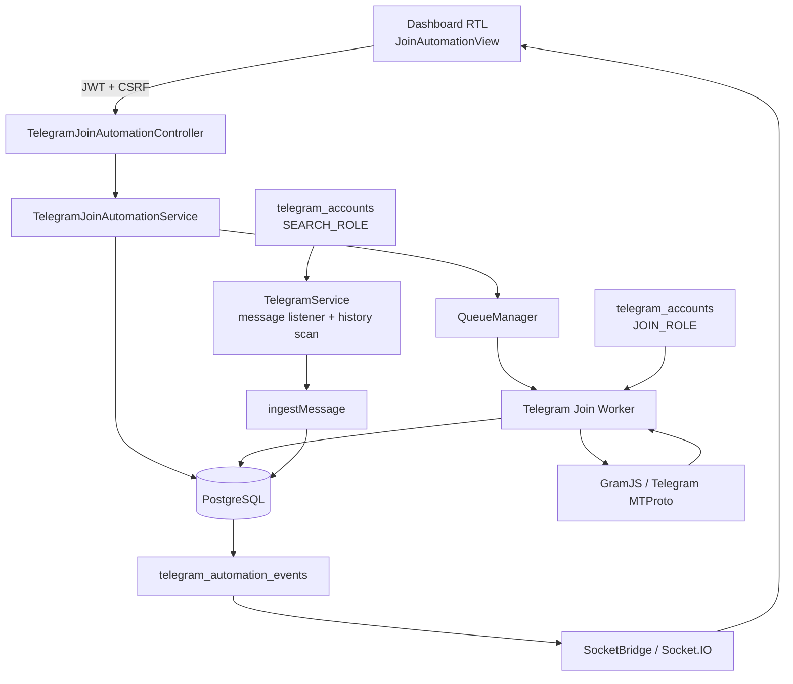
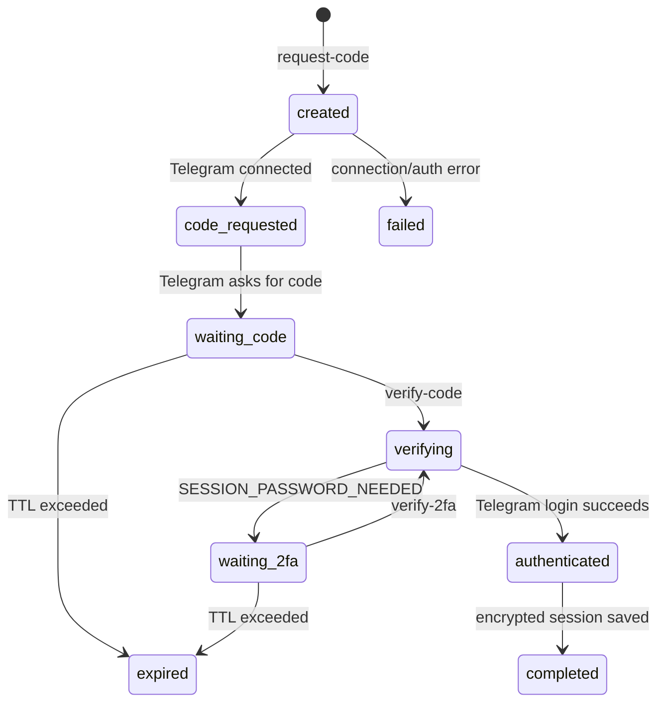
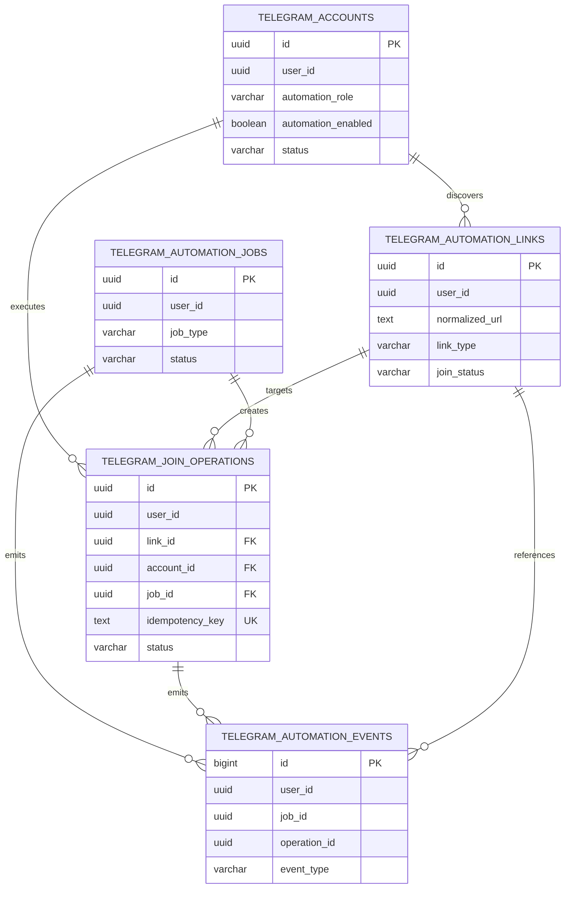
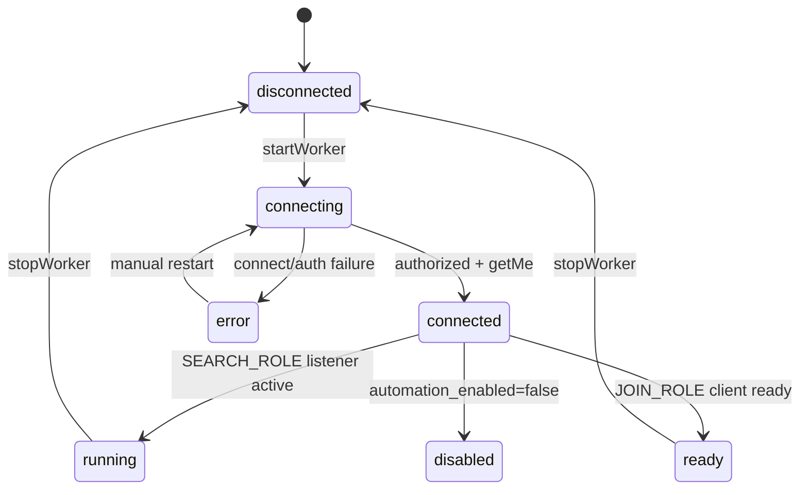
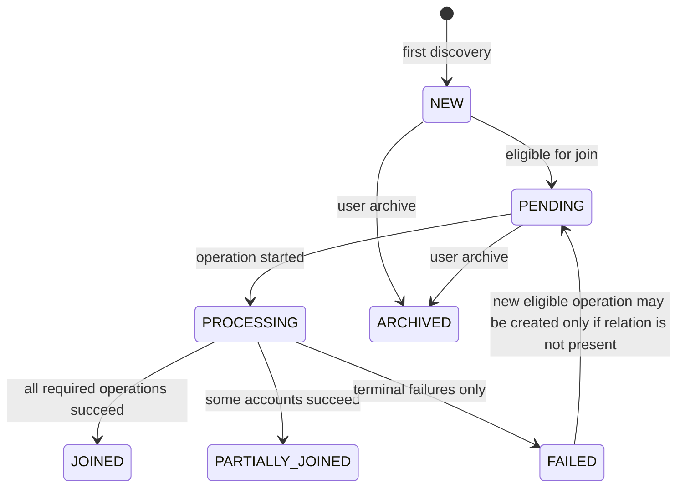
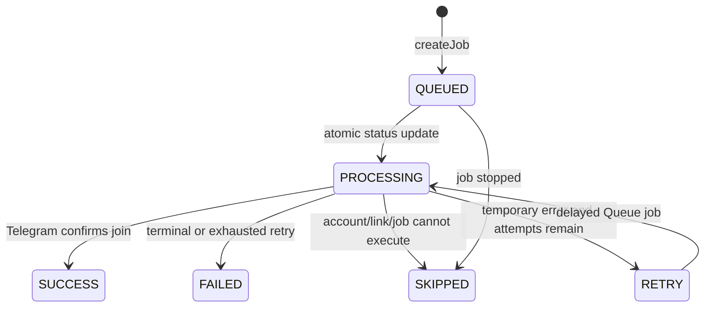
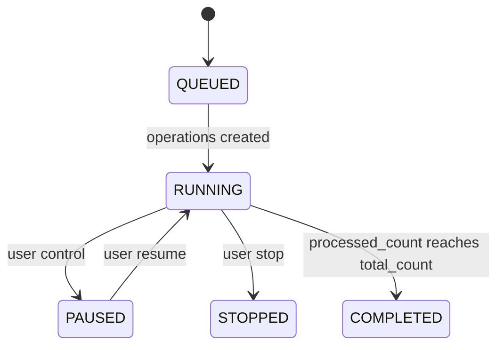
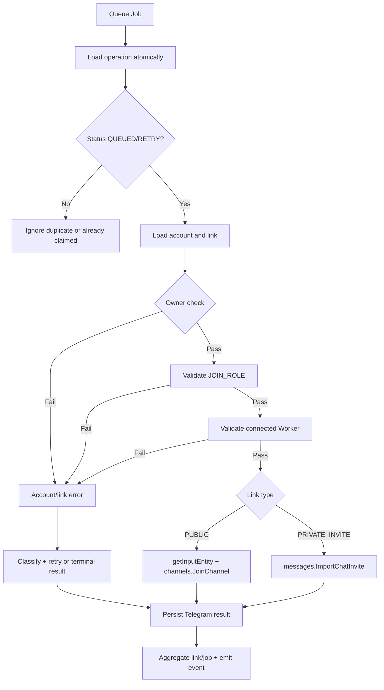
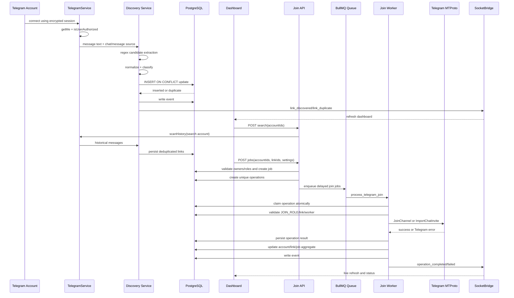

# التوثيق التقني الرسمي
# أتمتة الانضمام لروابط تيليجرام

> **اسم الملف:** `TELEGRAM_JOIN_AUTOMATION_DOCUMENTATION.md`  
> **الإصدار:** `3.0.0-final-hardening`
> **تاريخ إنشاء الوثيقة:** 2026-08-25  
> **حالة الوثيقة:** `AS-BUILT / PRODUCTION HARDENING WITH EXPLICIT LIMITATIONS`
> **المستودع:** [x781780889-jpg/whatsapp-dashboard-new](https://github.com/x781780889-jpg/whatsapp-dashboard-new)  
> **Commit التنفيذ الموثق:** [`f972d1d`](https://github.com/x781780889-jpg/whatsapp-dashboard-new/commit/f972d1d)؛ وتحديث الإصلاح النهائي في Commit لاحق موضح في سجل التغييرات أدناه.

## حالة التوثيق

تصف هذه الوثيقة **ما هو موجود فعليًا في الكود** بعد تنفيذ النسخة الأولى من قسم أتمتة الانضمام لروابط تيليجرام. لا تعتبر الوثيقة كل مطلب نظري منفذًا لمجرد وجود اسم أو زر مشابه. لذلك تستخدم الحالات التالية:

| الحالة | المعنى |
|---|---|
| `IMPLEMENTED` | المكوّن موجود ومربوط بمسار تنفيذي واضح في الخادم وقاعدة البيانات أو Telegram عند الحاجة. |
| `PARTIALLY IMPLEMENTED` | جزء من المكوّن موجود، لكن توجد حدود أو أجزاء تحتاج استكمالًا قبل اعتباره مكتملًا إنتاجيًا. |
| `MISSING` | لا يوجد تنفيذ فعلي في النسخة الحالية. |
| `BROKEN / RISK` | التنفيذ موجود، لكن توجد مشكلة معروفة أو احتمال تضارب يجب معالجته. |
| `UNVERIFIED / NEEDS CONFIRMATION` | لا يمكن إثباته من الاختبارات المحلية أو يحتاج بيئة تشغيل حقيقية وبيانات اعتماد Telegram. |
| `RECOMMENDED` | تحسين مقترح وليس جزءًا منفذًا في النسخة الحالية. |

> **ملاحظة مهمة:** النسخة الجديدة تستخدم مسارات `v2` ومخزن بيانات Telegram مستقلًا. المسارات القديمة `/telegram/join-automation` و`/telegram/link-import` ما زالت موجودة للحفاظ على التوافق، لكنها مرتبطة تاريخيًا بنموذج روابط واتساب وليست المصدر المعتمد للنسخة الجديدة.

---

## جدول المحتويات

1. [نطاق القسم وهدفه](#1-نطاق-القسم-وهدفه)
2. [ملخص الحالة التنفيذية](#2-ملخص-الحالة-التنفيذية)
3. [Architecture النظام](#3-architecture-النظام)
4. [هيكل Dashboard](#4-هيكل-dashboard)
5. [الأدوار والفصل بين الحسابات](#5-الأدوار-والفصل-بين-الحسابات)
6. [إدارة حسابات Telegram وSessions](#6-إدارة-حسابات-telegram-وsessions)
7. [محرك اكتشاف الروابط](#7-محرك-اكتشاف-الروابط)
8. [توحيد الروابط ومنع التكرار](#8-توحيد-الروابط-ومنع-التكرار)
9. [قاعدة البيانات والجداول](#9-قاعدة-البيانات-والجداول)
10. [العلاقات والقيود](#10-العلاقات-والقيود)
11. [الحالات State Machines](#11-الحالات-state-machines)
12. [Queue وWorkers وScheduler](#12-queue-وworkers-و-scheduler)
13. [دورة حياة Job](#13-دورة-حياة-job)
14. [محرك الانضمام الفعلي](#14-محرك-الانضمام-الفعلي)
15. [Retry وBackoff وRate Limits](#15-retry-وbackoff-وrate-limits)
16. [التوزيع والتزامن وIdempotency](#16-التوزيع-والتزامن-وidempotency)
17. [المراقبة اللحظية والسجل](#17-المراقبة-اللحظية-والسجل)
18. [API Endpoints](#18-api-endpoints)
19. [نماذج الطلب والاستجابة](#19-نماذج-الطلب-والاستجابة)
20. [الأخطاء ومعالجتها](#20-الأخطاء-ومعالجتها)
21. [الأزرار والتفاعلات والواجهة](#21-الأزرار-والتفاعلات-والواجهة)
22. [البطاقات والإحصائيات والحالات](#22-البطاقات-والإحصائيات-والحالات)
23. [الإعدادات والقيم المسموحة](#23-الإعدادات-والقيم-المسموحة)
24. [Import وExport وPagination](#24-import-وexport-و-pagination)
25. [الأمان والصلاحيات](#25-الأمان-والصلاحيات)
26. [التوافق مع الأقسام الأخرى](#26-التوافق-مع-الأقسام-الأخرى)
27. [تدفق البيانات الكامل](#27-تدفق-البيانات-الكامل)
28. [Recovery والتعافي](#28-recovery-والتعافي)
29. [الاختبارات](#29-الاختبارات)
30. [Current Problems وRoot Causes وFixes](#30-current-problems-وroot-causes-وfixes)
31. [Missing / Recommended Components](#31-missing--recommended-components)
32. [دليل التشغيل الفعلي](#32-دليل-التشغيل-الفعلي)
33. [Changelog](#33-changelog)
34. [المراجع](#34-المراجع)

---

## 1. نطاق القسم وهدفه

قسم **أتمتة الانضمام لروابط تيليجرام** هو قسم تشغيلي داخل لوحة التحكم يربط بين حسابات Telegram موثقة، واكتشاف روابط `t.me`، ومخزن روابط مركزي، وطابور انضمام، ونتائج فعلية قادمة من Telegram عبر GramJS.

الهدف الأساسي هو فصل عمليتين مختلفتين تمامًا:

1. **البحث والاكتشاف:** حسابات لها دور `SEARCH_ROLE` وتقرأ الرسائل المسموح بها لاستخراج روابط Telegram فقط.
2. **الانضمام:** حسابات لها دور `JOIN_ROLE` وتنفذ عمليات الانضمام فقط على الروابط المؤهلة.

لا يرسل القسم Session Data إلى المتصفح، ولا يعتمد على Timer داخل المتصفح لتنفيذ الانضمام. الواجهة تنشئ Job، ثم يضع الخادم العمليات في Queue، ويقوم Worker بتنفيذها لاحقًا مع تسجيل الحالة والنتيجة.

### حدود النطاق

القسم الحالي يدعم الروابط العامة مثل `https://t.me/channel_name` وروابط الدعوة الخاصة مثل `https://t.me/+InviteHash` و`https://t.me/joinchat/InviteHash`. لا يحاول النظام تجاوز القنوات الخاصة أو طلبات الانضمام أو حدود Telegram، ولا يقدم آلية للتحايل على أنظمة مكافحة الإساءة.

---

## 2. ملخص الحالة التنفيذية

| المجال | الحالة | الملاحظات |
|---|---|---|
| زر التنقل الرئيسي | `IMPLEMENTED` | يظهر باسم **أتمتة الانضمام لروابط تيليجرام** تحت قسم Telegram. |
| واجهة RTL الحديثة | `IMPLEMENTED` | صفحة `JoinAutomationView.tsx` أعيد بناؤها وربطها بمسارات v2. |
| حسابات SEARCH_ROLE وJOIN_ROLE | `IMPLEMENTED` | حقل `automation_role` مع تحقق Server-Side. |
| اكتشاف روابط Telegram من الرسائل الجديدة | `IMPLEMENTED` | TelegramService يوجه الرسائل إلى خدمة Telegram الجديدة للحسابات المخصصة للبحث. |
| فحص السجل التاريخي | `IMPLEMENTED` | متاح عبر إجراء البحث اليدوي، ويستخدم `TelegramService.scanHistory`. |
| Queue مستقلة للانضمام | `IMPLEMENTED` | Queue باسم `telegram-join-automation` وWorker بتزامن 1. |
| تنفيذ الانضمام العام والخاص | `IMPLEMENTED` | `channels.JoinChannel` للعام و`messages.ImportChatInvite` للدعوات. |
| منع تكرار الرابط | `IMPLEMENTED` | `UNIQUE(user_id, normalized_url)`. |
| منع تكرار علاقة الحساب والرابط | `IMPLEMENTED` | `UNIQUE(user_id, link_id, account_id)` وIdempotency Key. |
| Retry محدود | `IMPLEMENTED` | يعاد جدولة الأخطاء المؤقتة حتى حد 0–2 حسب الإعداد. |
| Backoff | `IMPLEMENTED` | Backoff خطي محافظ داخل حدود زمنية. |
| Socket Live Events | `IMPLEMENTED` | الأحداث تحفظ في `telegram_automation_events` وتبث عبر SocketBridge. |
| تقارير v2 | `IMPLEMENTED` على مستوى API | يوجد Endpoint للتقرير، لكن الصفحة الحالية لا تعرض شاشة تقارير v2 مستقلة. |
| بحث مستقل داخل Queue | `PARTIALLY IMPLEMENTED` | البحث اللحظي يعمل داخل Telegram worker، أما الفحص اليدوي فيمر حاليًا عبر Controller ويستدعي المسح مباشرة. |
| Scheduler مستقل لعمليات Telegram | `PARTIALLY IMPLEMENTED` | التأخير يعتمد على BullMQ delayed jobs، ولا يوجد Scheduler مجال مستقل خاص بـ Telegram. |
| Transactions صريحة | `PARTIALLY IMPLEMENTED` | توجد عمليات ذرية وقيود SQL، لكن الخدمة الجديدة لا تغلف دورة إنشاء Job كاملة في transaction صريحة. |
| Lock صريح `FOR UPDATE` | `PARTIALLY IMPLEMENTED` | توجد حماية بالـ Unique Constraint وتحديث شرطي للحالة، ولا يوجد قفل صف صريح. |
| استعادة عمليات PROCESSING بعد Crash | `MISSING` | BullMQ يحافظ على Job، لكن Recovery watchdog مستقل للنسخة v2 غير موجود. |
| Import/Export خاص بتيليجرام v2 | `MISSING` | المسارات القديمة للاستيراد مرتبطة بنموذج WhatsApp ولا تعتبر جزءًا من v2. |
| اختبار Telegram حي | `UNVERIFIED / NEEDS CONFIRMATION` | الاختبارات المحلية لا تستخدم حسابات Telegram أو Redis/PostgreSQL إنتاجية. |

---

## 3. Architecture النظام

### 3.1 المكونات الرئيسية

| الطبقة | المكوّن الفعلي | المسؤولية |
|---|---|---|
| Frontend | `frontend/src/views/JoinAutomationView.tsx` | عرض الحسابات والروابط والإحصائيات، وتوجيه الأفعال إلى API. |
| Navigation | `frontend/src/components/layout/Sidebar.tsx` | إظهار الزر الرئيسي تحت Telegram. |
| Authentication API | `TelegramAuthService` | مصادقة رقم الهاتف، كود Telegram، و2FA وإنشاء Session مشفرة. |
| Telegram runtime | `TelegramService` | تشغيل GramJS clients والاستماع للرسائل والحفاظ على اتصال الحساب. |
| Discovery domain | `TelegramJoinAutomationService.ingestMessage` | استخراج روابط Telegram وتوحيدها وتسجيل مصدرها ومنع التكرار. |
| Join domain | `TelegramJoinAutomationService.processOperation` | التحقق من الحساب والرابط وتنفيذ Join وتسجيل النتيجة. |
| HTTP API | `TelegramJoinAutomationController` | طبقة الحماية والتحقق وتحويل طلبات الواجهة إلى الخدمة. |
| Queue | `QueueManager` | إنشاء Queue `telegram-join-automation` وإدارة Worker. |
| Bootstrap | `backend/index.js` | تسجيل Handler `process_telegram_join` وإقلاع QueueManager. |
| Database | `TelegramMigrations.js` | إنشاء جداول الأدوار والروابط والـ Jobs والعمليات والأحداث. |
| Live events | `SocketBridge` | بث التحديثات للمستخدم عبر Socket.IO. |

### 3.2 مخطط معماري



### 3.3 مبدأ الفصل

التمييز بين الدورين موجود في قاعدة البيانات وفي الخادم، وليس في الواجهة فقط. اكتشاف الرسائل يستعلم عن `automation_role='SEARCH_ROLE'`، والتنفيذ يستعلم عن `automation_role='JOIN_ROLE'`. كما أن إنشاء Job يرفض أي حساب غير متصل أو غير مخصص لدور الانضمام.

---

## 4. هيكل Dashboard

الصفحة الحالية هي المسار `/join-automation`، وقد أصبح محتواها Telegram-native بدل استخدام نموذج روابط WhatsApp القديم.

### الأقسام المرئية

| القسم | الوظيفة | مصدر البيانات |
|---|---|---|
| Header | تعريف القسم وروابط إضافة الحساب والتنبيهات الأمنية | ثابت + حالة API |
| بطاقات المؤشرات | إجمالي الروابط، الجاهزة، المنضمة، الفاشلة، الحسابات والعمليات | `dashboard.stats` |
| البحث التلقائي | تحديد حسابات SEARCH_ROLE وتنفيذ فحص حقيقي للسجل | `/telegram/join-automation-v2/search` |
| حسابات الانضمام | تحديد حسابات JOIN_ROLE المتصلة والجاهزة | `/telegram/join-automation-v2/dashboard` |
| الروابط المؤهلة | البحث المحلي، التحديد الجماعي، عرض المصدر والحالة، الأرشفة | جدول `telegram_automation_links` |
| إنشاء مهمة | إعداد الفاصل، الإعادات، وطريقة التوزيع وإنشاء Job | `/telegram/join-automation-v2/jobs` |
| المهمة الحالية | تقدم Job، النجاح، الفشل، التخطي، إيقاف مؤقت واستئناف وإيقاف نهائي | `/telegram/join-automation-v2/jobs/:jobId` |
| سجل النشاط اللحظي | أحداث اكتشاف الروابط والعمليات وإعادة المحاولة | `telegram_automation_events` + Socket.IO |
| إدارة الأدوار | تحويل الحساب بين SEARCH_ROLE وJOIN_ROLE | PATCH role endpoint |

### الوصول من القائمة

يظهر العنصر باسم **أتمتة الانضمام لروابط تيليجرام** بعد عنصر **كلمات مفتاحية تيليجرام** لكل مشرف، وللمستخدم غير الإداري إذا كان لديه `enableTelegram` في بيانات المستخدم. الإضافة تمت في `Sidebar.tsx`، بينما Route `/join-automation` موجود في `App.tsx`.

---

## 5. الأدوار والفصل بين الحسابات

### 5.1 الأدوار

| الدور | الوظيفة المسموحة | الوظيفة الممنوعة |
|---|---|---|
| `SEARCH_ROLE` | الاستماع للرسائل، فحص السجل، اكتشاف روابط Telegram، حفظ المصدر | تنفيذ `JoinChannel` أو `ImportChatInvite` |
| `JOIN_ROLE` | الاتصال والحفاظ على العميل جاهزًا، تنفيذ عمليات الانضمام من Queue | قراءة الرسائل أو اكتشاف الروابط |

### 5.2 تحقق البحث

`TelegramJoinAutomationController.search` يتحقق من أن جميع الحسابات المطلوبة مملوكة للمستخدم أو أن المستخدم إداري، وأن كل حساب يحمل `SEARCH_ROLE`. الحساب غير المتصل يضاف إلى نتيجة `SKIPPED` بدل تنفيذ المسح عليه.

### 5.3 تحقق الانضمام

`TelegramJoinAutomationService.createJob` يرفض إنشاء عمليات إذا كان أحد الحسابات:

- غير موجود أو غير مملوك للمستخدم.
- لا يحمل `JOIN_ROLE`.
- معطل عبر `automation_enabled=false`.
- حالته ليست `connected`.

وعند التنفيذ يعاد فحص الدور والحالة والـ Worker مرة أخرى في `processOperation`. هذا يمنع الاعتماد على قرار الواجهة وحده.

### 5.4 حالة تعارض الدور

`PARTIALLY IMPLEMENTED / RISK`: تغيير الدور من الواجهة يحدّث قاعدة البيانات، لكن النسخة الحالية لا تعيد تشغيل Worker تلقائيًا عند تبديل الدور. لذلك يجب إعادة تشغيل Worker أو إعادة اتصال الحساب بعد تغيير الدور للتأكد من أن الذاكرة التشغيلية تعكس الدور الجديد.

---

## 6. إدارة حسابات Telegram وSessions

### 6.1 تدفق الإضافة

الإضافة الفعلية تتم من قسم Telegram الحالي عبر تدفق رقم الهاتف، كود Telegram، ثم كلمة مرور 2FA عند الحاجة. يدعم طلب الكود حقل `automationRole` بقيمة `SEARCH_ROLE` أو `JOIN_ROLE`. حتى إذا لم تستخدم الواجهة القديمة الحقل، يمكن تعيين الدور لاحقًا من صفحة الأتمتة.

### 6.2 دورة المصادقة



### 6.3 الحقول المرتبطة بالحساب

الحساب الأساسي في `telegram_accounts` يحتوي على معلومات الهوية والاتصال مثل `id`, `user_id`, `name`, `phone_number`, `username`, `telegram_user_id`, `status`, و`last_activity_at`. وتضيف Migration الأتمتة الحقول التالية:

| الحقل | النوع | الغرض |
|---|---|---|
| `automation_role` | `VARCHAR(20)` | `SEARCH_ROLE` أو `JOIN_ROLE`. الافتراضي `SEARCH_ROLE`. |
| `automation_enabled` | `BOOLEAN` | تعطيل الحساب من الأتمتة دون حذف السجل. |
| `operation_count` | `INTEGER` | عدد عمليات الانضمام المسجلة للحساب. |
| `error_count` | `INTEGER` | عدد النتائج الفاشلة أو المتخطاة التي سجلت على الحساب. |
| `last_error` | `TEXT` | آخر خطأ ظاهر للحساب. |
| `stopped_at` | `TIMESTAMPTZ` | وقت إيقاف الحساب إن وجد. |
| `stop_reason` | `TEXT` | سبب الإيقاف الإداري أو التشغيلي. |
| `last_operation_at` | `TIMESTAMPTZ` | آخر عملية انضمام مسجلة. |

### 6.4 Session Security

يُنشئ `TelegramAuthService` Session من GramJS ويخزنها في `session_encrypted` باستخدام `TelegramSessionCrypto`. لا تعاد `session_string` أو `session_encrypted` أو `api_hash` إلى الواجهة في قوائم الحسابات. كما يخفي `bot_token` الكامل ويرجع نسخة مختصرة عند استخدام Controllers القديمة.

`UNVERIFIED / NEEDS CONFIRMATION`: يجب تأكيد أن متغير مفتاح التشفير ثابت وآمن وموجود في بيئة الإنتاج، وأنه ليس قيمة افتراضية أو مشتركة بين البيئات.

---

## 7. محرك اكتشاف الروابط

### 7.1 مصادر الاكتشاف

المصدر الأساسي هو Telegram MTProto عبر `TelegramService`:

1. Worker الاتصال ينشئ `TelegramClient` باستخدام Session مخزنة.
2. بعد التحقق من `isUserAuthorized` و`getMe`, يصبح الحساب متصلًا.
3. حساب `SEARCH_ROLE` فقط يسجل `NewMessage` event handler.
4. عند وصول رسالة، يستخرج النص وهوية المحادثة ومعرف الرسالة.
5. يرسل البيانات إلى `TelegramJoinAutomationService.ingestMessage`.
6. تحفظ الروابط الجديدة أو تسجل كمكررة.

### 7.2 فحص السجل التاريخي

عند الضغط على **فحص الآن**، يطلب Controller حسابات البحث المحددة ويستدعي `TelegramService.scanHistory(accountId)`. يقوم TelegramService بجلب Dialogs ثم آخر رسائل من المجموعات والقنوات القابلة للقراءة، ويرسل كل رسالة إلى نفس مسار `ingestMessage`.

هذا يضمن أن المسح التاريخي والمسح اللحظي يشتركان في منطق التوحيد ومنع التكرار.

### 7.3 استخراج الرابط

يستخدم المسار نمطًا يلتقط مضيفي `t.me` و`telegram.me` مع الصيغ العامة والدعوات. بعد الالتقاط لا تعتبر المطابقة صالحة تلقائيًا؛ تمر عبر `normalizeTelegramLink` للتحقق من المضيف والمسار والمعرف.

### 7.4 مخرجات محرك البحث

| المخرج | الوصف |
|---|---|
| `linksFound` | قائمة الروابط الموحدة التي ظهرت في الرسالة بعد إزالة التكرار داخل الرسالة. |
| `linksSaved` | عدد السجلات الجديدة التي حفظت في قاعدة البيانات. |
| `duplicates` | عدد الروابط التي كانت موجودة مسبقًا. |
| `source_history` | سجل مصادر الاكتشاف، ويضم الحساب والمحادثة والرسالة ووقت الظهور. |

### 7.5 أخطاء الاكتشاف

قد يفشل الاكتشاف بسبب Session غير صالحة، انقطاع Telegram، عدم صلاحية الحساب لقراءة Dialog، قاعدة بيانات غير متاحة، أو نص غير صالح. الرسالة غير الصالحة لا تنشئ سجل رابط. أخطاء القنوات غير القابلة للقراءة في فحص التاريخي يتم تجاوزها في الحلقة الحالية مع تسجيل تحذير؛ وهذا يعني أن التقرير التفصيلي لكل قناة مرفوضة غير مكتمل في النسخة الحالية.

---

## 8. توحيد الروابط ومنع التكرار

### 8.1 الصيغ المدعومة

| الصيغة | النتيجة |
|---|---|
| `https://t.me/channel_name` | رابط عام `PUBLIC`. |
| `http://t.me/channel_name` | رابط عام بعد تحويله إلى HTTPS. |
| `t.me/channel_name` | يضاف له HTTPS. |
| `https://telegram.me/channel_name` | يطبع إلى `https://t.me/channel_name`. |
| `https://t.me/+InviteHash` | رابط دعوة `PRIVATE_INVITE`. |
| `https://t.me/joinchat/InviteHash` | يطبع إلى `https://t.me/+InviteHash`. |
| رابط على مضيف آخر | يرفض. |
| معرف قصير أو مسار غير صالح | يرفض. |

### 8.2 ناتج التوحيد

يتكون الكائن الموحد من:

```json
{
  "normalizedUrl": "https://t.me/example_channel",
  "originalUrl": "t.me/example_channel?start=tracking",
  "identifier": "example_channel",
  "linkType": "PUBLIC"
}
```

لا يعتمد النظام على الرابط الأصلي كهوية فريدة؛ يستخدم `normalized_url` مع `user_id` في قيد فريد.

### 8.3 منع التكرار الذري

يحاول `ingestMessage` تنفيذ `INSERT ... ON CONFLICT(user_id, normalized_url) DO UPDATE`. عند السجل الجديد يعود `inserted=true`، وعند وجوده مسبقًا يحدّث `last_seen_at` ومصدر الاكتشاف ويرجع كحالة مكررة. هذه الحماية على مستوى قاعدة البيانات وليست مجرد مقارنة في React.

### 8.4 مصدر الرابط

`source_history` يحفظ كل ظهور مختصرًا، ويتضمن `accountId`, `accountName`, `chatId`, `messageId`, `sourceGroup`, و`seenAt`. المصدر الأساسي الحالي واحد في أعمدة `source_account_id`, `source_chat_id`, `source_message_id`، بينما التاريخ التراكمي في JSONB.

---

## 9. قاعدة البيانات والجداول

تضاف الجداول الخاصة بالنسخة الجديدة داخل `TelegramMigrations.js`. الجداول الفعلية ليست أسماء نظرية مثل `link_sources` أو `job_attempts`؛ لذلك يوثق هذا القسم الأسماء الحقيقية.

### 9.1 `telegram_accounts`

جدول الحسابات الأساسي الموجود مسبقًا، وتستخدمه كل من واجهة Telegram ومركز الكلمات وقسم الأتمتة.

| المجموعة | الحقول المهمة |
|---|---|
| الهوية | `id`, `user_id`, `name`, `phone_number`, `telegram_user_id`, `username`, `first_name`, `last_name` |
| المصادقة | `session_string`, `session_encrypted`, `api_id`, `api_hash`, `auth_required` |
| الاتصال | `status`, `last_connected_at`, `last_activity_at`, `updated_at` |
| الإحصائيات | `links_collected`, `channels_monitored` |
| الدور الجديد | `automation_role`, `automation_enabled` |
| تشغيل الانضمام | `operation_count`, `error_count`, `last_error`, `last_operation_at`, `stopped_at`, `stop_reason` |

> حقول الجلسة الحساسة موجودة في قاعدة البيانات لأغراض التشغيل، لكنها لا تدخل في استجابة Dashboard الآمنة.

### 9.2 `telegram_automation_links`

| الحقل | النوع | الوصف |
|---|---|---|
| `id` | UUID | المعرف الأساسي. |
| `user_id` | UUID | مالك السجل وحدود العزل. |
| `normalized_url` | TEXT | الرابط الموحد، يدخل في القيد الفريد. |
| `original_url` | TEXT | الرابط كما ظهر أول مرة أو في آخر اكتشاف. |
| `telegram_identifier` | TEXT | اسم القناة أو Hash الدعوة. |
| `link_type` | VARCHAR | `PUBLIC` أو `PRIVATE_INVITE`. |
| `source_account_id` | UUID | حساب البحث الذي سجل آخر مصدر أساسي. |
| `source_chat_id` | TEXT | معرف المحادثة المصدر. |
| `source_message_id` | TEXT | معرف الرسالة المصدر. |
| `source_history` | JSONB | مصادر الاكتشاف التراكمية. |
| `first_seen_at` | TIMESTAMPTZ | أول ظهور. |
| `last_seen_at` | TIMESTAMPTZ | آخر ظهور. |
| `status` | VARCHAR | حالة الرابط التشغيلية. |
| `join_status` | VARCHAR | الحالة الإجمالية للانضمام. |
| `joined_by_accounts` | JSONB | الحسابات التي سجل لها نجاح الانضمام. |
| `last_error` | TEXT | آخر خطأ مرتبط بالرابط. |
| `archived` | BOOLEAN | إخفاء الرابط من التشغيل مع الاحتفاظ به. |
| `created_at`, `updated_at` | TIMESTAMPTZ | التتبع الزمني. |

### 9.3 `telegram_join_operations`

| الحقل | النوع | الوصف |
|---|---|---|
| `id` | UUID | معرف العملية. |
| `user_id` | UUID | مالك العملية. |
| `link_id` | UUID | الرابط المستهدف. |
| `account_id` | UUID | حساب JOIN_ROLE المنفذ. |
| `job_id` | UUID | المهمة التي أنشأت العملية. |
| `idempotency_key` | TEXT | مفتاح ثابت بصيغة `tg-join:user:link:account`. |
| `status` | VARCHAR | حالة تنفيذ العملية. |
| `result_code` | VARCHAR | نتيجة Telegram أو نتيجة التحقق. |
| `error_code` | VARCHAR | رمز خطأ مصنف. |
| `error_message` | TEXT | رسالة الخطأ. |
| `attempt_count` | INTEGER | عدد المحاولات. |
| `scheduled_at` | TIMESTAMPTZ | الوقت المحسوب للتنفيذ أو الإعادة. |
| `last_attempt_at` | TIMESTAMPTZ | آخر محاولة. |
| `joined_at` | TIMESTAMPTZ | وقت نجاح الانضمام. |
| `duration_ms` | INTEGER | مدة التنفيذ. |
| `created_at`, `updated_at` | TIMESTAMPTZ | التتبع الزمني. |

### 9.4 `telegram_automation_jobs`

| الحقل | الوصف |
|---|---|
| `id` | معرف المهمة. |
| `user_id` | مالك المهمة. |
| `job_type` | حاليًا `JOIN`. |
| `status` | `QUEUED`, `RUNNING`, `PAUSED`, `STOPPED`, `COMPLETED`. |
| `requested_account_ids` | الحسابات التي طلبها المستخدم. |
| `requested_link_ids` | الروابط التي طلبها المستخدم. |
| `total_count` | إجمالي العمليات المنشأة. |
| `processed_count` | العمليات المنتهية. |
| `success_count` | العمليات الناجحة. |
| `failed_count` | العمليات الفاشلة. |
| `skipped_count` | العمليات المتخطاة. |
| `settings` | إعدادات الفاصل والإعادات والتوزيع. |
| `error_message` | خطأ المهمة العام. |
| `started_at`, `completed_at`, `created_at`, `updated_at` | أزمنة دورة الحياة. |

### 9.5 `telegram_automation_events`

| الحقل | الوصف |
|---|---|
| `id` | معرف تسلسلي للحدث. |
| `user_id` | المستخدم المستفيد. |
| `job_id` | المهمة المرتبطة، إن وجدت. |
| `operation_id` | العملية المرتبطة، إن وجدت. |
| `account_id` | الحساب المرتبط، إن وجد. |
| `link_id` | الرابط المرتبط، إن وجد. |
| `event_type` | نوع الحدث. |
| `status` | حالة الحدث أو العملية. |
| `payload` | تفاصيل JSONB غير حساسة. |
| `created_at` | وقت الحدث. |

### 9.6 `telegram_auth_sessions`

جدول مصادقة مؤقت موجود مسبقًا ويستخدم `state`, `phone_reference`, `phone_code_hash`, `client_reference`, `expires_at`, `attempts`, و`last_error`. لا يعتبر هذا الجدول سجل عمليات الانضمام، بل حالة عملية التوثيق فقط.

### 9.7 جداول ليست موجودة في v2

| الجدول النظري | الحالة |
|---|---|
| `link_sources` | `MISSING`؛ تم استخدام `source_history` داخل جدول الروابط. |
| `job_attempts` | `MISSING`؛ المحاولات في `telegram_join_operations.attempt_count`. |
| `audit_logs` | `MISSING` كجدول تدقيق مستقل؛ يوجد event log تشغيلي. |
| `notifications` | `MISSING` كجدول خاص؛ التحديثات اللحظية عبر Socket.IO والأحداث. |

---

## 10. العلاقات والقيود



### القيود الفعلية

| القيد | الغرض |
|---|---|
| `UNIQUE(user_id, normalized_url)` | منع تكرار الرابط داخل مساحة المستخدم. |
| `UNIQUE(idempotency_key)` | منع إعادة إنشاء مفتاح العملية نفسه. |
| `UNIQUE(user_id, link_id, account_id)` | منع أكثر من عملية لحساب ورابط داخل المستخدم. |
| Foreign key للرابط والحساب | منع حذف المصدر أو الهدف إذا كان له سجل عمليات تاريخي. |
| فهارس الحالة والوقت | تسريع Dashboard واستعلامات الطابور والتقارير. |
| فهارس الدور والتفعيل | فصل الحسابات المؤهلة للبحث والانضمام. |

`PARTIALLY IMPLEMENTED`: لا يوجد Foreign Key ظاهر على `telegram_join_operations.job_id` في Migration الحالية، رغم أن الحقل يمثل مرجع المهمة منطقيًا. يوصى بإضافة القيد بعد تنظيف السجلات القديمة والتأكد من توافق الأنواع.

---

## 11. الحالات State Machines

### 11.1 حالة الحساب



الحالات الفعلية الظاهرة بين قاعدة البيانات والذاكرة قد تختلف: قاعدة البيانات تستخدم `connected`، بينما `TelegramService` يحتفظ بحالة Worker مثل `connecting`, `running`, و`error`.

### 11.2 حالة الرابط



القيم المستخدمة في الكود تشمل `NEW`, `PENDING`, `PROCESSING`, `JOINED`, `PARTIALLY_JOINED`, `FAILED`, و`ARCHIVED`. `join_status` يستخدم `PENDING`, `PARTIALLY_JOINED`, و`JOINED` في المسار الحالي.

### 11.3 حالة العملية



حالة `ALREADY_MEMBER` مصنفة كـ result code في `classifyError`، لكن هناك ملاحظة معروفة: `processOperation` لا يحولها حاليًا إلى حالة تشغيلية ناجحة، ولذلك يجب اعتبارها نقطة إصلاح قبل الاعتماد على تقارير العضوية المسبقة.

### 11.4 حالة المهمة



---

## 12. Queue وWorkers وScheduler

### 12.1 Queue الجديدة

| الخاصية | القيمة الفعلية |
|---|---|
| الاسم | `telegram-join-automation` |
| Job name | `process_telegram_join` |
| concurrency | `1` |
| limiter | عملية واحدة كل ثانية على مستوى Worker |
| BullMQ attempts | `1`؛ الإعادة تديرها الخدمة بإضافة Job مؤجل جديد |
| removeOnComplete | حتى 500 Job أو يوم واحد |
| removeOnFail | حتى 500 Job أو سبعة أيام |

### 12.2 Worker الانضمام

Handler الخادم في `backend/index.js` يستدعي `TelegramJoinAutomationService.processOperation(job.data)`. لا ينفذ Handler أي انضمام من React أو Browser Timer.

### 12.3 Worker Telegram الاتصال

`TelegramService.startWorker` ينشئ Client لكل حساب ويحتفظ به في `activeWorkers`. الحساب `SEARCH_ROLE` يسجل NewMessage handler، بينما حساب `JOIN_ROLE` يظل متصلًا دون تسجيل مسار بحث حتى يستخدمه Join Worker.

### 12.4 البحث والـ Queue

البحث اللحظي مرتبط باتصال Telegram طويل العمر، أما الفحص اليدوي التاريخي في النسخة الحالية يمر مباشرة عبر Controller. لذلك:

- `IMPLEMENTED`: البحث اللحظي الحقيقي.
- `IMPLEMENTED`: الفحص التاريخي الحقيقي.
- `PARTIALLY IMPLEMENTED`: Queue بحث Telegram مستقلة durable غير موجودة في v2.

### 12.5 Scheduler

لا يوجد Scheduler مجال مستقل يختار وقت كل حساب. وقت العملية يحسب عند إنشاء Job، ثم يرسل إلى BullMQ كـ `delay` ويخزن في `scheduled_at`. Generic `JobScheduler` موجود في المشروع لأقسام أخرى، لكنه ليس المسار الأساسي للانضمام الجديد.

---

## 13. دورة حياة Job

### إنشاء المهمة

يستقبل API قائمة حسابات وروابط وإعدادات الفاصل. يتحقق من الملكية والدور والاتصال، ثم ينشئ سجل `telegram_automation_jobs`، وينشئ عملية لكل علاقة حساب × رابط ما لم يمنعها القيد الفريد.

### حساب عدد العمليات

إذا كان هناك رابطان وحسابا JOIN_ROLE، فالمسار ينشئ أربع علاقات محتملة. التنفيذ الفعلي يظل محكومًا بقيود التكرار، لذلك قد يكون العدد أقل عند وجود عمليات سابقة.

### إدخال العمليات إلى Queue

لكل عملية جديدة يحسب العامل تأخيرًا بين الحد الأدنى والحد الأقصى، مع إضافة spread حسب ترتيب العملية. ثم يحفظ `scheduled_at` ويضيف Job إلى Queue بمعرف `tg-join-${operationId}`.

### التحديث النهائي

بعد النتيجة، يحدث Worker العملية والحساب والرابط والمهمة ويسجل Event. عند وصول `processed_count` إلى `total_count` تتحول المهمة إلى `COMPLETED`.

### إيقاف المهمة

عند `STOPPED`، تحول العمليات `QUEUED` و`RETRY` إلى `SKIPPED` مع `JOB_STOPPED`. العمليات النشطة التي بدأت بالفعل لا يوقفها الكود بالقوة؛ يجب أن تكمل أو تفشل نتيجة التنفيذ.

---

## 14. محرك الانضمام الفعلي

### 14.1 خطوات ما قبل التنفيذ



### 14.2 الروابط العامة

يستخدم `worker.client.getInputEntity(link.telegram_identifier)` ثم `new Api.channels.JoinChannel({ channel: entity })`. يتطلب ذلك حسابًا متصلًا وجلسة Telegram صالحة وقدرة الحساب على الوصول إلى المعرف.

### 14.3 روابط الدعوة الخاصة

يستخدم `new Api.messages.ImportChatInvite({ hash: link.telegram_identifier })`. إذا كان Hash منتهيًا أو غير صالح، تصنف النتيجة `INVALID_LINK` ولا يعاد الطلب بلا نهاية.

### 14.4 تأكيد النجاح

تعتبر العملية `SUCCESS` فقط إذا عاد استدعاء GramJS دون Exception ووصلت عملية الحفظ إلى قاعدة البيانات. لا تعرض الواجهة نجاحًا لمجرد أن Job دخل الطابور.

`UNVERIFIED / NEEDS CONFIRMATION`: النسخة الحالية لا تنفذ استدعاء تحقق ثانٍ من عضوية الحساب بعد `JoinChannel` في مسار v2. الاعتماد الحالي هو نجاح استجابة Telegram من الاستدعاء نفسه.

---

## 15. Retry وBackoff وRate Limits

### سياسة الإعادة

| الإعداد | القيمة أو الحد |
|---|---|
| `maxRetries` | من `0` إلى `2`، والافتراضي `1`. |
| `retryBackoffSeconds` | افتراضي `60`، والحد الأدنى `30` والحد الأعلى `3600`. |
| عدد المحاولات داخل العملية | يزيد `attempt_count` ذريًا عند بدء التنفيذ. |
| BullMQ attempts | `1` حتى لا تنفذ BullMQ إعادة غير مسيطرة. |
| إعادة المهمة | بإضافة Job مؤجل جديد بمفتاح retry مختلف. |

### تصنيف الأخطاء

| نمط الخطأ | النتيجة |
|---|---|
| `USER_ALREADY_PARTICIPANT` | `ALREADY_MEMBER` كـ result code. توجد ملاحظة تنفيذية موضحة أدناه. |
| `INVITE_HASH_INVALID`, `USERNAME_INVALID` | `INVALID_LINK`. |
| `CHANNEL_PRIVATE`, `PRIVATE_CHANNEL` | `PRIVATE_OR_RESTRICTED`. |
| `PERMISSION`, `ADMIN_REQUIRED` | `PERMISSION_REQUIRED`. |
| `AUTH_KEY`, `SESSION_REVOKED` | `ACCOUNT_UNAVAILABLE`. |
| `FLOOD_WAIT`, Timeout, Network | `TEMPORARY_ERROR` ومحاولة محدودة. |
| غير ذلك | `UNKNOWN_ERROR` ومحاولة محدودة حسب الإعداد. |

### التعامل مع Telegram Rate Limits

النظام لا يزيد السرعة تلقائيًا عند Rate Limit، ولا يستخدم random delay للتحايل. `FLOOD_WAIT` يدخل ضمن الأخطاء المؤقتة ويعاد وفق سياسة محدودة. كما أن الفاصل الأدنى في API هو 30 ثانية في النسخة الجديدة.

### التوقيت المتغير

التأخير العشوائي يستخدم من أجل توزيع الحمل ومنع تزامن عمليات المستخدم نفسه، وليس لتجاوز حدود Telegram. الحد الأدنى والحد الأقصى يطبعان في الخادم ويرفض الخادم الحد الأدنى إذا تجاوز الحد الأقصى.

---

## 16. التوزيع والتزامن وIdempotency

### 16.1 استراتيجيات التوزيع في الواجهة

واجهة Dashboard تعرض:

- `smart`: الاختيار الذكي.
- `least_loaded`: الأقل حملًا.
- `round_robin`: التوزيع الدوري.

لكن النسخة الحالية من `createJob` لا تطبق خوارزمية قياس الحمل فعليًا؛ تستخدم ترتيب الحسابات وتوزيعًا دوريًا أثناء إنشاء علاقات الحساب × الرابط. لذلك حالة استراتيجيات التوزيع المتقدمة هي `PARTIALLY IMPLEMENTED`، ويجب عدم تقديم `smart` على أنه يستند حاليًا إلى معدل الأخطاء أو عدد المهام النشطة.

### 16.2 Idempotency Key

المفتاح ثابت على مستوى المستخدم والرابط والحساب:

```text
tg-join:{userId}:{linkId}:{accountId}
```

هذا يمنع إنشاء علاقة جديدة بعد نجاح أو وجود محاولة سابقة لنفس الحساب والرابط.

### 16.3 Claim ذري للعملية

يبدأ Worker عبر:

```sql
UPDATE telegram_join_operations
SET status = 'PROCESSING',
    attempt_count = attempt_count + 1,
    last_attempt_at = NOW()
WHERE id = $1
  AND status IN ('QUEUED', 'RETRY')
RETURNING *;
```

إذا لم يعد التحديث صفًا، يتوقف Worker عن التنفيذ، وهو ما يمنع تنفيذ Job مكرر تمت مطالبته مسبقًا.

### 16.4 حدود القفل

لا يوجد `SELECT ... FOR UPDATE` أو distributed lock مستقل في الخدمة الجديدة. الحماية الحالية تعتمد على:

1. Unique constraints.
2. Idempotency key.
3. تحديث الحالة بشرط.
4. Queue concurrency = 1.

هذا جيد لمنع جزء كبير من التكرار، لكنه ليس بديلًا كاملًا عن قفل موزع أو transaction متعددة الخطوات في سيناريوهات تعدد replicas.

---

## 17. المراقبة اللحظية والسجل

### 17.1 الأحداث المحفوظة

الأحداث التي يستخدمها v2 تشمل:

| الحدث | متى يحدث |
|---|---|
| `link_discovered` | حفظ رابط جديد. |
| `link_duplicate` | العثور على رابط موجود وتحديث مصدره. |
| `job_created` | إنشاء Job وعمليات جديدة. |
| `operation_completed` | اكتمال عملية بنجاح. |
| `operation_failed` | انتهاء العملية بفشل أو تخطٍ. |
| `operation_retry` | إعادة جدولة خطأ مؤقت. |
| `job_paused` | إيقاف مؤقت. |
| `job_resumed` | استئناف. |
| `job_stopped` | إيقاف نهائي. |
| `link_archived` | أرشفة رابط. |
| `account_role_changed` | تغيير دور حساب. |

### 17.2 Socket.IO

`recordEvent` يحفظ الحدث في `telegram_automation_events` ثم يبثه إلى غرفة المستخدم عبر `SocketBridge.to('user:${userId}')`. الواجهة تنشئ Socket وتعيد جلب Dashboard وJob عند استقبال الأحداث.

### 17.3 بطاقات المراقبة

| البطاقة | المؤشرات |
|---|---|
| الروابط | `total`, `new`, `pending`, `processing`, `joined`, `failed`. |
| العمليات | إجمالي العمليات، الناجحة، المتخطاة. |
| الحسابات | عدد SEARCH_ROLE وعدد JOIN_ROLE المتصل الجاهز. |
| Jobs | عدد المهام النشطة `QUEUED/RUNNING/PAUSED`. |
| المهمة الحالية | `progress`, `success`, `failed`, `skipped`, `pending`. |

### 17.4 صدق الحالة

الواجهة لا تنشئ `SUCCESS` محليًا. النجاح يعاد من API بعد حفظ نتيجة العملية. ومع ذلك، حالة Worker `running` تعتمد على الذاكرة التشغيلية واتصال GramJS، ولذلك يجب اعتبار مراقبة العملية الحية `UNVERIFIED` إذا لم توجد Heartbeat persisted خاصة بالنسخة v2.

---

## 18. API Endpoints

### 18.1 مسارات v2 الأساسية

| Method | Path | Authentication | Authorization | الغرض |
|---|---|---|---|---|
| `GET` | `/api/telegram/join-automation-v2/dashboard` | JWT | مالك الحساب أو Admin | Dashboard شامل للحسابات والروابط والإحصائيات والأحداث. |
| `GET` | `/api/telegram/join-automation-v2/report` | JWT | مالك البيانات أو Admin | ملخص وتقارير الحسابات والإحصاءات اليومية. |
| `POST` | `/api/telegram/join-automation-v2/search` | JWT + CSRF | دور تشغيلي وليس Viewer | فحص سجل Telegram لحسابات SEARCH_ROLE. |
| `PATCH` | `/api/telegram/join-automation-v2/accounts/:accountId/role` | JWT + CSRF | مالك الحساب أو Admin | تغيير دور الحساب وتفعيل الأتمتة. |
| `POST` | `/api/telegram/join-automation-v2/jobs` | JWT + CSRF | دور تشغيلي وليس Viewer | إنشاء Job انضمام ووضع العمليات في Queue. |
| `GET` | `/api/telegram/join-automation-v2/jobs/:jobId` | JWT | مالك Job أو Admin | عرض Job والعمليات والأحداث والتقدم. |
| `PATCH` | `/api/telegram/join-automation-v2/jobs/:jobId` | JWT + CSRF | دور تشغيلي وليس Viewer | `PAUSED`, `RUNNING`, أو `STOPPED`. |
| `PATCH` | `/api/telegram/join-automation-v2/links/:linkId/archive` | JWT + CSRF | دور تشغيلي وليس Viewer | أرشفة الرابط دون حذف السجل التاريخي. |

### 18.2 مسارات حسابات Telegram المستخدمة

| Method | Path | الغرض |
|---|---|---|
| `POST` | `/api/telegram/auth/request-code` | بدء مصادقة رقم الهاتف، مع `automationRole` اختياريًا. |
| `POST` | `/api/telegram/auth/:id/verify-code` | إرسال كود Telegram. |
| `POST` | `/api/telegram/auth/:id/verify-2fa` | إرسال كلمة مرور 2FA. |
| `GET` | `/api/telegram/auth/:id/status` | قراءة حالة المصادقة. |
| `DELETE` | `/api/telegram/auth/:id` | إلغاء جلسة المصادقة المؤقتة. |
| `GET` | `/api/telegram/accounts` | قائمة حسابات Telegram مع إخفاء الأسرار. |
| `GET` | `/api/telegram/accounts/workers` | حالة Workers الحالية. |
| `POST` | `/api/telegram/accounts/:id/start` | تشغيل Worker لحساب. |
| `POST` | `/api/telegram/accounts/:id/stop` | إيقاف Worker لحساب. |
| `DELETE` | `/api/telegram/accounts/:id` | حذف الحساب بعد تحقق الملكية. |

### 18.3 مسارات قديمة يجب عدم استخدامها للنسخة الجديدة

| Path | الحالة |
|---|---|
| `/api/telegram/join-automation/*` | Legacy، بعضه مرتبط بجدول `whatsapp_links` و`accounts`. |
| `/api/telegram/link-import/*` | Legacy لاستيراد روابط WhatsApp/Link Import. |
| `/api/telegram/links/*` | Legacy قائمة روابط WhatsApp المكتشفة. |

هذه المسارات أبقيت لأسباب توافقية ولا يجب استخدامها لإثبات أن مسار Telegram v2 يعمل.

---

## 19. نماذج الطلب والاستجابة

### 19.1 طلب تغيير الدور

```json
{
  "role": "JOIN_ROLE",
  "enabled": true
}
```

الاستجابة الناجحة:

```json
{
  "success": true,
  "account": {
    "id": "uuid",
    "name": "Telegram Account",
    "status": "connected",
    "automation_role": "JOIN_ROLE",
    "automation_enabled": true,
    "operation_count": 0,
    "error_count": 0
  }
}
```

### 19.2 طلب البحث

```json
{
  "accountIds": ["search-account-uuid"]
}
```

استجابة نموذجية:

```json
{
  "success": true,
  "results": [
    {
      "accountId": "search-account-uuid",
      "status": "COMPLETED",
      "linksFound": ["https://t.me/example_channel"],
      "linksSaved": 1,
      "duplicates": 0
    }
  ]
}
```

### 19.3 إنشاء Job

```json
{
  "accountIds": ["join-account-uuid"],
  "linkIds": ["link-uuid-1", "link-uuid-2"],
  "settings": {
    "minDelaySeconds": 120,
    "maxDelaySeconds": 150,
    "maxRetries": 1,
    "retryBackoffSeconds": 60,
    "strategy": "smart"
  }
}
```

الاستجابة:

```json
{
  "success": true,
  "job": {
    "id": "job-uuid",
    "status": "RUNNING",
    "total_count": 2
  },
  "totalOperations": 2
}
```

### 19.4 Dashboard response

يحتوي الرد على `accounts`, `searchAccounts`, `joinAccounts`, `links`, `events`, `workers`, و`stats`. لا يحتوي الرد الآمن على `session_string` أو `session_encrypted` أو `api_hash`.

### 19.5 Job response

يحتوي الرد على:

- `job`.
- `operations` مع اسم الحساب والرابط.
- `events` الخاصة بالمهمة.
- `stats` مثل `total`, `success`, `failed`, `skipped`, و`pending`.
- `progress` كنسبة مئوية.

---

## 20. الأخطاء ومعالجتها

### 20.1 أخطاء HTTP

| HTTP | الحالة | مثال |
|---|---|---|
| `400` | مدخلات غير صالحة أو فشل تحقق مجال | دور غير صالح، حساب غير متصل، لا توجد روابط. |
| `403` | صلاحية غير كافية | Viewer يحاول تشغيل بحث أو Job. |
| `404` | سجل أو Job غير موجود أو خارج الملكية | رابط أو حساب غير موجود. |
| `500` | خطأ خادم أو قاعدة بيانات | فشل استعلام غير متوقع. |
| `202` | بحث قبل التنفيذ/إرجاع نتيجة فحص | مسار البحث يرجع العملية المقبولة والنتائج. |
| `201` | Job جديد | إنشاء مهمة انضمام. |

### 20.2 رموز النتائج

| `result_code` | المعنى | الإجراء |
|---|---|---|
| `SUCCESS` | Telegram قبل العملية | حفظ نجاح وتحديث الرابط. |
| `ALREADY_MEMBER` | الحساب عضو مسبقًا | يجب إصلاح mapping التشغيلي ليعامل كنجاح idempotent. |
| `INVALID_LINK` | الرابط أو المعرف غير صالح | تخطٍ دون إعادة لا نهائية. |
| `PRIVATE_OR_RESTRICTED` | المورد خاص أو مقيد | فشل يحتاج مراجعة أو صلاحية. |
| `PERMISSION_REQUIRED` | Telegram طلب صلاحية أو Admin | فشل دون تجاوز. |
| `TEMPORARY_ERROR` | خطأ مؤقت أو Network | Retry محدود. |
| `ACCOUNT_UNAVAILABLE` | Session أو الحساب غير متاح | تخطٍ وإظهار الحساب للمراجعة. |
| `UNKNOWN_ERROR` | خطأ غير مصنف | Retry محدود ثم فشل. |

### 20.3 قواعد عدم الإخفاء

الأخطاء تحفظ في `error_code` و`error_message` للعملية، ويحدث `last_error` و`error_count` للحساب عند الفشل النهائي. لا ينبغي إخفاء رسالة Telegram الأصلية في بيئة التشغيل، لكن يجب التأكد أنها لا تحتوي Session أو Token قبل تسجيلها.

---

## 21. الأزرار والتفاعلات والواجهة

| الزر / التفاعل | الوظيفة | Backend |
|---|---|---|
| **إضافة حساب Telegram** | الانتقال إلى صفحة Telegram لتوثيق حساب جديد. | مسارات Telegram Auth الحالية. |
| **فحص الآن** | فحص السجل التاريخي للحسابات المحددة في SEARCH_ROLE. | `POST /telegram/join-automation-v2/search`. |
| تحديد حساب بحث | اختيار حسابات القراءة والاكتشاف فقط. | يرسل IDs عند الفحص. |
| تحديد حساب انضمام | اختيار الحسابات المتصلة والجاهزة فقط. | يرسل IDs عند إنشاء Job. |
| تغيير الدور | تبديل `SEARCH_ROLE` و`JOIN_ROLE`. | `PATCH /accounts/:accountId/role`. |
| تحديد الروابط | تحديد رابط أو كل الروابط المعروضة. | IDs داخل إنشاء Job. |
| البحث في الروابط | فلترة محلية للبيانات التي أعادها Dashboard. | لا ينشئ طلبًا جديدًا. |
| **بدء الانضمام** | إنشاء Job حقيقي ووضع العمليات في Queue. | `POST /jobs`. |
| **إيقاف مؤقت** | تغيير حالة Job إلى `PAUSED`. | `PATCH /jobs/:jobId`. |
| **استئناف** | تغيير الحالة إلى `RUNNING`. | `PATCH /jobs/:jobId`. |
| **إيقاف نهائي** | تخطي العمليات غير المنفذة وتسجيل السبب. | `PATCH /jobs/:jobId`. |
| **أرشفة** | إخفاء الرابط من التشغيل مع الاحتفاظ بسجله. | `PATCH /links/:linkId/archive`. |
| **تحديث** | إعادة جلب Dashboard وJob. | GET endpoints. |

### الحالات المرئية للأزرار

الأزرار تعطل أثناء الطلبات غير القابلة للتكرار، وتظهر Loader عند تغيير الدور أو البحث أو إنشاء Job أو التحكم به. أخطاء API تظهر عبر Toast، بينما حالات عدم وجود الحسابات أو الروابط تعرض Empty State.

---

## 22. البطاقات والإحصائيات والحالات

### 22.1 البطاقات

| البطاقة | المصدر | تفسير الرقم |
|---|---|---|
| إجمالي الروابط | `COUNT(*)` | كل الروابط غير المؤرشفة في مساحة المستخدم. |
| روابط جديدة | `status='NEW'` | روابط اكتشفت ولم تدخل دورة انضمام مكتملة. |
| جاهزة للانضمام | `join_status='PENDING'` | روابط يمكن إدخالها في Job وفق الحسابات. |
| قيد التنفيذ | `status='PROCESSING'` | رابط له عملية في مسار التنفيذ. |
| تم الانضمام | `join_status='JOINED'` | كل العمليات المطلوبة أو الناجحة للرابط. |
| فاشلة | `status='FAILED'` | روابط ذات فشل نهائي ظاهر. |
| حسابات البحث | حسابات `SEARCH_ROLE` المفعلة. | حسابات الاكتشاف فقط. |
| حسابات الانضمام | `JOIN_ROLE` المتصلة وWorkerها `running`. | حسابات قابلة للتنفيذ الآن. |
| العمليات | عدد عمليات `telegram_join_operations`. | يشمل كل الحالات. |
| مهام نشطة | Jobs في `QUEUED/RUNNING/PAUSED`. | مهام ليست نهائية. |

### 22.2 Loading

- عند بداية الصفحة يظهر Loader داخل جدول الروابط.
- عند البحث يظهر Loader داخل زر **فحص الآن**.
- عند تغيير الدور يظهر تعطيل للقائمة حتى نهاية الطلب.
- عند إنشاء Job يظهر Loader داخل زر **بدء الانضمام**.
- عند التحكم بالمهمة تعطّل أزرار Pause/Resume/Stop مؤقتًا.

### 22.3 Empty

- لا توجد حسابات SEARCH_ROLE: رسالة تطلب إضافة حساب وتعيين دوره.
- لا توجد حسابات JOIN_ROLE: رسالة توضح أن الحساب يجب أن يكون متصلًا ومخصصًا للانضمام.
- لا توجد روابط: رسالة تطلب تشغيل فحص حقيقي.
- لا توجد مهمة: رسالة توضح خطوات تحديد الحسابات والروابط.
- لا توجد أحداث: مساحة انتظار حتى أول اكتشاف أو عملية.

### 22.4 Error وSuccess

النجاح يظهر بعد استجابة API الحقيقية، والفشل يظهر برسالة الخادم. لا يوجد Optimistic Success لعملية الانضمام. الأرشفة تحتاج Confirmation من المتصفح قبل إرسال الطلب.

---

## 23. الإعدادات والقيم المسموحة

### 23.1 إعدادات إنشاء Job

| الإعداد | الافتراضي | الحد الفعلي |
|---|---:|---:|
| `minDelaySeconds` | `120` | حد أدنى `30` ثانية. |
| `maxDelaySeconds` | `150` | لا يقل عن الحد الأدنى. |
| `maxRetries` | `1` | من `0` إلى `2`. |
| `retryBackoffSeconds` | `60` | من `30` إلى `3600`. |
| `strategy` | `smart` | `smart`, `least_loaded`, `round_robin`. |

### 23.2 إعدادات الحساب

| الإعداد | الافتراضي | الوظيفة |
|---|---|---|
| `automation_role` | `SEARCH_ROLE` | الدور الأساسي للحساب. |
| `automation_enabled` | `true` | تمكين الحساب في الأتمتة. |
| `operation_count` | `0` | عداد العمليات. |
| `error_count` | `0` | عداد الأخطاء. |

### 23.3 قواعد القيم

القيم السالبة للفاصل لا تقبل. إذا تجاوز الحد الأدنى الحد الأقصى يرفض الخادم الطلب. لا توجد قيمة `maxConcurrentJobs` مستقلة في v2؛ Queue تعمل بتزامن 1 على مستوى Worker.

---

## 24. Import وExport وPagination

### Import / Export

| المكوّن | الحالة |
|---|---|
| اكتشاف الروابط من Telegram | `IMPLEMENTED` عبر الرسائل الجديدة والسجل التاريخي. |
| إدخال ملف روابط Telegram v2 | `MISSING`. |
| تصدير روابط Telegram v2 | `MISSING`. |
| تصدير سجل عمليات Telegram v2 | `MISSING`. |
| مسارات `/telegram/link-import/*` | موجودة، لكنها Legacy مرتبطة بمسار WhatsApp/Link Import. |

### Pagination

Dashboard v2 يجلب حتى 250 رابطًا ويطبق البحث محليًا على البيانات التي تم تحميلها. لا يوجد في v2 حاليًا `page`, `pageSize`, `totalPages` أو Pagination server-side. لذلك:

- `PARTIALLY IMPLEMENTED`: حد تحميل يمنع نتيجة غير محدودة.
- `MISSING`: Pagination كاملة قابلة للتنقل.
- `RECOMMENDED`: نقل الفلاتر والبحث إلى SQL وإضافة `cursor` أو `page/pageSize`.

---

## 25. الأمان والصلاحيات

### 25.1 Authentication

كل مسارات v2 محمية بـ middleware `auth` الذي يعتمد على JWT. الواجهة تستخدم `authFetch` لإضافة Bearer token، وتضيف CSRF token للطلبات التي تعدل البيانات.

### 25.2 Authorization

كل خدمة تقارن `user_id` بالحساب أو الرابط أو المهمة. المستخدم الإداري يمر عبر `isAdmin`، بينما أدوار `viewer` و`view_only` تمنع العمليات التشغيلية مثل البحث وتغيير الدور وإنشاء Job.

### 25.3 حماية Session

- `session_encrypted` هو الحقل التشغيلي المشفر.
- لا يعاد `session_string` أو `session_encrypted` في Dashboard.
- لا يرسل Frontend بيانات Session إلى أي Endpoint v2.
- `api_hash` لا يظهر في استجابة الحسابات الآمنة.
- `bot_token` في Controllers القديمة يرجع مختصرًا فقط.

### 25.4 حماية Logs

`telegram_automation_events.payload` لا ينبغي أن يخزن Session أو Token. رسائل أخطاء Telegram قد تتضمن تفاصيل تقنية، لذلك يجب تنقيتها قبل إضافة أي logging جديد.

### 25.5 التكرار والتزامن

توجد Unique Constraints وIdempotency Key وتحديثات حالة ذرية. لكن لا يوجد distributed lock صريح ولا transaction صريحة لدورة Job كاملة، وهو خطر يجب أخذه في الاعتبار عند تشغيل عدة replicas.

### 25.6 Rate Limits وسياسات Telegram

التصميم لا يهدف إلى تجاوز Rate Limits أو مكافحة الإساءة. التأخير هدفه توزيع الحمل واحترام الحدود. عند `FLOOD_WAIT` لا ترفع الخدمة السرعة، بل تؤجل أو تنهي العملية وفق عدد الإعادات.

### 25.7 Audit Logs

`telegram_automation_events` يسجل الأحداث التشغيلية، لكنه ليس جدول تدقيق إداري كاملًا. لا يحتوي حاليًا على `actor_ip`, `user_agent`, أو snapshot قبل/بعد لكل تغيير إداري. الحالة `PARTIALLY IMPLEMENTED`.

---

## 26. التوافق مع الأقسام الأخرى

### 26.1 مركز كلمات مفتاحية Telegram

يشترك مركز الكلمات مع القسم في `telegram_accounts` وTelegramService وGramJS. حساب SEARCH_ROLE قد يستمر في معالجة نتائج الكلمات المفتاحية لأن TelegramService يرسل الرسالة إلى `TelegramKeywordService.ingest` قبل تمريرها لمحرك الروابط.

هذا الاشتراك مفيد، لكنه يجعل تغيير دور الحساب أو إيقاف Worker مؤثرًا على أكثر من وظيفة. يجب التحقق من أثر الدور قبل تعديل سياسات الحساب في المستقبل.

### 26.2 صفحة Telegram

صفحة Telegram الحالية مسؤولة عن مصادقة الحسابات وإدارة Worker الأساسي. صفحة الأتمتة لا تدير أسرار الحساب ولا تعيد بناء Session.

### 26.3 QueueManager

QueueManager مشترك مع حملات WhatsApp ومهام المزامنة واستيراد الروابط. تم إضافة Queue Telegram منفصلة حتى لا تتشارك عمليات انضمام Telegram مع Queue WhatsApp.

### 26.4 Redis وPostgreSQL

BullMQ يعتمد على Redis، بينما الجداول الجديدة على PostgreSQL. توقف Redis يمنع تنفيذ Queue لكنه لا يجب أن يحذف سجلات العمليات. توقف PostgreSQL يمنع حفظ النتائج ويجب ألا تعتبر العملية ناجحة دون كتابة النتيجة.

### 26.5 المسار القديم لواتساب

المستودع يحتوي بالفعل على قسم قديم كان يسمى أتمتة الانضمام لكنه كان يستخدم `accounts`, `whatsapp_links`, و`LinkImportService`. تم الإبقاء عليه لتجنب كسر الوظائف القديمة، لكن الزر الجديد يفتح الصفحة التي تستخدم مسارات Telegram v2.

### 26.6 مخاطر التعارض

| التعارض | الحالة | الإجراء |
|---|---|---|
| Worker واحد للحساب يتغير دوره | `BROKEN / RISK` | إعادة تشغيل Worker بعد تغيير الدور. |
| TelegramService مشترك مع الكلمات المفتاحية | `PARTIAL` | الحفاظ على عقد ingest واختبار أثر الأدوار. |
| QueueManager مشترك | `IMPLEMENTED` | Queue منفصلة باسم مستقل. |
| جدول `telegram_accounts` مشترك | `IMPLEMENTED WITH RISK` | كل استعلام v2 يفلتر `user_id` والدور. |
| المسارات القديمة | `LEGACY COMPATIBILITY` | عدم استخدامها في توثيق v2 أو اختبارها كبديل. |

---

## 27. تدفق البيانات الكامل



### مراحل التدفق ومدخلات ومخرجات وأخطاء كل مرحلة

| المرحلة | المدخل | المخرج | الأخطاء المحتملة |
|---|---|---|---|
| Telegram Account | Session مشفرة وAPI credentials | GramJS client متصل | Session revoked، API credentials ناقصة، Network. |
| Search Engine | رسائل Telegram ومحادثات قابلة للقراءة | نص + مصدر رسالة | Dialog غير قابل للقراءة، Timeout. |
| Link Detection | نص الرسالة | مرشحات t.me | نص غير صالح أو رابط غير مدعوم. |
| Normalization | رابط أصلي | `normalizedUrl`, identifier, type | host غير مدعوم، معرف قصير، مسار غير صحيح. |
| Deduplication | رابط موحد | سجل جديد أو تحديث مكرر | DB error، constraint error. |
| Central Database | link row | رابط قابل للعرض | انقطاع PostgreSQL. |
| Eligible Links | روابط `PENDING` وحسابات JOIN_ROLE | IDs مختارة | حسابات غير متصلة، روابط مؤرشفة. |
| Join Queue | account × link operations | BullMQ delayed jobs | Redis unavailable، duplicate job. |
| Scheduler/Delay | min/max delay | `scheduled_at` وdelay | قيم غير صالحة. |
| Account Selection | الحسابات المطلوبة | الحساب المحدد للعملية | role mismatch، disabled، offline. |
| Validation | account, link, previous operation | Allow/Skip | ownership، archived، worker missing. |
| Join Worker | job data | Telegram API request | rate limit، invalid invite، private channel. |
| Telegram | JoinChannel/ImportChatInvite | response أو exception | Telegram error أو session error. |
| Result | نتيجة التنفيذ | SUCCESS/FAILED/SKIPPED/RETRY | mapping غير مكتمل لبعض النتائج. |
| Database update | result + operation | اتساق نسبي في الجداول | فشل حفظ جزئي دون transaction شاملة. |
| Live Monitoring | DB event + Socket event | تحديث Dashboard | Socket disconnect، stale UI. |

---

## 28. Recovery والتعافي

### 28.1 إعادة تشغيل Backend

BullMQ يحتفظ بالـ Job في Redis، وقاعدة البيانات تحتفظ بالعملية. لكن إذا كانت العملية في حالة `PROCESSING` لحظة توقف العملية، فلا يوجد Recovery watchdog خاص بـ v2 يعيدها تلقائيًا بأمان. الحالة `MISSING / RISK` حتى إضافة Lease أو heartbeat.

### 28.2 إعادة تشغيل Worker

عند إعادة تشغيل Worker، Jobs الموجودة في Queue تستأنف حسب BullMQ. العمليات التي لم تدخل `PROCESSING` تظل قابلة للتنفيذ. العمليات التي كانت `PROCESSING` تحتاج آلية stale-operation recovery غير موجودة حاليًا.

### 28.3 انقطاع Redis

لن تصل Jobs الجديدة إلى Queue أثناء انقطاع Redis. يجب أن يعيد QueueManager الاتصال وفق إعدادات Redis. لا ينبغي للواجهة اعتبار الطلب ناجحًا إلا بعد رد API يؤكد إدخال Job.

### 28.4 انقطاع PostgreSQL

إذا تعذر حفظ النتيجة، قد يبقى Telegram قد نفذ العملية بينما لا يملك النظام سجل النجاح. لهذا يجب قبل الإنتاج إضافة transaction/ reconciliation أو إجراء تحقق idempotent من العضوية، وعدم إعادة العملية تلقائيًا بلا معرفة حالة Telegram.

### 28.5 انقطاع Telegram

أخطاء الشبكة تصنف مؤقتة وتدخل Retry محدودًا. أخطاء Session أو الحساب تصنف `ACCOUNT_UNAVAILABLE` وتمنع استمرار العملية لهذا الحساب.

### 28.6 توقف Dashboard

التنفيذ لا يعتمد على بقاء الصفحة مفتوحة بعد إنشاء Job. Dashboard يعيد جلب الحالة عند العودة، لكن التحديثات التي حدثت أثناء الانقطاع تعتمد على وجودها في قاعدة البيانات والأحداث.

### 28.7 التوصية المطلوبة للتعافي

إضافة حقول `lease_expires_at`, `heartbeat_at`, و`worker_id` إلى `telegram_join_operations`، مع watchdog يعيد العمليات التي انتهت Lease الخاصة بها إلى `RETRY` بشرط عدم وجود نتيجة نهائية مؤكدة.

---

## 29. الاختبارات

### 29.1 نتائج الاختبارات المنفذة

| الاختبار | النتيجة |
|---|---|
| Frontend production build | `PASS` |
| Node syntax checks للملفات المعدلة | `PASS` |
| Backend Jest suite | `42 passed, 42 total` |
| Telegram URL normalization tests | `PASS` |
| `git diff --check` | `PASS` |
| Telegram live login | `UNVERIFIED` دون بيانات حساب حقيقية. |
| Telegram live join | `UNVERIFIED` دون Session حقيقية وبيئة Redis/PostgreSQL. |

### 29.2 اختبارات Unit

| السيناريو | النتيجة المتوقعة | الحالة |
|---|---|---|
| توحيد رابط عام | HTTPS وt.me ومعرف صحيح | `IMPLEMENTED / PASS` |
| توحيد دعوة `joinchat` | `PRIVATE_INVITE` وHash صحيح | `IMPLEMENTED / PASS` |
| رفض مضيف غير Telegram | `null` | `IMPLEMENTED / PASS` |
| رفض معرف قصير | `null` | `IMPLEMENTED / PASS` |
| تصنيف Flood Wait | `TEMPORARY_ERROR` | `RECOMMENDED TEST` |
| تصنيف Invite invalid | `INVALID_LINK` | `RECOMMENDED TEST` |
| تحقق الدور | رفض JOIN_ROLE في البحث | `RECOMMENDED TEST` |

### 29.3 اختبارات Integration

| السيناريو | النتيجة المتوقعة |
|---|---|
| رسالة SEARCH_ROLE تحتوي رابطًا جديدًا | سجل واحد + حدث `link_discovered`. |
| الرسالة نفسها تحتوي الرابط مرتين | سجل واحد مع نتيجة dedupe منطقية. |
| حسابان يكتشفان الرابط نفسه | سجل واحد لكل مستخدم مع تحديث المصدر. |
| JOIN_ROLE يحاول البحث | لا يتم حفظ روابط. |
| SEARCH_ROLE يحاول تنفيذ Join Job | API يرفض الطلب. |
| حساب Offline في Job | Job لا يبدأ العملية أو يسجل `SKIPPED`. |
| رابط مؤرشف | لا ينفذ. |
| حساب غير مملوك | `403/400` حسب المسار. |

### 29.4 اختبارات Queue وWorker

| السيناريو | النتيجة المتوقعة |
|---|---|
| إضافة Job جديد | Job في Queue وoperation `QUEUED`. |
| تشغيل Worker | العملية تتحول إلى `PROCESSING`. |
| نجاح GramJS | `SUCCESS` وتحديث الرابط والحساب والمهمة. |
| خطأ مؤقت | `RETRY` مع delay محدود. |
| استنفاد retries | `FAILED`. |
| Job duplicate | لا ينشأ operation جديد بسبب Unique Constraint. |
| Stop Job | العمليات المؤجلة تتحول إلى `SKIPPED`. |

### 29.5 اختبارات Database

| السيناريو | النتيجة المتوقعة |
|---|---|
| Unique normalized URL | يمنع سجلًا ثانيًا. |
| Unique account × link | يمنع إعادة الانضمام لنفس الحساب والرابط. |
| Ownership filter | المستخدم لا يرى سجل مستخدم آخر. |
| Archive | يبقى السجل التاريخي ولا يظهر ضمن المؤهل. |
| Event persistence | كل حدث تشغيلي يحفظ payload غير حساس. |

### 29.6 اختبارات API

يجب تغطية كل Endpoint v2 باختبار مصادقة ناجحة وفاشلة، ودور Viewer، وحساب غير مملوك، ومحتوى ناقص، وJSON غير صالح، وقاعدة بيانات غير متاحة.

### 29.7 اختبارات Recovery وConcurrency

هذه الاختبارات لم تنفذ حيًا في النسخة الحالية وتحتاج بيئة Redis/PostgreSQL فعلية:

1. قتل Backend بعد Claim وقبل حفظ النتيجة.
2. تشغيل Replica ثانية على نفس Queue.
3. إرسال طلبي إنشاء Job في الوقت نفسه.
4. قطع Redis أثناء enqueue.
5. قطع PostgreSQL بعد نجاح Telegram وقبل UPDATE.
6. إعادة تشغيل Telegram Worker أثناء عملية Join.

### 29.8 اختبارات Security

يجب التحقق من أن أي استجابة لا تحتوي `session_string`, `session_encrypted`, `api_hash`, أو Token كامل، وأن مسار تغيير الدور وإنشاء Job يرفض CSRF المفقود ودور Viewer وملكية المستخدم غير الصحيحة.

---

## 30. Current Problems وRoot Causes وFixes

### المشكلة 1: وجود Legacy WhatsApp في المشروع

| العنصر | التوثيق |
|---|---|
| Current Problem | توجد مسارات وواجهات قديمة تحمل اسم أتمتة الانضمام لكنها تستخدم `whatsapp_links` و`accounts`. |
| Root Cause | الميزة السابقة بنيت فوق Link Import الخاص بواتساب ثم أضيفت تحت Telegram routes. |
| Fix Applied | إنشاء Tables وخدمة وAPI v2 خاصة بـ Telegram وربط الزر والصفحة بها. |
| Remaining Risk | استمرار المسارات القديمة قد يسبب التباسًا إذا استدعاها مطور أو مستخدم مباشرة. |
| Status | `PARTIALLY FIXED`. |

### المشكلة 2: البحث اليدوي ليس Queue مستقلة

| العنصر | التوثيق |
|---|---|
| Current Problem | Controller يستدعي `scanHistory` مباشرة داخل طلب HTTP. |
| Root Cause | إعادة استخدام Worker الاتصال بدل بناء Search Queue. |
| Fix Applied | البحث الحقيقي موجود ومفصول حسب الدور. |
| Remaining Risk | فحص عدد كبير من الحسابات قد يطيل Response أو يستهلك اتصال API. |
| Status | `PARTIALLY IMPLEMENTED`. |

### المشكلة 3: تغيير الدور لا يعيد تشغيل Worker

| العنصر | التوثيق |
|---|---|
| Current Problem | الذاكرة التشغيلية قد تحتفظ بدور قديم بعد PATCH role. |
| Root Cause | `setAccountRole` يحدث قاعدة البيانات ولا يستدعي stop/start Worker. |
| Fix Applied | تحقق الدور موجود في كل طلب، لكن ليس في Worker الجاري نفسه. |
| Recommended Fix | إيقاف Worker وإعادة تشغيله بعد تغيير الدور، أو تحديث state.account atomically. |
| Status | `BROKEN / RISK`. |

### المشكلة 4: نتيجة ALREADY_MEMBER

| العنصر | التوثيق |
|---|---|
| Current Problem | `classifyError` ينتج `ALREADY_MEMBER`، لكن المسار النهائي لا يحفظها كحالة نجاح تشغيلية. |
| Root Cause | `finalStatus` يعامل فقط `ACCOUNT_UNAVAILABLE` و`INVALID_LINK` كـ `SKIPPED`، والباقي `FAILED`. |
| Fix Applied | result code مصنف وموجود في تقارير الإحصاء النظرية. |
| Recommended Fix | جعل `ALREADY_MEMBER` idempotent success، وتحديث `joined_by_accounts` و`join_status`. |
| Status | `BROKEN / RISK`. |

### المشكلة 5: لا يوجد Recovery للعمليات العالقة

| Current Problem | عملية `PROCESSING` قد تبقى كذلك بعد Crash. |
| Root Cause | لا توجد Lease أو Heartbeat أو watchdog في خدمة v2. |
| Fix Applied | Queue durable تحفظ Jobs غير المنفذة. |
| Status | `PARTIALLY IMPLEMENTED`. |

### المشكلة 6: لا توجد Transaction شاملة

| Current Problem | إنشاء Job، إنشاء العمليات، وتسجيل Queue تتم في عدة استعلامات. |
| Root Cause | الخدمة الجديدة تستخدم `query` متتابعة دون transaction صريحة. |
| Risk | فشل وسط العملية قد يترك Job جزئيًا أو عملية بلا Job Queue. |
| Status | `PARTIALLY IMPLEMENTED`. |

### المشكلة 7: استراتيجيات التوزيع غير مكتملة

| Current Problem | واجهة الاختيار تعرض smart وleast loaded وround robin، لكن الإنشاء يعتمد عمليًا على ترتيب/توزيع دوري. |
| Root Cause | لم يتم بناء محرك قياس حمل مستقل. |
| Status | `PARTIALLY IMPLEMENTED`. |

### المشكلة 8: Pagination وExport v2 غير مكتملين

| Current Problem | Dashboard يجلب حتى 250 رابطًا ويبحث محليًا. |
| Root Cause | المسار الأول ركز على التدفق التشغيلي الأساسي. |
| Status | `MISSING / RECOMMENDED`. |

---

## 31. Missing / Recommended Components

| المكوّن | الحالة | التوصية |
|---|---|---|
| Telegram Search Queue مستقلة | `MISSING` | إنشاء Queue `telegram-link-discovery` للفحص التاريخي الطويل. |
| Search Job table | `MISSING` | إضافة `telegram_discovery_jobs` مع progress وcursor وrecovery. |
| Distributed lock | `MISSING` | Redis lock أو PostgreSQL advisory lock لكل `account_id + link_id`. |
| Transaction createJob | `MISSING` | تغليف إنشاء Job والعمليات في transaction مع Outbox أو enqueue بعد commit. |
| Stale operation recovery | `MISSING` | Lease/heartbeat/watchdog. |
| Membership verification | `PARTIAL` | تأكيد العضوية بعد استدعاء Join عند الحاجة وبطريقة idempotent. |
| Dedicated Telegram import | `MISSING` | Endpoint لرفع قائمة روابط Telegram وتوحيدها بنفس Repository. |
| Telegram export | `MISSING` | CSV/JSON لتصدير الروابط والعمليات والأحداث. |
| Server-side filtering | `PARTIAL` | نقل البحث والحالة والتاريخ إلى SQL. |
| Pagination | `MISSING` | `page/pageSize` أو cursor مع total/count. |
| Audit log | `PARTIAL` | جدول تدقيق مستقل للأفعال الإدارية الحساسة. |
| Notifications table | `MISSING` | إنشاء Notification outbox إذا احتاج النظام إشعارات persistent. |
| Account role transition worker restart | `RECOMMENDED` | stop/start عند تغيير الدور. |
| Account health heartbeat | `RECOMMENDED` | persisted heartbeat لكل Worker Telegram. |
| Live E2E test | `UNVERIFIED` | بيئة اختبار بحساب Telegram مخصص وقناة اختبار. |

---

## 32. دليل التشغيل الفعلي

### 32.1 المتطلبات

يجب أن تكون بيئة التشغيل مجهزة بما يلي:

| المتطلب | الغرض |
|---|---|
| `TELEGRAM_API_ID` | Telegram application ID. |
| `TELEGRAM_API_HASH` | Telegram application hash. |
| PostgreSQL | حفظ الحسابات والروابط والعمليات والأحداث. |
| Redis | تشغيل BullMQ. |
| `telegram` npm package | GramJS runtime الموجود في Backend. |
| Session Telegram موثقة | الاتصال الفعلي بالحساب. |

### 32.2 خطوات التشغيل

1. شغّل Migration الخاصة بالنظام أو أعد تشغيل Backend بالطريقة المعتمدة للمشروع حتى تنفذ `TelegramMigrations.run`.
2. تأكد من وجود PostgreSQL وRedis واتصال Backend بهما.
3. افتح قسم Telegram وأضف حسابًا عبر رقم الهاتف وكود Telegram و2FA عند الحاجة.
4. افتح **أتمتة الانضمام لروابط تيليجرام**.
5. عيّن الحساب الأول إلى `SEARCH_ROLE` وتأكد من أنه `connected` وWorkerه `running`.
6. اضغط **فحص الآن** لمراجعة السجل التاريخي، أو اترك Worker يستقبل الرسائل الجديدة.
7. تحقق من ظهور الرابط في جدول الروابط ومن مصدره وحالته.
8. أضف أو وثّق حسابًا ثانيًا، عيّنه إلى `JOIN_ROLE`, وتأكد من اتصاله.
9. حدد حساب الانضمام والروابط المطلوبة.
10. اختر فاصلًا محافظًا، ثم اضغط **بدء الانضمام**.
11. راقب Job والأحداث والنتائج الفعلية.
12. عند خطأ Telegram، راجع `error_code`, `error_message`, و`last_error` قبل إعادة المحاولة.

### 32.3 التحقق من عدم خلط الحسابات

يجب اختبار أن حساب SEARCH_ROLE لا يظهر في قائمة حسابات الانضمام المؤهلة، وأن حساب JOIN_ROLE لا يولد سجلات اكتشاف من الرسائل. إذا تم تغيير الدور، أعد تشغيل Worker يدويًا في النسخة الحالية بسبب ملاحظة انتقال الدور المذكورة سابقًا.

### 32.4 تشغيل الاختبارات

```bash
cd frontend
npm run build

cd ../backend
node --check src/api/services/TelegramJoinAutomationService.js
npm test -- --runInBand
```

النتيجة الموثقة في Commit التنفيذ: `42 passed, 42 total` مع نجاح بناء الواجهة.

---

## 33. Changelog

### 1.0.0 — 2026-08-25

- إضافة زر رئيسي باسم **أتمتة الانضمام لروابط تيليجرام** تحت قسم Telegram.
- إعادة بناء `JoinAutomationView` ليتصل بمسارات Telegram v2.
- إضافة `TelegramJoinAutomationService` لاكتشاف روابط Telegram وتوحيدها وإنشاء Jobs وتنفيذ الانضمام.
- إضافة `TelegramJoinAutomationController` ومسارات v2 المحمية.
- إضافة `telegram_automation_links`, `telegram_join_operations`, `telegram_automation_jobs`, و`telegram_automation_events`.
- إضافة `automation_role` وحقول مراقبة العمليات إلى `telegram_accounts`.
- إضافة Queue `telegram-join-automation` وHandler `process_telegram_join`.
- تحويل Listener Telegram إلى تمرير روابط Telegram إلى Repository الجديد للحسابات SEARCH_ROLE.
- دعم الروابط العامة والدعوات الخاصة.
- إضافة Idempotency وUnique Constraints وRetry محدود وBackoff.
- إضافة Socket events وLive Activity في Dashboard.
- إضافة اختبارات توحيد روابط Telegram.
- رفع التعديلات إلى GitHub في Commit [`f972d1d`](https://github.com/x781780889-jpg/whatsapp-dashboard-new/commit/f972d1d).

### Planned 1.1.0 — غير منفذ

- Search Queue وDiscovery Jobs مستقلة.
- Recovery للعمليات العالقة.
- Transaction وOutbox للربط بين PostgreSQL وBullMQ.
- إعادة تشغيل Worker تلقائيًا عند تغيير الدور.
- Pagination وServer-side filters وTelegram import/export.
- إصلاح mapping الخاص بـ `ALREADY_MEMBER`.
- اختبار E2E حي باستخدام حساب Telegram مخصص للاختبار.

---

## 34. المراجع

> المراجع التالية هي ملفات التنفيذ الفعلية في Commit التوثيق، وليست مصادر تخمينية.

[1]: https://github.com/x781780889-jpg/whatsapp-dashboard-new/blob/f972d1d/backend/src/api/services/TelegramJoinAutomationService.js "TelegramJoinAutomationService"

[2]: https://github.com/x781780889-jpg/whatsapp-dashboard-new/blob/f972d1d/backend/src/api/controllers/TelegramJoinAutomationController.js "TelegramJoinAutomationController"

[3]: https://github.com/x781780889-jpg/whatsapp-dashboard-new/blob/f972d1d/backend/src/api/routes.js "API routes"

[4]: https://github.com/x781780889-jpg/whatsapp-dashboard-new/blob/f972d1d/backend/src/database/TelegramMigrations.js "Telegram database migrations"

[5]: https://github.com/x781780889-jpg/whatsapp-dashboard-new/blob/f972d1d/backend/src/api/services/TelegramService.js "TelegramService and MTProto workers"

[6]: https://github.com/x781780889-jpg/whatsapp-dashboard-new/blob/f972d1d/backend/src/api/services/TelegramAuthService.js "Telegram authentication and encrypted sessions"

[7]: https://github.com/x781780889-jpg/whatsapp-dashboard-new/blob/f972d1d/backend/src/lib/QueueManager.js "QueueManager and Telegram queue"

[8]: https://github.com/x781780889-jpg/whatsapp-dashboard-new/blob/f972d1d/backend/index.js "Backend bootstrap and queue handlers"

[9]: https://github.com/x781780889-jpg/whatsapp-dashboard-new/blob/f972d1d/frontend/src/views/JoinAutomationView.tsx "Telegram join automation Dashboard"

[10]: https://github.com/x781780889-jpg/whatsapp-dashboard-new/blob/f972d1d/frontend/src/components/layout/Sidebar.tsx "Dashboard sidebar navigation"

[11]: https://github.com/x781780889-jpg/whatsapp-dashboard-new/blob/f972d1d/backend/src/api/services/TelegramJoinAutomationService.test.js "Telegram URL normalization tests"

---

## الخلاصة التنفيذية

النسخة الحالية تحتوي على **مسار Telegram حقيقي** للاكتشاف والانضمام، مع عزل أدوار أساسي، قاعدة بيانات مستقلة، Queue انضمام، نتائج محفوظة، Socket events، ومنع تكرار على مستوى قاعدة البيانات. لكنها ليست مكتملة في بعض متطلبات الأنظمة الإنتاجية عالية الاعتمادية: Search Queue مستقلة، Recovery للعمليات العالقة، Transactions شاملة، Pagination، Export، وإدارة انتقال الدور تحتاج استكمالًا قبل وصف النظام بأنه مكتمل بالكامل في بيئة متعددة النسخ أو عالية الحمل.

لا يجوز اعتبار نجاح Job دليلًا على نجاح كل عملية؛ الدليل النهائي هو `telegram_join_operations` و`result_code` و`telegram_automation_events` الناتجة عن استدعاء Telegram الفعلي.


---

# تحديث Production Hardening — الإصدار 2

## نطاق التحديث

أضيفت طبقة Hardening فوق التنفيذ الأساسي حتى لا تكون لوحة التحكم مجرد واجهة تشغيل، بل Control Plane يعتمد على حالات محفوظة في PostgreSQL، وطوابير BullMQ مستقلة، وHeartbeat وLease للاستعادة، وOutbox يربط الكتابة الدائمة بإرسال المهمة، وقفل موزع يمنع تنفيذ علاقة الحساب والرابط مرتين بالتزامن.

> **مبدأ التشغيل:** قاعدة البيانات هي مصدر الحقيقة. Redis وBullMQ وسيلة تنفيذ قابلة لإعادة المحاولة، وليستا مصدرًا نهائيًا لحالة الانضمام.

## ما تم تطويره

| المحور | التنفيذ الحالي |
|---|---|
| انتقال الدور | تغيير `SEARCH_ROLE` و`JOIN_ROLE` أصبح محميًا بـ PostgreSQL advisory lock، ويوقف Worker القديم، يحدّث الدور مع `role_transition_version`، ثم يعيد تشغيل Worker بالدور الجديد. |
| ALREADY_MEMBER | خطأ `USER_ALREADY_PARTICIPANT` يتحول إلى `SUCCESS` مع `result_code=ALREADY_MEMBER` و`membership_state=ALREADY_MEMBER`، ولا يُعرض كفشل أو يُعاد تنفيذه بلا داعٍ. |
| State Machine | تم تقييد انتقالات العمليات والمهام. العملية لا تنتقل من `SUCCESS` أو `SKIPPED` أو `FAILED` إلى حالة تنفيذ جديدة، والمهمة المكتملة أو المتوقفة لا تُستأنف. |
| Lease وHeartbeat | تحتوي العملية على `lease_expires_at` و`heartbeat_at` و`worker_id` و`processing_started_at` و`recovery_count`. يحدّث العامل Lease دوريًا، ويعيد المراقب العمليات المنتهية إلى `RETRY`. |
| قفل التنفيذ | كل علاقة `user + link + account` تستخدم PostgreSQL advisory lock أثناء استدعاء Telegram، مع إعادة المحاولة عند انشغال القفل. |
| Transaction | إنشاء Job والعمليات وعناصر Outbox يتم داخل Transaction واحدة. إذا فشل التحقق أو لم تُنشأ عملية جديدة، يتم Rollback ولا تُحفظ مهمة فارغة. |
| Outbox | جدول `telegram_automation_outbox` يحفظ طلب إدخال العملية إلى الطابور بعد Commit، مع Dispatcher وRetry عند تعذر Redis أو توقف Worker. |
| البحث التاريخي | البحث اليدوي ينشئ `telegram_discovery_jobs` وتنفذه Queue مستقلة باسم `telegram-link-discovery` مع Cursor وProgress بدل تنفيذ مسح طويل داخل HTTP Request. |
| صحة النظام | مسار `/health` يعرض PostgreSQL وRedis وQueue وعدد Workers وحالة الحسابات وHeartbeat، وتظهر القيم داخل أعلى لوحة التحكم. |
| Pagination | مسار `/links` يدعم Pagination وSearch وStatus وJoin Status وLink Type والحساب والتاريخ والفرز على مستوى PostgreSQL. |
| Import/Export | يمكن استيراد روابط عامة ودعوات خاصة من النص داخل الواجهة مع ربطها بحساب `SEARCH_ROLE`، كما يمكن تصدير الروابط والعمليات والمهام والأحداث بصيغة JSON. |
| Audit وNotifications | أضيفت سجلات `telegram_automation_audit_logs` وإشعارات `telegram_automation_notifications` مع مسارات قراءة الإشعارات وتعليمها كمقروءة. |

## مخطط الحالة

```text
Operation:
QUEUED ────────> PROCESSING ────────> SUCCESS
   │                   │                 ├── result_code=SUCCESS
   │                   │                 └── result_code=ALREADY_MEMBER
   │                   ├───────────────> RETRY ────────> PROCESSING
   │                   ├───────────────> SKIPPED
   │                   └───────────────> FAILED
   └───────────────> SKIPPED

Job:
QUEUED ────────> RUNNING ────────> COMPLETED
   │                  ├──────────> PAUSED ────────> RUNNING
   │                  └──────────> STOPPED
```

الحالات النهائية لا تُعاد إلى Queue. وفي حالة انقطاع العملية أثناء `PROCESSING`، لا يتم افتراض النجاح أو الفشل؛ ينتظر النظام انتهاء Lease ثم يجري Recovery آمنًا قبل إعادة المحاولة.

## جدول قاعدة البيانات الجديد

| الجدول/الأعمدة | الغرض |
|---|---|
| `telegram_accounts.worker_state` | حالة Worker المحفوظة مثل `CONNECTING` أو `RUNNING` أو `ERROR`. |
| `telegram_accounts.connection_state` | حالة اتصال جلسة Telegram دون كشف Session Data. |
| `telegram_accounts.worker_id` و`last_heartbeat_at` | تحديد العامل الذي يملك جلسة الحساب ومراقبة نشاطه. |
| `telegram_accounts.role_transition_version` | رقم متزايد يمنع التعامل مع Snapshot قديم بعد تغيير الدور. |
| `telegram_join_operations.lease_expires_at` | حد زمني يمنع بقاء العملية في `PROCESSING` إلى الأبد. |
| `telegram_join_operations.recovery_count` | عدد مرات استعادة العملية بعد انتهاء Lease. |
| `telegram_join_operations.membership_state` | نتيجة العضوية مثل `JOINED` أو `ALREADY_MEMBER` أو `JOIN_PENDING`. |
| `telegram_automation_outbox` | سجل durable لإرسال مهام الانضمام إلى BullMQ بعد نجاح Transaction. |
| `telegram_discovery_jobs` | سجل durable للبحث التاريخي مع Cursor وProgress. |
| `telegram_automation_audit_logs` | سجل إداري لتغيير الدور وإنشاء المهمة والاستيراد والأرشفة. |
| `telegram_automation_notifications` | إشعارات دائمة للمستخدم بعد اكتمال مهمة أو حدث تشغيلي مهم. |

تُنفذ هذه الإضافات بأسلوب `CREATE TABLE IF NOT EXISTS` و`ALTER TABLE ... ADD COLUMN IF NOT EXISTS` داخل `TelegramMigrations.js`، ولذلك يمكن تطبيقها عند إقلاع Backend دون حذف بيانات الجداول القديمة.

## نقاط API في الإصدار الحالي

| Method | Path | الوظيفة |
|---|---|---|
| `GET` | `/telegram/join-automation-v2/dashboard` | تحميل لوحة الحسابات والروابط والأحداث والإحصائيات. |
| `GET` | `/telegram/join-automation-v2/health` | فحص PostgreSQL وRedis وQueue وWorkers. |
| `GET` | `/telegram/join-automation-v2/links` | Pagination وFiltering من الخادم. |
| `POST` | `/telegram/join-automation-v2/search` | إنشاء Discovery Job غير متزامن لحسابات البحث. |
| `POST` | `/telegram/join-automation-v2/links/import` | استيراد روابط عامة ودعوات خاصة. |
| `GET` | `/telegram/join-automation-v2/export` | تصدير links أو operations أو jobs أو events. |
| `PATCH` | `/telegram/join-automation-v2/accounts/:accountId/role` | انتقال ذري للدور مع إعادة تشغيل Worker. |
| `POST` | `/telegram/join-automation-v2/jobs` | إنشاء Job وعمليات وOutbox داخل Transaction. |
| `GET` | `/telegram/join-automation-v2/jobs/:jobId` | تفاصيل المهمة والعمليات والأحداث والإحصائيات. |
| `PATCH` | `/telegram/join-automation-v2/jobs/:jobId` | إيقاف مؤقت أو استئناف أو إيقاف نهائي وفق State Machine. |
| `PATCH` | `/telegram/join-automation-v2/links/:linkId/archive` | أرشفة الرابط دون حذف السجل. |
| `GET` | `/telegram/join-automation-v2/notifications` | قراءة الإشعارات الدائمة. |
| `PATCH` | `/telegram/join-automation-v2/notifications/:notificationId/read` | تعليم إشعار كمقروء. |

كل الاستجابات الجديدة تستخدم Envelope موحدًا: `success=true` مع `data` أو `success=false` مع `error.code` و`error.message`، وتبقى الملكية والتحقق من الدور على الخادم.

## Queues وWorkers

| Queue | Handler | الوظيفة |
|---|---|---|
| `telegram-join-automation` | `process_telegram_join` | تنفيذ JoinChannel أو ImportChatInvite للحسابات `JOIN_ROLE`. |
| `telegram-link-discovery` | `process_telegram_discovery` | فحص السجل التاريخي لحسابات `SEARCH_ROLE` مع Cursor. |
| `telegram-automation-outbox` | `dispatch_telegram_outbox` | إرسال عناصر Outbox إلى Queue الانضمام بعد Commit. |

يبدأ `TelegramJoinAutomationService.startBackgroundWorkers()` بعد تهيئة `QueueManager`، ويشغل Dispatcher وRecovery كل 15 ثانية. ويوقف Graceful Shutdown العامل الدوري قبل إغلاق Queue وRedis.

## تشغيل الإصدار المطور

يتطلب التشغيل الحقيقي إعداد `TELEGRAM_API_ID` و`TELEGRAM_API_HASH` و`REDIS_URL` واتصال PostgreSQL، إضافة إلى جلسات Telegram موثقة. يجب تعيين حساب واحد على الأقل إلى `SEARCH_ROLE` لاكتشاف الروابط، وحساب آخر إلى `JOIN_ROLE` لتنفيذ الانضمام. لا يتم إرسال Session String أو API Hash إلى الواجهة.

بعد نشر Backend وإعادة تشغيله، تُطبق Migration تلقائيًا، ثم يُعاد تشغيل Telegram Workers حسب الدور المحفوظ. إذا كان Redis غير متاح، تبقى Job وOperations وOutbox محفوظة في PostgreSQL وتُعاد محاولة إرسالها عند عودة Redis.

## التحقق والاختبارات

| الفحص | النتيجة |
|---|---|
| Node syntax check للـ Backend والـ Migration والـ Queue | ناجح. |
| Frontend production build | ناجح. |
| Backend test suites | `14` Suites ناجحة. |
| Backend tests | `46` اختبارًا ناجحًا. |
| اختبار `ALREADY_MEMBER` | ناجح على مستوى Error Mapping. |
| اختبار `FLOOD_WAIT` | ناجح مع حفظ قيمة التأخير التي أرسلها Telegram. |
| اختبار Operation State Machine | ناجح. |
| اختبار Job State Machine | ناجح. |
| اختبار Telegram حي بحساب فعلي | غير منفذ داخل بيئة التطوير لعدم توفر Session حقيقية. |
| اختبار Redis/PostgreSQL متعدد العمليات | غير منفذ كاختبار تكامل حي، مع وجود المسارات البرمجية والوحدات اللازمة. |

> نجاح الاختبارات البرمجية لا يعني أن الحسابات ستنضم فعليًا قبل إعداد بيانات Telegram وRedis وPostgreSQL والجلسات الموثقة في بيئة التشغيل.

## الملفات التي تم تطويرها في هذا التحديث

| الملف | التغيير |
|---|---|
| `backend/src/api/services/TelegramJoinAutomationService.js` | Service لـ Discovery وJoin وTransaction وOutbox وRecovery وHealth وImport/Export. |
| `backend/src/api/services/TelegramService.js` | Worker identity وHeartbeat وإزالة Listener وإعادة تشغيل الدور وفحص تاريخي قابل للاستكمال. |
| `backend/src/api/controllers/TelegramJoinAutomationController.js` | Controller موحد للاستجابات والمسارات الجديدة والصلاحيات. |
| `backend/src/api/routes.js` | تسجيل مسارات v2 الإضافية. |
| `backend/src/database/TelegramMigrations.js` | جداول وحقول وفهارس Production Hardening. |
| `backend/src/lib/postgres.js` | `withTransaction` و`withAdvisoryLock`. |
| `backend/src/lib/QueueManager.js` | Queues مستقلة للبحث وOutbox. |
| `backend/index.js` | تسجيل Handlers وتشغيل Dispatcher وRecovery. |
| `frontend/src/views/JoinAutomationView.tsx` | Health panel وPagination وImport/Export وحالات التشغيل الجديدة. |
| `backend/src/api/services/TelegramJoinAutomationService.hardening.test.js` | اختبارات Error Mapping وState Machine. |

## القيود المعروفة

لا يستطيع الكود إثبات العضوية عبر واجهة Telegram من دون جلسة حقيقية متصلة، لذلك لا تُعرض نتيجة حية داخل التطوير المحلي. كما أن اختبار انقطاع Worker وعودة Redis يحتاج بيئة تكامل تحتوي PostgreSQL وRedis وحساب Telegram تجريبيًا، ولا ينبغي استبداله بادعاء نجاح من اختبار الوحدات.

تظل قرارات الالتزام بقيود Telegram ومنع الإزعاج مسؤولية تشغيلية؛ الفواصل الزمنية والقفل وRetry هنا لحماية الاتساق واحترام حدود الخدمة، وليست وسيلة لتجاوز أنظمة مكافحة الإساءة.


---

# Final Hardening Addendum — الإصدار 3.0.0

## الإصلاحات المنفذة في المرحلة النهائية

| المتطلب | الحالة النهائية | التنفيذ |
|---|---|---|
| Role Transition | `IMPLEMENTED` | قفل PostgreSQL للحساب، رفض التغيير أثناء `PROCESSING`، إيقاف Worker الحالي، تحديث الدور، إعادة التشغيل، والتحقق من تطابق Runtime role. |
| ALREADY_MEMBER | `IMPLEMENTED` | يتحول إلى `SUCCESS` مع `result_code=ALREADY_MEMBER` و`idempotent=true`، ويظهر في Event وSocket ويُحتسب ضمن النجاح. |
| Membership Verification | `IMPLEMENTED WITH LIMITATION` | فحص `getParticipant` أو `channels.GetParticipant` بعد الانضمام، حفظ `verification_evidence`، واستخدام نتيجة Telegram المباشرة عند توفرها. الاختبار الحي يحتاج جلسة حقيقية. |
| Safe Recovery | `IMPLEMENTED` | لا يعيد العملية stale مباشرة. يفحص العضوية أولًا؛ إذا كان الحساب عضوًا يُنهي العملية كـ `ALREADY_MEMBER`، وإذا لم يتوفر Worker يمدد Lease وينتظر الاتصال. |
| Idempotency | `IMPLEMENTED` | جدول `telegram_automation_idempotency` ومفاتيح مستقرة للـ Job وDiscovery وRole وImport وArchive وPause/Resume/Stop، مع Replay للنتيجة. |
| Smart Distribution | `IMPLEMENTED` | اختيار الحساب يعتمد على العمليات النشطة، الفشل خلال 24 ساعة، cooldown، والتوافر. `round_robin` يحافظ على التوزيع الدوري. لا يستخدم لتجاوز حدود Telegram. |
| Keyword Center Compatibility | `IMPLEMENTED` | Listener واحد يمرر الرسائل إلى Keyword Center للحساب المتصل، ثم يمررها إلى Discovery فقط عندما يكون الدور `SEARCH_ROLE`. تغيير الدور لا يعطل قدرة الكلمات المفتاحية. |
| Export Audit | `IMPLEMENTED` | تصدير JSON وCSV يسجل حدث `EXPORT` مع النوع والصيغة وعدد السجلات دون تسجيل أسرار. |
| Dashboard status labels | `IMPLEMENTED` | تعرض الواجهة نصوص Worker وConnection وHealth وHeartbeat وLast Operation، إضافة إلى حالات `ALREADY_MEMBER` و`NOT_VERIFIED` و`AUTH_REQUIRED` بدل الاعتماد على اللون وحده. |

## اختبارات المرحلة النهائية

| الفئة | النتيجة الفعلية |
|---|---|
| Node syntax checks | ناجحة لكل الملفات المعدلة. |
| Backend Unit suites | `14/14` ناجحة. |
| Backend Unit tests | `48/48` ناجحة بعد إضافة اختبارات Membership Verification. |
| Frontend production build | ناجح. |
| `git diff --check` | ناجح بعد إصلاح تنسيق التوثيق. |
| Secret scan على التغيير | لم تظهر قيم Session أو Token أو API Hash في diff staged. |
| Multi-replica live test | `UNVERIFIED`؛ يحتاج Redis/PostgreSQL وحاويات أو replicas حقيقية. |
| Live Telegram E2E | `UNVERIFIED`؛ يحتاج حسابي اختبار مخصصين ومجموعة/دعوة اختبار. |

## حدود لا يجوز اعتبارها PASS

لم يتم ادعاء نجاح Login أو Public Join أو Private Invite أو Recovery عبر Telegram حي؛ لا توجد في بيئة التطوير بيانات اعتماد أو جلسات Telegram مخصصة. كما لم يتم تنفيذ اختبار عطل PostgreSQL بعد نجاح Telegram أو Redis outage متعدد العمليات بشكل حي. الكود يحتوي على مسارات التعامل والاستعادة، لكن إثباتها النهائي يتطلب بيئة تكامل منفصلة وآمنة.

> لا ينبغي تشغيل اختبارات E2E على حسابات أو مجموعات مستخدمين حقيقية. استخدم حسابات Telegram ومجموعات وروابط دعوة مخصصة للاختبار فقط.
