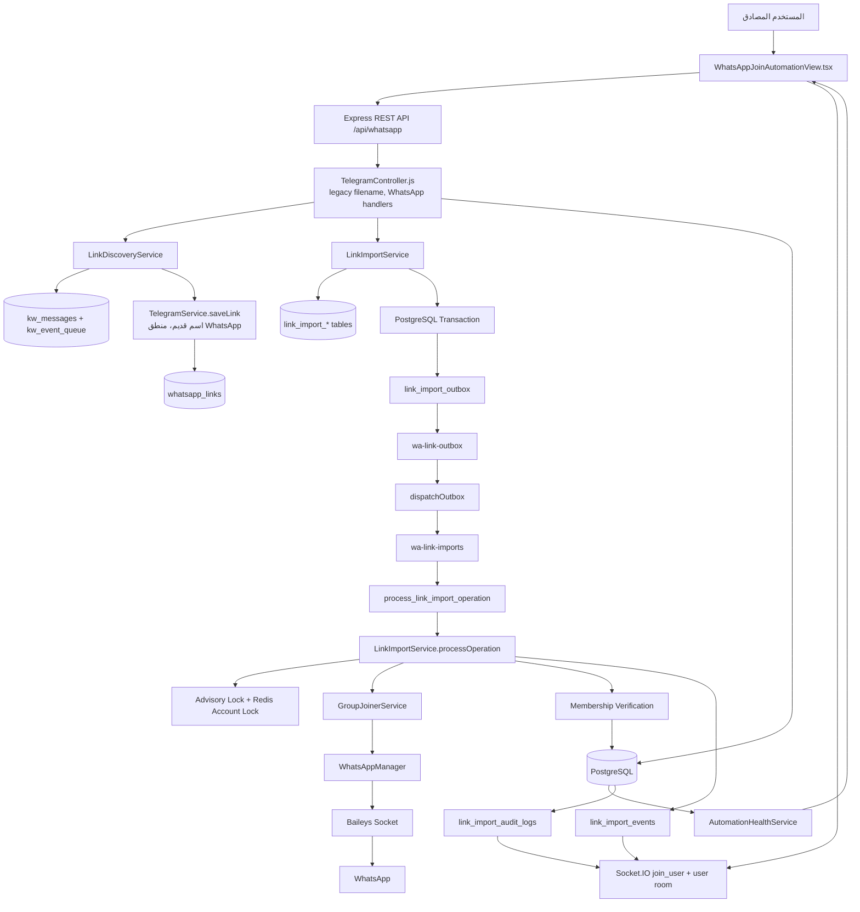
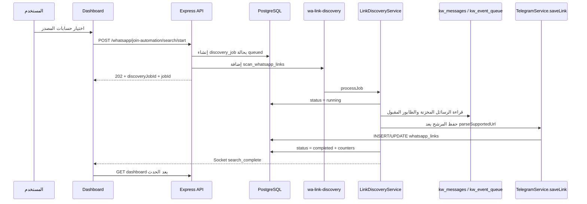
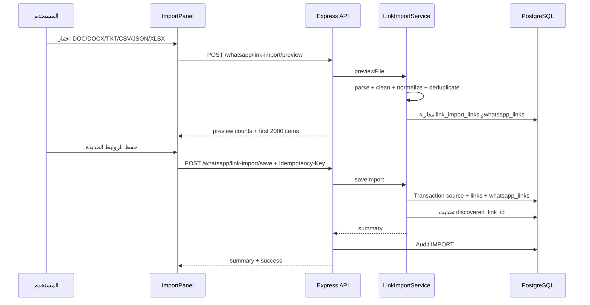
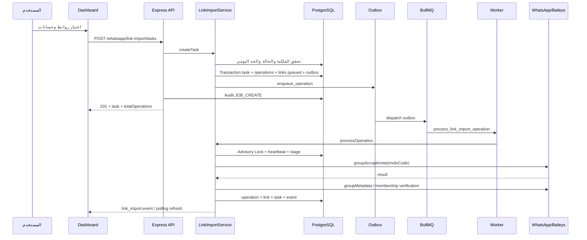
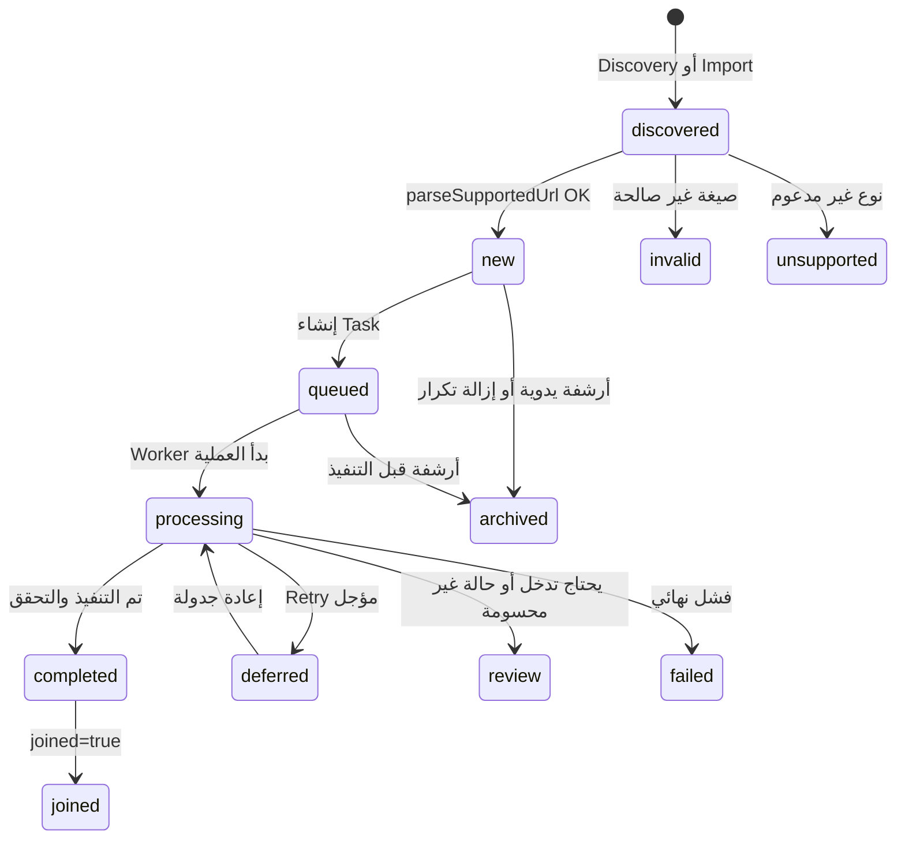
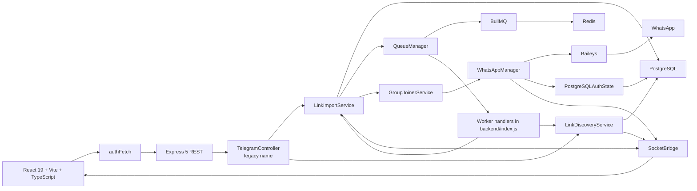
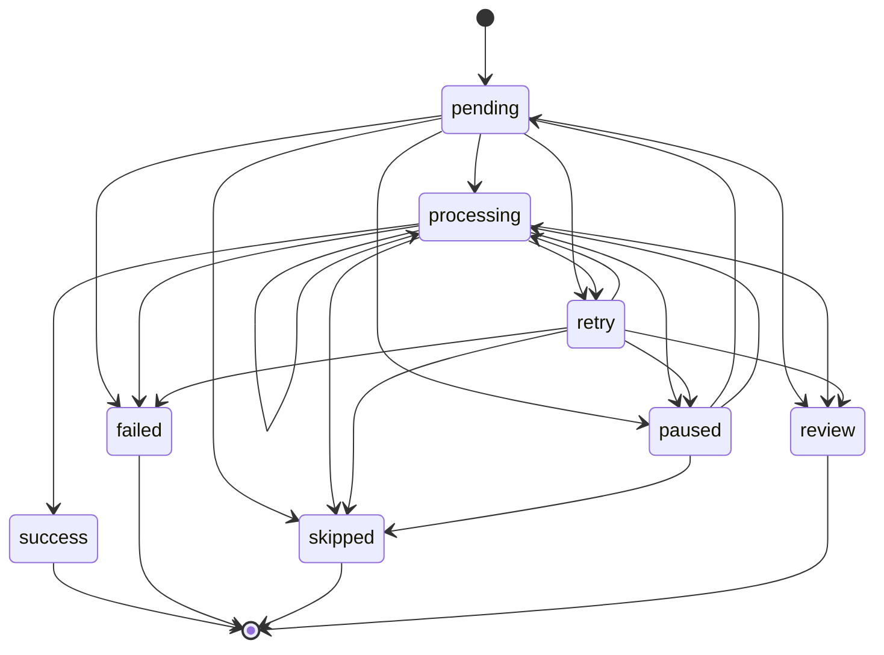
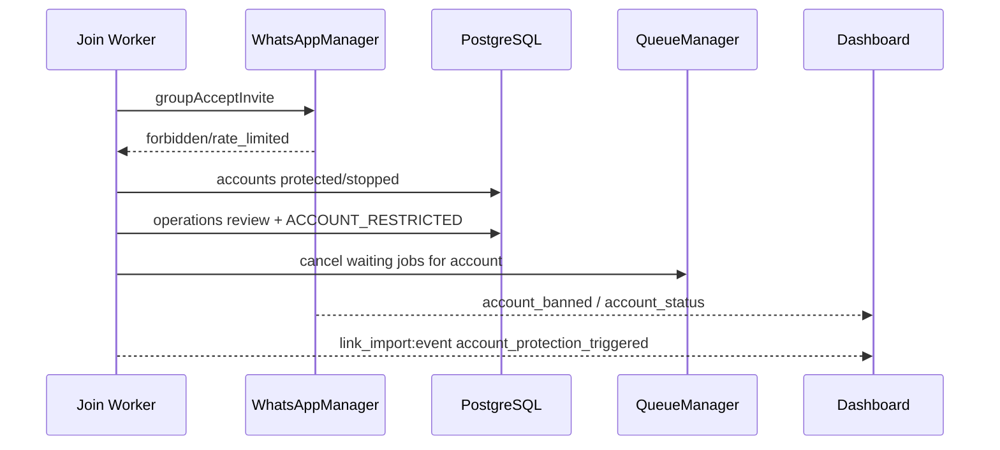
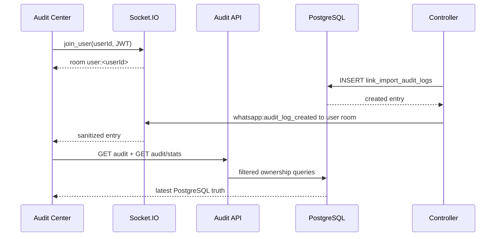

# WHATSAPP_JOIN_LINKS_AUTOMATION

## التوثيق التقني الرسمي لقسم أتمتة الانضمام لروابط WhatsApp

**حالة الوثيقة:** توثيق مبني على الكود الحالي، وليس مواصفة نظرية.  
**تاريخ المراجعة:** 2026-08-25  
**المستودع:** `x781780889-jpg/whatsapp-dashboard-new`  
**النطاق:** واجهة أتمتة الانضمام لروابط WhatsApp، واكتشاف الروابط، واستيرادها، وجدولتها، وتنفيذها بواسطة Baileys وBullMQ، مع التحقق من العضوية والتعافي والتدقيق.  
**الإصدار المرجعي للكود:** Commit `5f9f7df`  
**المؤلف:** Manus AI

> **قاعدة القراءة:** كل ما يرد تحت وسم **CURRENT** موجود أو مستنتج مباشرة من الكود الحالي. كل ما يرد تحت **PARTIALLY IMPLEMENTED** موجود جزئيًا أو توجد فجوة بين أجزاء النظام. كل ما يرد تحت **NOT IMPLEMENTED** أو **NOT FOUND IN CURRENT CODEBASE** لم يُثبت وجوده في الملفات التي تمت مراجعتها. كل ما يرد تحت **PROPOSED** توصية مستقبلية وليس سلوكًا حاليًا.

---

## 1. Executive Summary

### 1.1 النتيجة التنفيذية

قسم **أتمتة الانضمام لروابط WhatsApp** عبارة عن مسار مستقل داخل لوحة التحكم، يبدأ من واجهة React، ويمر عبر REST API محمي بالمصادقة، ثم PostgreSQL كمصدر حقيقة، ثم BullMQ/Redis لتنفيذ الأعمال خارج طلب HTTP، ثم `WhatsAppManager` المبني على Baileys لتنفيذ `groupAcceptInvite` والتحقق من العضوية بعد الانضمام. توجد أيضًا طبقة Outbox وHeartbeat وLease وAdvisory Lock وIdempotency وRecovery لحماية العمليات من التكرار أو فقدان المهمة عند إعادة تشغيل العامل. [1] [2] [3]

تستخدم الصفحة الحالية مساحة العمل `/whatsapp-join-automation`، بينما تستخدم الخدمة مسارات API صريحة تبدأ بـ `/api/whatsapp/...`. بقيت مسارات قديمة تبدأ بـ `/api/telegram/...` للتوافق الخلفي، لكنها تستدعي بعض handlers المشتركة نفسها ولا ينبغي اعتبارها جزءًا من نموذج Telegram Join Automation v2. الفصل التشغيلي الصحيح هو أن Telegram v2 يملك خدماته وطوابيره الخاصة، أما هذا القسم فيعتمد على `LinkImportService` و`LinkDiscoveryService` و`WhatsAppManager`.

### 1.2 التقييم المختصر

| المجال | الحالة الحالية | الملاحظة |
|---|---|---|
| واجهة Dashboard | CURRENT | واجهة RTL كاملة للبحث والاستيراد والفلترة والاختيار والتشغيل والمتابعة. |
| REST API | CURRENT | مجموعة مسارات WhatsApp صريحة، مع بقاء Legacy aliases. |
| مصدر الحقيقة | CURRENT | PostgreSQL للجداول والحالات والعمليات؛ Socket.IO قناة تحديث وليست مصدر حقيقة. |
| التنفيذ الفعلي | CURRENT | Baileys عبر `WhatsAppManager` و`GroupJoinerService`. |
| Queue | CURRENT | BullMQ مع `wa-link-imports`, `wa-link-discovery`, `wa-link-outbox`. |
| التحقق بعد الانضمام | CURRENT | فحص Metadata وأعضاء المجموعة، مع تخزين `membership_state` و`verification_evidence`. |
| Idempotency | CURRENT/PARTIALLY IMPLEMENTED | مدعومة للاستيراد والبحث وإنشاء المهمة، مع Unique constraints وقفل للعملية. |
| Recovery | CURRENT/PARTIALLY IMPLEMENTED | Watchdog كل 30 ثانية، ويفحص العضوية قبل إعادة جدولة العملية العالقة. |
| الإشعارات الخارجية | NOT FOUND IN CURRENT CODEBASE | لا يوجد مسار مثبت لإرسال إشعار مخصص عبر Telegram أو Email أو WhatsApp لهذه الميزة. |
| اختبار WhatsApp حي | UNVERIFIED | لا توجد جلسة اختبار WhatsApp ومجموعة اختبار مملوكة متاحة وقت المراجعة. |

### 1.3 ما لا يثبته هذا التوثيق

نجاح HTTP `202` أو `201` يعني قبول المهمة أو حفظها فقط، ولا يعني أن حساب WhatsApp انضم فعلًا. النتيجة الفعلية تعتمد على Job العامل، ونتيجة `groupAcceptInvite`، ثم تأكيد العضوية عبر `groupMetadata` و`groupFetchAllParticipating` إن كانت متاحة. [2]

---

## 2. Scope

يشمل هذا المستند كل المسارات التي تؤثر مباشرة أو غير مباشرة في التشغيل التالي:

```text
مصدر رسالة WhatsApp أو ملف روابط
    ↓
استخراج مرشح الرابط
    ↓
تنظيف وتطبيع والتحقق
    ↓
حفظ whatsapp_links أو link_import_links
    ↓
اختيار الحسابات والروابط
    ↓
إنشاء Task وOperation
    ↓
PostgreSQL Transaction + Outbox
    ↓
BullMQ / Redis
    ↓
Worker
    ↓
WhatsAppManager / Baileys
    ↓
groupAcceptInvite
    ↓
Membership Verification
    ↓
تحديث العملية والرابط والمهمة
    ↓
Socket.IO + Dashboard Polling
    ↓
Audit Logs وHealth وReports
```

لا يشمل هذا المستند منطق Telegram Join Automation v2 إلا عند المقارنة أو توضيح سبب إبقاء المسارات القديمة. كما لا يشمل إرسال الحملات العامة إلا عندما تتقاطع آلية حماية الحساب المحظور مع حسابات WhatsApp المستخدمة في الانضمام.

---

## 3. Current Architecture

### 3.1 المخطط الفعلي



### 3.2 طبقات النظام

| الطبقة | الملف أو الوحدة | الدور الفعلي |
|---|---|---|
| Frontend page | `frontend/src/views/WhatsAppJoinAutomationView.tsx` | شاشة التشغيل، الاختيار، الفلاتر، الاستيراد، التحكم، والتحديث. |
| Import component | `frontend/src/components/JoinAutomationImportPanel.tsx` | اختيار ملف، إرسال معاينة، عرض النتائج، ثم حفظ الروابط الجديدة. |
| Frontend API | `frontend/src/utils/api.ts` و`frontend/src/utils/linkImport.ts` | JWT Bearer، CSRF للطلبات المعدلة، Refresh تلقائي، وتحويل الملف إلى Base64. |
| Route registration | `frontend/src/App.tsx` | تسجيل `/whatsapp-join-automation` و`/whatsapp-join-automation/audit`. |
| Backend routes | `backend/src/api/routes.js` | ربط مسارات WhatsApp بالـ middleware والـ Controller. |
| Controller | `backend/src/api/controllers/TelegramController.js` | اسم تاريخي؛ يحتوي handlers الحالية للقسم. |
| Import/task service | `backend/src/api/services/LinkImportService.js` | Parsing، الحفظ، المهام، العمليات، Outbox، Recovery، Audit. |
| Discovery service | `backend/src/api/services/LinkDiscoveryService.js` | فحص الرسائل المخزنة واكتشاف روابط WhatsApp. |
| URL service | `backend/src/api/services/LinkUrlProcessingService.js` | تنظيف الرابط، استخراج Invite Code، التطبيع، تصنيف أخطاء الانضمام. |
| Join executor | `backend/src/api/services/GroupJoinerService.js` | تنفيذ الدعوة، التحقق من العضوية، والخروج الاختياري. |
| Session runtime | `backend/src/bot/WhatsAppManager.js` | جلسات Baileys، الاتصال، الجاهزية، QR، reconnect، وحماية الحساب. |
| Queue layer | `backend/src/lib/QueueManager.js` | BullMQ Queues وWorkers وJob options وStats. |
| DB migrations | `backend/src/database/LinkImportMigrations.js` | إنشاء الجداول والفهارس والترقيات المتوافقة. |
| Health | `backend/src/api/services/AutomationHealthService.js` | فحص PostgreSQL وQueue وWorkers والحسابات والنبضات. |
| Realtime | `backend/src/core/SocketBridge.js` | التحقق من JWT للانضمام إلى غرفة `user:<userId>` والبث. |

---

## 4. Dashboard UI

### 4.1 الوصول والتنقل

**CURRENT:** اسم الصفحة البصري هو «أتمتة الانضمام»، وتظهر تحت قسم الروابط في القائمة الجانبية. المسار الأمامي هو `/whatsapp-join-automation`. أضيف مسار Audit Center مستقل هو `/whatsapp-join-automation/audit`، مع رابط من رأس صفحة الأتمتة ومن Sidebar. [4] [5]

تستخدم الصفحة اتجاه RTL، وبطاقات حالة بألوان مختلفة، وحالات Loading وEmpty وError وToast. لا توجد صفحة منفصلة للإدارة الإدارية الخاصة بواتساب؛ API يطبق نطاق المستخدم أو المشرف حسب `req.user.role` و`user_id`.

### 4.2 رأس الصفحة والحالة العامة

| العنصر | السلوك الفعلي |
|---|---|
| العنوان | «أتمتة الانضمام». |
| الرمز | `Bot` من `lucide-react`. |
| رابط Audit | يفتح `/whatsapp-join-automation/audit`. |
| رابط التقارير | يفتح `/join-automation/reports`، وهو مسار تقارير عام مشترك وليس مسار WhatsApp مستقلًا في الواجهة. |
| حالة النظام | تعرض `running` أو `stopped` أو `needs_intervention` وفق workers وHealth. |
| زر «فحص الآن» | يعيد جلب Dashboard وTask من API. |
| دليل الحياة | يعتمد على Queue running، عدد Workers، Heartbeat، وآخر نشاط حقيقي. |

### 4.3 بطاقات الإحصاءات

تعرض الصفحة البطاقات التالية من `dashboard.stats` الحقيقي:

| البطاقة | الحقل أو طريقة الحساب |
|---|---|
| إجمالي الروابط | `stats.total`. |
| روابط صالحة | `stats.valid`. |
| قيد المعالجة | `stats.processing`، ويشمل queued وprocessing. |
| مكتملة | `stats.completed`، وتشمل `joined=true` أو `processing_status='completed'`. |
| فاشلة | `stats.failed`، وتشمل `status='failed'` أو `processing_status IN ('failed','review')`. |
| مؤجلة | `stats.deferred`، وتشمل deferred وpending. |
| الحسابات النشطة | `stats.activeWorkers`. |
| العملية التالية | `nextOperationAt` وتحويلها إلى عد تنازلي محلي. |

### 4.4 الحسابات المراقبة لحظيًا

تستعرض الصفحة حسابات المصدر وحسابات التشغيل مع الاسم ورقم الهاتف إن كان متاحًا وحالة الاتصال والـ Heartbeat وعدد العمليات والأخطاء. الحساب لا يظهر كمؤهل للتشغيل إلا إذا تحقق الآتي في `isEligibleJoinAccount`:

```text
account.status === 'connected'
account.is_ready !== false
health_status ليس blocked أو protected أو stopped
task_status ليس stopped
```

إذا كان الحساب متصلًا في قاعدة البيانات لكن `is_ready=false`، تعرض الصفحة رسالة بأن جلسة WhatsApp ليست جاهزة فعليًا. وإذا كان الحساب محميًا أو متوقفًا، يظهر زر «إعادة التحقق» فقط عندما تكون الجلسة متصلة، ولا يسمح checkbox بإدخاله في المهمة قبل اجتياز شروط الجاهزية.

### 4.5 البحث الحقيقي عن الروابط

يستخدم المستخدم حسابات المصادر، ثم يضغط «بدء البحث». الواجهة ترسل:

```json
{
  "accountIds": ["<ACCOUNT_UUID>"]
}
```

مع `Idempotency-Key` مولد على مستوى الطلب. يستجيب الخادم بحالة `202` و`discoveryJobId` و`jobId` وحالة `queued`. بعد ذلك تظهر حالة Job وعدد الرسائل المفحوصة والروابط المكتشفة عند توفرها.

زر «إيقاف البحث» يرسل `POST /whatsapp/join-automation/search/stop` مع `accountIds`. الإيقاف منطقي عبر تحديث Jobs المفتوحة إلى `stopped`؛ لا توجد آلية مثبتة لإيقاف استدعاء WhatsApp خارجي جارٍ في منتصفه.

### 4.6 استيراد الروابط من ملف

يستخدم `JoinAutomationImportPanel` زر «اختيار ملف الروابط». الصيغ المدعومة فعليًا هي:

| الصيغة | الدعم الحالي |
|---|---|
| `.doc` | CURRENT؛ يستخدم `antiword`، مع fallback محدود إذا كانت الأداة غير مثبتة والملف OLE. |
| `.docx` | CURRENT؛ يقرأ حاوية ZIP وملفات Word XML والعلاقات ويستخرج الروابط. |
| `.txt` | CURRENT؛ يقرأ الملف UTF-8. |
| `.csv` | CURRENT؛ يقسم الأسطر بالفاصلة أو الفاصلة المنقوطة أو Tab. |
| `.json` | CURRENT؛ يقبل Array من القيم أو كائنًا يحتوي `links`. ويدعم مفاتيح `url` أو `link` أو `whatsapp_link` داخل العناصر. |
| `.xlsx` | CURRENT؛ يقرأ جميع الأوراق بواسطة مكتبة `xlsx`. |
| PDF | NOT IMPLEMENTED. |
| Google Sheets/URL خارجي | NOT FOUND IN CURRENT CODEBASE. |

الحد الأقصى لحجم الملف **10MB**. حد قراءة XML الداخلي **40MB**، وحد المعاينة **2000 عنصر**. الملف يرسل إلى Backend كـ Base64 ضمن:

```json
{
  "filename": "links.xlsx",
  "contentBase64": "<BASE64_REDACTED>"
}
```

المعاينة تعرض إجمالي المكتشف، الفريد بعد التنظيف، التكرارات داخل الملف، الموجود مسبقًا، غير الصالح، والجديد. زر الحفظ لا ينفذ الانضمام؛ بل يضيف الروابط إلى قائمة الأتمتة فقط. [6] [7]

### 4.7 فلترة الروابط

توجد فلاتر البحث النصي والحساب والمصدر والتاريخ والحالة. الفلاتر الواجهة تشمل:

- بحث في الرابط أو المصدر أو اسم الحساب.
- اختيار عدة حسابات مصدر.
- اليوم، أمس، آخر 7 أيام، آخر 30 يومًا، أو نطاق مخصص.
- الحالة: صالح، غير صالح، قيد المعالجة، مكتمل، مؤجل، فشل.
- المصدر أو المجموعة.
- إظهار المكتملة أو إخفاؤها افتراضيًا.
- فرز حسب تاريخ الاكتشاف أو آخر تحقق أو الحالة.

يتم طلب الصفحة من Backend بحد أقصى 500 عنصر، بينما تطبق الواجهة فلترة إضافية على النتائج المعادة. هذه نقطة مهمة في قسم الفجوات؛ فالفلترة ليست كلها Server-side في الصفحة الحالية.

### 4.8 جدول الروابط

يعرض الجدول checkbox، الحالة، الرابط، المصدر، الحساب، وقت الاكتشاف، آخر تحقق، العملية التالية، والإجراءات. الإجراءات الفعلية هي:

| الإجراء | Endpoint أو الأثر |
|---|---|
| عرض التفاصيل | `GET /whatsapp/join-automation/links/:id/details`. |
| نسخ الرابط | `navigator.clipboard.writeText` محليًا؛ لا يرسل طلبًا للخادم. |
| إعادة التحقق | `POST /whatsapp/join-automation/links/:id/revalidate`. |
| أرشفة الرابط | تأكيد محلي ثم `PATCH /whatsapp/join-automation/links/:id/archive`. يسجل `LINK_ARCHIVE`. |
| إزالة المكررات | `POST /whatsapp/join-automation/links/deduplicate`. |
| تصدير الروابط | `GET /whatsapp/links/export`. |
| تحديد كل النتائج المطابقة | `GET /whatsapp/join-automation/links/selection` ثم حفظ UUIDs المحددة. |

### 4.9 اختيار حسابات التشغيل

الصفحة تميز بين **حسابات المصدر** التي تبحث في الرسائل، و**حسابات التشغيل** التي تنفذ الانضمام. يمكن للمستخدم تحديد حساب واحد أو عدة حسابات مؤهلة. لا يتم الاعتماد على وجود Socket في الذاكرة وحده؛ `WhatsAppManager.isReady` يتطلب أن تكون الجلسة موجودة وأن تكون قد وصلت إلى `connection === 'open'`.

يوجد زر «تحديد المؤهل»، وزر «إعادة فحص المتصل». إعادة الفحص تزيل وسم الحماية القديم فقط عندما يكون الحساب متصلًا وجاهزًا، ثم تضبط `health_status='unknown'` و`task_status='idle'`.

### 4.10 إعدادات التأخير

تسمح الواجهة بإدخال الحد الأدنى والحد الأقصى والوحدة: ثوانٍ أو دقائق أو ساعات. تحول الواجهة القيم إلى ثوانٍ، ثم يفرض Backend حدودًا إضافية:

| الإعداد | القيمة الافتراضية أو الحد |
|---|---|
| الحد الأدنى | 60 ثانية في إنشاء المهمة إذا لم يرسل المستخدم قيمة. |
| الحد الأقصى | 180 ثانية افتراضيًا، ولا يقل عن الحد الأدنى. |
| الحد الأعلى العام | 86400 ثانية عبر `clampSeconds`. |
| إعادة المحاولة | من إعدادات المستخدم، افتراضيًا 2، وحد أقصى 5. |
| Backoff | افتراضيًا 15 ثانية، وحد أقصى 3600 ثانية. |
| أولوية Queue | من 1 إلى 10، افتراضيًا 5. |
| الحد اليومي | من 1 إلى 5000، افتراضيًا 10 عملية لكل حساب. |
| حماية الحد اليومي | اختيارية، معطلة افتراضيًا؛ عند تفعيلها فقط تمنع quota المهمة الإنشاء. حماية الحظر وRate Limit تبقى مستقلة. |

يوجد مساران مختلفان للتأخير. المسار الحالي durable يستخدم `JoinScheduler` و`DelayEngine` لاختيار قيمة صحيحة داخل النطاق. ويوجد مسار قديم في `GroupJoinerService.scheduleAutoJoin` يستخدم وضع delayed مع Jitter بين 90% و110% ثم `_safeDelay` بين 3 و8 ثوانٍ؛ هذا المسار الذاكري ليس مسار صفحة الأتمتة الحالي.

### 4.11 التحكم بالمهمة

الواجهة الحالية تدعم حالات «إيقاف مؤقت»، «استئناف»، و«إيقاف كامل» عبر `PATCH /whatsapp/link-import/tasks/:taskId` مع:

```json
{ "status": "paused" }
```

أو:

```json
{ "status": "pending" }
```

أو:

```json
{ "status": "stopped" }
```

الإيقاف الكامل يحول العمليات المعلقة إلى `skipped` مع `TASK_STOPPED`. ولا يسمح State Machine باستئناف Task متوقفة نهائيًا.

### 4.12 Audit Center

المسار `/whatsapp-join-automation/audit` يعرض السجل الحقيقي من PostgreSQL، وليس بيانات mock. يحتوي على KPI، رسم آخر 14 يومًا، توزيع الإجراءات، فلاتر، Pagination، تفاصيل Before/After، وتصدير CSV. يستعمل `authFetch` ويقرأ:

```text
GET /whatsapp/join-automation/audit
GET /whatsapp/join-automation/audit/stats
GET /whatsapp/join-automation/audit/:id
GET /whatsapp/join-automation/audit/export
```

عند وصول `whatsapp:audit_log_created` تعيد الصفحة تحميل القائمة والإحصاءات. Socket.IO هنا قناة تنبيه، أما PostgreSQL فهو مصدر الحقيقة.

---

## 5. User Flow

### 5.1 تدفق اكتشاف الرسائل



### 5.2 تدفق الاستيراد



### 5.3 تدفق إنشاء وتنفيذ مهمة



---

## 6. Link Input

### 6.1 مصدر الرسائل الحقيقي

يتم حفظ رسائل WhatsApp التي تصل عبر `messages.upsert`، وكذلك الرسائل التي تصل ضمن `messaging-history.set`، بواسطة `KeywordMonitoringService.persistMessageForDiscovery`. تحفظ البيانات في `kw_messages` وتدخل الرسائل الجديدة في `kw_event_queue` مع Heartbeat في `kw_service_health`. [8]

عند بدء Discovery، يقرأ `LinkDiscoveryService` الرسائل من `kw_messages`، ثم يضيف الرسائل الموجودة في `kw_event_queue` بحالات `received` أو `retry` أو `processing` إذا لم تكن موجودة بالفعل بنفس `message_id`. هذا يعالج نافذة السباق التي يبدأ فيها البحث قبل أن ينتهي عامل Keyword من نقل الرسالة إلى جدول الرسائل.

### 6.2 أنواع النصوص التي تبحث فيها Discovery

تستخرج الخدمة النص من الحقول التالية عند توفرها:

- `conversation`.
- `extendedTextMessage.text`.
- `imageMessage.caption`.
- `videoMessage.caption`.
- `documentMessage.caption`.
- `buttonsResponseMessage.selectedDisplayText`.
- `listResponseMessage.title`.

### 6.3 ملفات الاستيراد

الحد الحالي للملف 10MB. ملفات DOCX تقرأ XML من `document`, `header`, `footer`, `footnotes`, و`endnotes`، كما تقرأ علاقات Word لاستخراج Targets HTTP/HTTPS. ملفات DOC تعتمد على `antiword` أو fallback محدود للملفات OLE. لا يوجد رفع مباشر إلى S3 لهذا المسار؛ الملف يمر من المتصفح إلى API كـ Base64.

### 6.4 الإدخال اليدوي المباشر

**NOT FOUND IN CURRENT CODEBASE:** لم يثبت وجود حقل مستقل في `WhatsAppJoinAutomationView.tsx` لإدخال رابط واحد نصيًا من دون ملف أو Discovery. المسار الحالي يركز على الروابط المكتشفة والمستوردة، مع وجود خدمات Backend قادرة على استقبال روابط محفوظة عبر جداولها.

---

## 7. Link Validation

### 7.1 Pipeline الفعلي

```text
Raw message/file value
    ↓
cleanCandidate
    ↓
extractUrls عند النص
    ↓
new URL(candidate)
    ↓
التحقق من protocol
    ↓
التحقق من hostname
    ↓
استخراج أول pathname segment
    ↓
INVITE_CODE_RE = [A-Za-z0-9_-]{6,}
    ↓
canonicalUrl = https://chat.whatsapp.com/<inviteCode>
    ↓
urlHash SHA-256 محسوب في الخدمة
    ↓
parseMany deduplication
    ↓
Database lookup
```

### 7.2 نوع الرابط المقبول فعليًا

`LinkUrlProcessingService.parseSupportedUrl` يقبل `http` أو `https` مع hostname يساوي `chat.whatsapp.com`، ويستخرج Invite Code لا يقل عن 6 أحرف من `[A-Za-z0-9_-]`. الرابط النهائي يوحد إلى:

```text
https://chat.whatsapp.com/<inviteCode>
```

يحسب الكود أيضًا `urlHash` بواسطة SHA-256، لكن جدول `link_import_links` لا يحتوي عمود hash مستخدمًا؛ لذا فإن منع التكرار الحالي يعتمد على `canonical_url` وUnique constraints، وليس على تخزين hash.

### 7.3 فرق الاكتشاف عن الحفظ

يستخدم `LinkDiscoveryService` نمطًا مرشحًا أوسع:

```regex
https?://(?:chat\.whatsapp\.com|wa\.me|api\.whatsapp\.com/send)...
```

لكن `TelegramService.saveLink` يعيد تمرير المرشح إلى `parseSupportedUrl`، ولا يحفظه إذا كان Unsupported أو Invalid. لذلك فإن `wa.me` و`api.whatsapp.com/send` قد يظهران كمرشحات مكتشفة أثناء المسح، لكنهما ليسا روابط دعوة قابلة للتشغيل في المسار الحالي. [9]

### 7.4 نتائج المعاينة

| `parseMany` result | حالة المعاينة | المعنى |
|---|---|---|
| `ok=true` ورابط غير موجود | `new` | رابط صالح وجديد للمستخدم. |
| `ok=true` ورابط موجود | `existing` | رابط موجود في `link_import_links` أو `whatsapp_links`. |
| `code=UNSUPPORTED_LINK` | `unsupported` | يحتاج مراجعة ولا يدخل كدعوة قابلة للتشغيل. |
| أي خطأ آخر | `invalid` | صيغة أو Invite Code غير صالح. |

---

## 8. Supported Link Types

| النوع | الحالة الفعلية |
|---|---|
| WhatsApp Group Invite عبر `chat.whatsapp.com` | CURRENT؛ النوع الأساسي المدعوم. |
| Community link مستقل | NOT IMPLEMENTED؛ لا يوجد parser أو executor مستقل للمجتمعات. |
| `wa.me` | مرشح Discovery فقط؛ لا يحفظه `saveLink` كدعوة قابلة للتشغيل. |
| `api.whatsapp.com/send` | مرشح Discovery فقط؛ لا يدعم الانضمام. |
| رابط HTTP/HTTPS خارج WhatsApp | UNSUPPORTED_LINK. |
| رابط بلا Invite Code صالح | INVALID_LINK. |
| رابط منتهي أو ملغى | لا يمكن اكتشافه كحالة مبكرة دائمًا؛ يصنف أثناء محاولة WhatsApp حسب النتيجة كـ `invalid_link` أو `expired_link`. |
| رابط مكرر | لا ينشئ سجلًا جديدًا؛ يزيد `duplicate_count` في `whatsapp_links`. |
| الحساب منضم مسبقًا | نتيجة تنفيذ ناجحة idempotent بحالة `already_joined` و`membership_state='ALREADY_MEMBER'`. |

---

## 9. Duplicate Prevention

### 9.1 منع تكرار الرابط

يتم تنظيف الرابط وإزالة علامات الاقتباس والنقاط النهائية، ثم توحيده إلى `canonicalUrl`. داخل `parseMany` تستخدم الخدمة Set محليًا لتجنب تكرار الرابط داخل نفس الملف أو النص. في قاعدة البيانات توجد:

```sql
UNIQUE(user_id, canonical_url)
```

في `link_import_links`، بينما يستخدم `whatsapp_links` تعارضًا على `whatsapp_link` في `INSERT ... ON CONFLICT`. عند التعارض يزيد `duplicate_count` ويحدّث `last_seen` ويضيف المصدر إلى `source_history` مع حد أقصى تاريخي 100 عنصر تقريبًا.

### 9.2 منع تكرار المهمة

يدعم `saveImport` و`createTask` و`startJoinAutomationSearch` قيمة `Idempotency-Key` من HTTP header أو `requestId` في Body. لكل مستخدم يوجد Unique index جزئي:

```text
link_import_sources(user_id, request_id)
link_import_tasks(user_id, request_id)
join_automation_discovery_jobs(user_id, request_id)
```

عند إعادة نفس الطلب يعيد الخادم السجل السابق ويضع `idempotent=true` بدل إنشاء Task جديدة.

### 9.3 منع تكرار Account × Link

ينشئ `createTask` مفتاحًا منطقيًا:

```text
join:<userId>:<taskId>:<accountId>:<linkId>
```

كما توجد قيود:

```sql
UNIQUE(task_id, account_id, link_id)
UNIQUE(idempotency_key) WHERE idempotency_key IS NOT NULL
```

هذا يمنع تكرار نفس العملية داخل Task واحدة، لكنه لا يمنع إنشاء Tasks مختلفة لنفس Account × Link ما لم يستخدم العميل Idempotency-Key نفسه على مستوى الطلب أو تتحقق طبقة أعمال إضافية من وجود Task سابقة.

### 9.4 منع تكرار Job

`QueueManager.enqueueLinkImportOperation` يستخدم Job ID افتراضيًا `link-import-<operationId>`، لكن حالات retry والانتظار اليدوي قد تستخدم Job IDs متميزة تحتوي على timestamp. الحماية الأساسية ليست BullMQ Job ID وحده؛ بل حالة العملية في PostgreSQL وAdvisory Lock وAccount Lock.

### 9.5 الحماية من Double Worker

يستخدم `processOperation`:

1. Advisory Lock على مفتاح مشتق من user/link/account/operation.
2. `wait:false`؛ إذا كان القفل مشغولًا يعاد إدراج Job بعد 5 ثوانٍ.
3. داخل المسار قفل حساب Redis بمفتاح `wa:link-import:account:<accountId>` لمدة 120 ثانية مع NX.
4. عند تعذر Redis يستخدم fallback in-memory داخل نفس process فقط.

**PARTIALLY IMPLEMENTED:** fallback in-memory ليس قفلًا موزعًا بين replicas. الضمان الأقوى في multi-replica هو PostgreSQL Advisory Lock، لكن نجاحه يعتمد على توفر جلسة قاعدة البيانات واستقرارها.

---

## 10. Link Lifecycle

### 10.1 دورة سجل الرابط



### 10.2 حالات `whatsapp_links` المستخدمة

| الحقل | القيم الملاحظة في الكود |
|---|---|
| `status` | `new`, `queued`, `joined`, `failed`, `review`, `invalid`, `archived`, وقد تظل قيم `valid` أو `unavailable` من مسارات قديمة. |
| `processing_status` | `new`, `queued`, `processing`, `completed`, `deferred`, `failed`, `review`, `archived`, `pending`. |
| `joined` | Boolean؛ يصبح true بعد نتيجة مؤكدة. |
| `membership_state` | يكتب عند توفر العمود: `JOINED`, `ALREADY_MEMBER`, `JOIN_PENDING`, `UNKNOWN`. |
| `last_operation_id` | يربط آخر عملية بالمعرف. |
| `next_operation_at` | وقت العملية المجدولة أو retry. |
| `last_error` | آخر سبب فشل أو مراجعة. |

### 10.3 حالات Operation الدقيقة

`JoinScheduler` يعرّف مجموعة الحالات التالية:

```text
pending, processing, retry, paused, success, failed, skipped, review
```

والحالات النهائية هي:

```text
success, failed, skipped, review
```

لا تعتبر `retry` نجاحًا أو فشلًا نهائيًا. ولا تعتبر `review` مساوية لنجاح الانضمام؛ هي حالة تتطلب مراجعة.

---

## 11. Account Selection

### 11.1 حسابات المصدر

تتحقق `LinkDiscoveryService.ownedSources` من أن كل Account ID مطلوب موجود في جدول `accounts`، وأن الحساب يخص المستخدم الحالي، أو أن الطلب إداري. لا تقبل الخدمة قائمة فارغة. البحث لا يفتح جلسة جديدة بحد ذاته؛ يفحص الرسائل المخزنة التي وصلت من الحساب.

### 11.2 حسابات التشغيل

تتحقق `LinkImportService.ownedAccounts` من:

- وجود قائمة غير فارغة.
- إزالة التكرارات من Account IDs.
- وجود الحسابات في `accounts`.
- ملكية الحساب للمستخدم، إلا للمشرف.

ثم يرفض إنشاء المهمة إذا وجد حساب:

- `status='banned'`.
- `health_status IN ('blocked','protected')`.
- `task_status='stopped'`.
- `status` مختلف عن `connected`.

بعد ذلك تطبق `accountSettings[accountId].enabled !== false` لاستبعاد الحساب المعطل من إعداداته الشخصية.

### 11.3 التوزيع

تدعم الخدمة الحالية وضعين:

| الإعداد | النتيجة |
|---|---|
| `applyAllLinksToAllAccounts=true` أو غيابه | `distribution_mode='all_accounts'`، ينشئ عملية لكل علاقة Account × Link. |
| `applyAllLinksToAllAccounts=false` | `distribution_mode='round_robin'`، يوزع الروابط بالتناوب على الحسابات. |

الحسابات لا تختار رابطًا جديدًا أثناء التنفيذ؛ الأزواج تثبت عند إنشاء Task. لا يوجد Load Balancer ديناميكي يبدل الحساب بعد فشل حساب آخر، لكن توجد حماية توقف الحساب المقيد وتمنع استمرار عملياته.

### 11.4 الحد اليومي

تحسب الخدمة عدد `link_import_operations` لكل حساب منذ `CURRENT_DATE`، ثم تضيف العمليات المخططة. إذا تجاوز أي حساب `daily_operation_limit` وكانت `daily_limit_protection_enabled=true` تفشل المهمة قبل إنشاء Transaction؛ أما عند التعطيل فتستمر المهمة مع بقاء حماية الحظر وRate Limit وForbidden فعالة. القيمة الافتراضية 10 والحد الأعلى 5000، والحماية معطلة افتراضيًا.

### 11.5 استبعاد الحساب غير الجاهز أثناء التنفيذ

حتى بعد إنشاء Task، يعيد العامل فحص `accounts` قبل العملية. إذا كان الحساب غير موجود، أو غير متصل، أو محميًا، أو متوقفًا، تحول العمليات المرتبطة به إلى `review` مع `ACCOUNT_UNAVAILABLE`. هذا الفحص يمنع الاعتماد على حالة قديمة من واجهة Dashboard.

---

## 12. Queue System

### 12.1 أسماء الطوابير

| الاسم الثابت | الاسم الفعلي في Redis/BullMQ | الغرض |
|---|---|---|
| `QUEUES.LINK_IMPORTS` | `wa-link-imports` | تنفيذ Account × Link. |
| `QUEUES.LINK_DISCOVERY` | `wa-link-discovery` | مسح الرسائل واكتشاف الروابط. |
| `QUEUES.LINK_OUTBOX` | `wa-link-outbox` | إرسال أحداث Outbox إلى Queue التنفيذ. |
| `QUEUES.CAMPAIGNS` | `wa-campaigns` | مشترك عام للحملات، ليس جزءًا من join pipeline. |
| `QUEUES.SYNC` | `wa-sync` | مزامنة المجموعات وجهات الاتصال. |
| `QUEUES.NOTIFICATIONS` | `wa-notifications` | إشعارات داخلية عامة. |

### 12.2 Workers

| Worker | Concurrency | Limiter | Job name |
|---|---:|---|---|
| `wa-link-imports` | 1 | 1 في الثانية | `process_link_import_operation` |
| `wa-link-discovery` | 1 | لا يوجد limiter خاص | `scan_whatsapp_links` |
| `wa-link-outbox` | 1 | لا يوجد limiter خاص | `dispatch_link_import_outbox` |
| `wa-campaigns` | من `CAMPAIGN_CONCURRENCY`، الافتراضي 3 | 5 رسائل/ثانية | أنواع الحملات |
| `wa-sync` | من `SYNC_CONCURRENCY`، الافتراضي 5 | لا يوجد | `sync_groups` وغيرها |

### 12.3 Job structure

Job تنفيذ العملية يحمل عادة:

```json
{
  "taskId": "<TASK_UUID>",
  "operationId": "<OPERATION_UUID>",
  "accountId": "<ACCOUNT_UUID>",
  "linkId": "<LINK_UUID>"
}
```

ويضيف العامل `jobId` و`workerId` إلى `processOperation`. Job Discovery يحمل `discoveryJobId`, `userId`, `sourceAccountIds`, و`isAdmin`.

### 12.4 Retry داخل BullMQ وداخل الخدمة

`QueueManager` يملك Defaults عامة: 3 attempts وExponential backoff 3000ms. لكن `enqueueLinkImportOperation` يرسل `attempts: 1` افتراضيًا، ولذلك فإن Retry المنطقي للانضمام يدار في `LinkImportService` عبر `status='retry'`، `next_retry_at`، وJob جديد بتأخير `retryBackoffSeconds`. هذا فصل مقصود بين إعادة Job البنيوية وإعادة عملية الانضمام.

### 12.5 Outbox

يكتب إنشاء Task العمليات وتحديث الروابط وOutbox ضمن Transaction واحدة. يسجل Outbox `aggregate_type='operation'` و`aggregate_id=operationId` و`event_type='enqueue_operation'` وPayload العملية. عند Dispatch:

1. Claim ذري يحول السجل من `PENDING` إلى `PROCESSING`.
2. يكتب `worker_id` وLease لمدة دقيقتين.
3. يضيف Job إلى `wa-link-imports`.
4. يحدّث Outbox إلى `PROCESSED`.
5. يكتب `queue_job_id` في العملية.
6. يسجل أحداث Queue في `link_import_events`.

إذا فشل Dispatch، يعود Outbox إلى `PENDING` مع تأخير يبدأ من 30 ثانية ويزيد حتى 3600 ثانية تقريبًا وفق عدد المحاولات.

### 12.6 إلغاء Jobs

`cancelAccountLinkImportJobs` يزيل Jobs في `waiting` أو `delayed` أو `prioritized` المرتبطة بالحساب. لا يزيل Job النشط مباشرة. إيقاف Task يعتمد أساسًا على تحديث PostgreSQL، والعامل يفحص `task.status` قبل متابعة المراحل.

### 12.7 Dead Letter Queue

**NOT FOUND IN CURRENT CODEBASE:** لا توجد Queue مستقلة باسم Dead Letter. توجد سجلات BullMQ failed، وحالات Operation النهائية `failed` و`review`، وحقول Outbox مثل `last_error`، لكنها ليست Dead Letter Queue مستقلة ذات سياسة إعادة معالجة منفصلة.

---

## 13. Worker System

### 13.1 تسجيل الـ handlers

يسجل `backend/index.js` handlers قبل تشغيل `QueueManager`:

```text
wa-link-imports::process_link_import_operation
wa-link-discovery::scan_whatsapp_links
wa-link-outbox::dispatch_link_import_outbox
```

ويستدعي كل handler الخدمة المسؤولة. إذا وصل Job بلا handler، يرمي `QueueManager` خطأ `No handler for <queue>::<job>` وتظهر نتيجة فشل Job.

### 13.2 مراحل العامل

المراحل الممكنة في `processOperationCore` هي:

```text
pending
joining
wait_after_join
publishing
wait_after_publish
leaving
wait_after_leave
completed
failed
```

ويحدث العامل `heartbeat_at` و`lease_expires_at` عند الانتقال أو أثناء العملية. أثناء طلب الانضمام، يستخدم `withOperationHeartbeat` تحديثًا كل 30 ثانية، ويضع Timeout مدته 90 ثانية لطلب الانضمام الفعلي.

### 13.3 التزامن

يوجد Worker واحد لـ `wa-link-imports`، بالإضافة إلى Account-level Redis Lock وPostgreSQL Advisory Lock. النتيجة أن عمليات الحسابات لا تنفذ بالتوازي داخل نفس العامل، ولا يفترض النظام أن Dashboard المفتوحة مسؤولة عن بقاء العملية.

**PARTIALLY IMPLEMENTED:** `max_concurrent_jobs` محفوظ في `join_automation_settings`، لكن Worker العام مضبوط على `concurrency: 1` ولا يوجد تنفيذ يضبط Concurrency مستقلًا لكل مستخدم أو حساب.

---

## 14. Join Operation

### 14.1 التنفيذ الفعلي

`GroupJoinerService._doJoin` ينفذ الآتي:

1. الحصول على Socket من `WhatsAppManager.getSession(accountId)`.
2. التحقق من `WhatsAppManager.isReady(accountId)`.
3. استخراج Invite Code.
4. استدعاء `sock.groupAcceptInvite(code)`.
5. إذا أعاد WhatsApp Group ID، تشغيل `_confirmMembership`.
6. عند التأكيد يعيد `success=true`, `status='joined'`, `confirmed=true`, `groupId`, و`selfJid`.

إذا أعاد WhatsApp خطأ «منضم مسبقًا» يحاول `groupGetInviteInfo` ثم `_confirmMembership`. إذا تأكدت العضوية، يعيد `success=true` و`status='already_joined'`.

### 14.2 Membership Verification

يتحقق `_confirmMembership` من هوية الحساب عبر `sock.user.id` و`lid` و`jid` وCredentials، ثم يقرأ `groupMetadata(groupId)` ويبحث عن الحساب ضمن المشاركين. وعند توفر `groupFetchAllParticipating` يتأكد أيضًا من ظهور المجموعة ضمن المجموعات المشاركة.

يحفظ العامل:

```json
{
  "membership_state": "JOINED",
  "verification_evidence": {
    "confirmed": true,
    "groupId": "<GROUP_ID>",
    "selfJid": "<JID_REDACTED_OR_NORMALIZED>",
    "verifiedAt": "<ISO_TIMESTAMP>",
    "source": "whatsapp_group_metadata"
  }
}
```

يجب عدم وضع Session أو Token أو مفاتيح Baileys داخل هذا الحقل. الكود الحالي لا يضع مواد المصادقة فيه.

### 14.3 النشر والمغادرة الاختيارية

يدعم Backend Workflow باسم `staged` إذا أرسلت `adLibraryIds`، ويستطيع بعد الانضمام نشر الإعلانات عبر `BroadcastController._sendOne`، ثم الانتظار، ثم الخروج من المجموعة إذا كان `leaveEnabled=true` وكان الانضمام من تنفيذ العملية نفسها. الوضع الافتراضي `join_only`، و`leave_status` الافتراضي `skipped`.

**PARTIALLY IMPLEMENTED:** هذه الإمكانات موجودة في Backend وSchema، لكن عناصر التحكم التفصيلية لا تظهر كلها في واجهة WhatsApp الحالية؛ لا ينبغي اعتبار واجهة staged publishing مكتملة إلا بعد مراجعة UI مستقلة.

---

## 15. Delay and Scheduling

### 15.1 القيم المحفوظة

يحفظ `join_automation_settings` و`link_import_tasks`:

```text
min_delay_seconds
max_delay_seconds
retry_backoff_seconds
queue_priority
wait_after_join_seconds
wait_after_publish_seconds
wait_after_leave_seconds
```

### 15.2 الخوارزمية الحالية للمسار durable

`JoinScheduler.schedule` يستدعي `DelayEngine.nextDelay(minDelaySeconds, maxDelaySeconds, random)` ثم يحسب `scheduledAt`. `DelayEngine` يطبع القيم إلى نطاق صحيح، يضمن أن min لا يتجاوز max، ويستخدم قيمة عشوائية داخل النطاق الشامل.

إذا لم يرسل المستخدم تأخيرًا محددًا، تستخدم `scheduleNextOperation` إعدادات Task وتكتب `scheduled_at` في العملية و`next_operation_at` في `whatsapp_links` ثم تنشئ Outbox.

### 15.3 التأخير بعد المراحل

`waitAndContinue` يكتب بداية الانتظار في `wait_started_at`، يسجل Event، وينشئ Job مؤجلًا بمدة الثواني المطلوبة. بعد عودة Job يكتب `wait_completed_at` ثم ينتقل إلى المرحلة التالية.

### 15.4 القيم غير الموجودة

**NOT FOUND IN CURRENT CODEBASE:** لا توجد جدولة Cron للمستخدمين لهذه العمليات، ولا Scheduler مستقل يعرض تقويمًا؛ الجدولة الحالية هي Delay/Job delay وTask fields. كما لا يوجد دليل على Account cooldown منفصل عن التأخير والحد اليومي.

---

## 16. Error Handling

| الخطأ أو الحالة | كيف تكتشف | الإجراء الفعلي | Retry | الحالة النهائية المحتملة |
|---|---|---|---|---|
| رابط فارغ | `EMPTY_INPUT` | رفض المعاينة أو الإدخال. | لا | invalid |
| صيغة URL خاطئة | `INVALID_FORMAT` | رفض الرابط. | لا | invalid |
| Host غير مدعوم | `UNSUPPORTED_LINK` | يعرض للمراجعة ولا يحفظ كدعوة قابلة للتشغيل. | لا | unsupported/review |
| Invite Code ناقص | `INVALID_LINK` | رفض قبل Queue. | لا | invalid |
| رابط منتهي/ملغى | خطأ WhatsApp أو 404/Invite error | تصنيف كرابط غير متاح. | لا | failed أو review حسب السياق |
| الحساب غير متصل | `account.status !== connected` أو Socket غير جاهز | يمنع إنشاء Task أو يحول العملية إلى review. | Retry محدود إذا ظهر أثناء التنفيذ كـ account_offline. | review/retry |
| جلسة غير جاهزة | `isReady=false` | يمنع التنفيذ. | نعم في نتيجة `_doJoin` إذا كانت حالة مؤقتة. | retry/review |
| Already joined | matching `already/member/409` ثم Membership Verification | نجاح idempotent وتخزين `ALREADY_MEMBER`. | لا | success |
| Pending approval | matching pending/approval | لا يكرر الطلب تلقائيًا. | لا | review |
| Rate limit | matching 429/throttle | يحمي الحساب ويوقفه. | لا في `_doJoin` الحالي عند التصنيف النهائي. | review + protected |
| Forbidden/blocked/banned | 403 أو كلمات المنع | `health_status='protected'`, `task_status='stopped'`, إيقاف عمليات الحساب. | لا | review |
| Timeout | 90 ثانية في `withTimeout` | يعيد نتيجة retryable. | حسب max retries. | retry أو failed |
| Network temporary | connection/socket/500/502/503/504 | يعيد retryable. | نعم | retry ثم failed/review |
| Membership غير مؤكدة | لا يظهر الحساب داخل Metadata | يعيد retryable، ولا يعلن نجاحًا. | نعم | retry أو review |
| فشل النشر | `publishAds` يعيد failed | يسجل النتائج ويغادر أو يحول إلى review حسب الإعداد. | لا يوجد Retry publish مستقل مثبت. | review/failed |
| فشل الخروج | `leaveGroup` يرمي أو يعيد false | يسجل leave_failed. | لا يوجد Retry مستقل مثبت. | review |
| خطأ DB | فشل query | استجابة 400/500 حسب Handler أو فشل Worker. | يعتمد على الطبقة. | failed أو job failed |
| Worker بلا handler | `_dispatch` | يرمي خطأ واضحًا. | BullMQ defaults قد تتعامل معه، لكن Join operation نفسها attempts=1. | failed |

### 16.1 تصنيف الأخطاء

`LinkUrlProcessingService.classifyJoinError` يعيد `status`, `errorCode`, `category`, `retryable`, `severity`, و`userMessage`. بعض المسارات في `GroupJoinerService._doJoin` تصنف الأخطاء مباشرة وتعيد بنية مشابهة، لذلك يوجد تداخل بين التصنيف العام والتصنيف التنفيذي.

**PARTIALLY IMPLEMENTED:** توجد ازدواجية بين `classifyJoinError` وRegex داخل `_doJoin`. قد يؤدي ذلك إلى اختلاف اسم الحالة بين مسار وآخر، خصوصًا في `rate_limited`, `account_restricted`, `expired_link`, و`invalid_link`.

---

## 17. Retry System

### 17.1 القواعد الحالية

الإعدادات الافتراضية هي `retry_count=2` و`retry_backoff_seconds=15`. يقرأ العامل `operation.attempt_count` و`operation.max_retries` الموروث من Task. بعد فشل retryable، إذا كان:

```text
attempt_count < max_retries
```

يحول العملية إلى `retry` ويكتب `next_retry_at` وينشئ Job مؤجلًا. إذا استنفدت المحاولات، يستدعي `failOperation` ويحول العملية عادة إلى `failed` أو `review`.

### 17.2 ما لا يعاد تلقائيًا

لا يعاد تلقائيًا عادةً:

- الرابط غير الصالح.
- الرابط المنتهي أو الملغى.
- Pending approval.
- Forbidden أو blocked أو banned.
- الحساب المحمي أو المتوقف.
- Already joined المؤكد؛ يعامل كنجاح بدل Retry.

### 17.3 إعادة المحاولة اليدوية

`POST /whatsapp/link-import/operations/:operationId/retry` يتحقق من ملكية العملية، ثم يعيد الحقول الأساسية إلى pending، ويمسح الخطأ و`completed_at` وأزمنة المراحل، ثم يستدعي `scheduleNextOperation` بتأخير صفر. لا يسمح المسار الحالي بإعادة محاولة Operation نهائية إذا لم تكن مملوكة للمستخدم.

---

## 18. Database

### 18.1 جدول `link_import_sources`

| العمود | النوع | الدور |
|---|---|---|
| `id` | UUID PK | مصدر عملية الاستيراد. |
| `user_id` | UUID | مالك الاستيراد. |
| `filename` | TEXT | اسم الملف. |
| `file_size_bytes` | INT | الحجم. |
| `total_found` | INT | إجمالي القيم المقروءة. |
| `new_count` | INT | الروابط الجديدة. |
| `duplicate_count` | INT | التكرارات. |
| `invalid_count` | INT | غير الصالحة. |
| `review_count` | INT | Unsupported أو مراجعة. |
| `processing_ms` | INT | مدة التحليل/الحفظ. |
| `status` | VARCHAR(20) | غالبًا processing ثم completed. |
| `request_id` | TEXT | Idempotency للمستخدم. |
| `created_at` | TIMESTAMPTZ | وقت الإنشاء. |

### 18.2 جدول `link_import_links`

| العمود | النوع | الدور |
|---|---|---|
| `id` | UUID PK | هوية سجل الرابط المستورد. |
| `user_id` | UUID | مالك الرابط المستورد. |
| `source_id` | UUID FK | مصدر الاستيراد، ON DELETE SET NULL. |
| `discovered_link_id` | UUID | رابط `whatsapp_links` المادي، دون FK صريح في Migration الحالية. |
| `url` | TEXT | الرابط الأصلي. |
| `canonical_url` | TEXT | الرابط الموحد. |
| `invite_code` | TEXT | Invite Code. |
| `validation_status` | VARCHAR(20) | الافتراضي valid. |
| `last_status` | VARCHAR(30) | آخر حالة عملية. |
| `last_error` | TEXT | آخر خطأ. |
| `created_at`, `updated_at` | TIMESTAMPTZ | التتبع الزمني. |
| Unique | `(user_id, canonical_url)` | منع تكرار المستخدم نفسه. |

### 18.3 جدول `link_import_tasks`

| العمود | النوع | الدور |
|---|---|---|
| `id` | UUID PK | هوية المهمة. |
| `user_id` | UUID | مالك Task. |
| `status` | VARCHAR(20) | pending/paused/stopped/completed فعليًا. |
| `min_delay_seconds` | INT | الحد الأدنى. |
| `max_delay_seconds` | INT | الحد الأقصى. |
| `max_retries` | INT | عدد الإعادات. |
| `retry_backoff_seconds` | INT | Backoff. |
| `queue_priority` | INT | أولوية Queue. |
| `ad_library_ids` | JSONB | إعلانات staged. |
| `ad_payloads` | JSONB | snapshot للإعلانات. |
| `workflow_mode` | VARCHAR(30) | join_only أو staged. |
| `distribution_mode` | VARCHAR(30) | all_accounts أو round_robin. |
| `source_link_ids` | JSONB | IDs المكتشفة المستخدمة. |
| `wait_after_*` | INT | الانتظار بين المراحل. |
| `leave_enabled` | BOOLEAN | الخروج الاختياري. |
| `total_operations` | INT | المخطط. |
| `completed_operations` | INT | المكتمل. |
| `scheduled_at` | TIMESTAMPTZ | وقت الجدولة، أضيف بترقية. |
| `request_id` | TEXT | Idempotency. |
| `created_at`, `updated_at`, `completed_at` | TIMESTAMPTZ | التتبع. |

### 18.4 جدول `link_import_operations`

| العمود | النوع | الدور |
|---|---|---|
| `id` | UUID PK | هوية Account × Link operation. |
| `task_id` | UUID FK | Task، ON DELETE CASCADE. |
| `user_id` | UUID | نطاق المستخدم. |
| `account_id` | UUID | الحساب المنفذ؛ لا يوجد FK صريح على accounts في Migration الحالية. |
| `link_id` | UUID FK | `link_import_links`, ON DELETE CASCADE. |
| `status` | VARCHAR(20) | حالة State Machine. |
| `current_stage` | VARCHAR(20) | joining/publishing/leaving/waiting. |
| `join_status` | VARCHAR(20) | pending/success/review. |
| `publish_status` | VARCHAR(20) | pending/processing/success/failed. |
| `leave_status` | VARCHAR(20) | skipped/processing/success/failed. |
| `group_id` | TEXT | معرف المجموعة بعد الانضمام. |
| `joined_by_operation` | BOOLEAN | هل هذه العملية هي التي انضمت فعليًا. |
| `attempt_count` | INT | عدد المحاولات. |
| `last_error` | TEXT | آخر خطأ. |
| `error_code` | VARCHAR(80) | كود مصنف. |
| `result` | JSONB | نتيجة التنفيذ. |
| `membership_state` | VARCHAR(30) | JOINED/ALREADY_MEMBER/JOIN_PENDING/UNKNOWN. |
| `verification_evidence` | JSONB | دليل التحقق. |
| `idempotency_key` | VARCHAR(255) | حماية التكرار. |
| `queue_job_id`, `worker_id` | TEXT | تتبع Queue والعامل. |
| `lease_expires_at`, `heartbeat_at` | TIMESTAMPTZ | Recovery. |
| timestamps | TIMESTAMPTZ | أزمنة كل مرحلة. |
| Unique | `(task_id, account_id, link_id)` | منع التكرار داخل Task. |

### 18.5 جدول `join_automation_settings`

يحفظ إعدادات كل مستخدم مرة واحدة عبر Unique `user_id`: `automation_enabled`, التأخير، التزامن، الإعادة، Backoff، أولوية Queue، الحد اليومي، و`account_settings` JSONB.

### 18.6 جدول `join_automation_discovery_jobs`

يحفظ Job البحث: `user_id`, `source_account_ids`, `status`, `queue_job_id`, `messages_scanned`, `found_count`, `error`, وtimestamps، مع `request_id` وUnique جزئي للمستخدم.

### 18.7 جدول `join_automation_account_states`

يحفظ إعدادات الحساب لكل مستخدم: `enabled`, `max_concurrent_jobs`, `pause_on_error`, `health_threshold`, `last_error`, و`last_transition_at`. **PARTIALLY USED:** الحقول موجودة وتحدث من Settings، لكن ليس كل حقول التزامن وthreshold يدخل في منطق Worker الحالي.

### 18.8 جدول `link_import_events`

جدول أحداث تشغيلي غير Audit: `user_id`, `task_id`, `operation_id`, `account_id`, `link_id`, `event_type`, `payload`, `created_at`. يحفظ أحداث مثل `job_received`, `join_started`, `join_completed`, `join_retry`, `account_unavailable`, `operation_recovered_as_already_member`، وعمليات الانتظار.

### 18.9 جدول `link_import_outbox`

يحفظ Events المطلوب إرسالها إلى Queue، مع `status`, `attempt_count`, `available_at`, `processed_at`, `last_error`, `worker_id`, و`lease_expires_at`. يوجد Unique `(aggregate_type, aggregate_id, event_type)`.

### 18.10 جدول `link_import_audit_logs`

| العمود | النوع | الاستخدام |
|---|---|---|
| `id` | BIGSERIAL PK | هوية سجل التدقيق. |
| `actor_id` | UUID NOT NULL | المستخدم المنفذ. |
| `action` | VARCHAR(60) | IMPORT/JOB_CREATE/LINK_ARCHIVE/EXPORT وغيرها. |
| `entity_type` | VARCHAR(40) | نوع الكيان. |
| `entity_id` | TEXT | هوية الكيان. |
| `before_state` | JSONB | الحالة السابقة بعد التنقية. |
| `after_state` | JSONB | الحالة اللاحقة بعد التنقية. |
| `ip` | INET | IP الطلب. |
| `user_agent` | TEXT | User Agent. |
| `created_at` | TIMESTAMPTZ | وقت الحدث. |

الفهرس الحالي هو `(actor_id, created_at DESC)`. **PROPOSED:** إضافة فهارس مركبة على action وentity_type إذا زاد حجم السجل وأثبتت EXPLAIN الحاجة.

### 18.11 الجداول المشتركة

| الجدول | علاقته بالقسم |
|---|---|
| `accounts` | حسابات المصدر والتنفيذ وملكية المستخدم وحالة الاتصال. |
| `users` | اسم المستخدم في Audit وعزل الهوية. |
| `whatsapp_links` | القائمة المادية الرئيسية للروابط المكتشفة/المستوردة. |
| `kw_messages` | مصدر الرسائل النصية المخزنة للاكتشاف. |
| `kw_event_queue` | Inbox durable لسد race condition في الاكتشاف. |
| `kw_service_health` | Heartbeat لخدمة الرسائل. |
| `session_data` | بيانات جلسة WhatsApp المشفرة/المستديمة عبر PostgreSQLAuthState، خارج جداول Join. |
| `broadcast_schedules` و`campaigns` | تتأثر عند حظر الحساب، لكنها ليست مصدر Join الرئيسي. |

### 18.12 ERD نصي

```text
users
  │
  ├── accounts (user_id)
  │       ├── whatsapp_links.source_account_id
  │       ├── join_automation_account_states (user_id, account_id)
  │       └── session_data.account_id
  │
  ├── link_import_sources (user_id)
  │       └── link_import_links (source_id)
  │               └── link_import_operations (link_id)
  │
  ├── link_import_tasks (user_id)
  │       └── link_import_operations (task_id)
  │
  ├── join_automation_settings (user_id)
  ├── discovery_jobs (user_id)
  ├── link_import_events (user_id)
  ├── link_import_outbox (user_id)
  └── link_import_audit_logs (actor_id)
```

---

## 19. API Documentation

> جميع المسارات التالية مضافة تحت Router API الذي يخدمه Backend. كل المسارات المحمية تستخدم `auth`. الطلبات المعدلة تحتاج أيضًا CSRF في Frontend عبر `authFetch`.

### 19.1 Dashboard

| Method | Path | Request | Response/الأثر |
|---|---|---|---|
| GET | `/api/whatsapp/join-automation/dashboard` | Query: `page`, `pageSize`, `sortBy`, `sortDirection` | `links`, `sources`, `joinAccounts`, `workers`, `health`, `latestTask`, `latestDiscoveryJob`, `pagination`, `stats`, `systemStatus`. |
| GET | `/api/whatsapp/join-automation/health` | لا شيء | `{success:true, health}`. |
| GET | `/api/whatsapp/join-automation/report` | لا شيء | Summary للروابط والعمليات والحسابات وdaily/hourly. |
| GET | `/api/whatsapp/join-automation/links/selection` | search/status/source/accountIds/dateFrom/dateTo/showCompleted | UUIDs كل الروابط المطابقة. |

### 19.2 Discovery

| Method | Path | Body | Response/الأثر |
|---|---|---|---|
| POST | `/api/whatsapp/join-automation/search/start` | `{accountIds: UUID[]}` + Idempotency-Key اختياري | `202`, `discoveryJobId`, `jobId`, `status='queued'`. ينشئ `join_automation_discovery_jobs` ويضيف `scan_whatsapp_links`. |
| POST | `/api/whatsapp/join-automation/search/stop` | `{accountIds: UUID[]}` | يوقف Jobs queued/running المطابقة منطقيًا. |

### 19.3 Link management

| Method | Path | Body/Query | Response/الأثر |
|---|---|---|---|
| GET | `/api/whatsapp/join-automation/links/:id/details` | `id` | الرابط، العمليات، والأحداث ضمن نطاق الملكية. |
| POST | `/api/whatsapp/join-automation/links/:id/revalidate` | لا شيء | يعيد parse ويكتب status وprocessing_status وlast_verified_at. |
| PATCH | `/api/whatsapp/join-automation/links/:id/archive` | Body فارغ | يكتب deleted=true وstatus/processing_status=archived ويسجل `LINK_ARCHIVE`. |
| POST | `/api/whatsapp/join-automation/links/deduplicate` | لا شيء | يؤرشف السجلات المكررة ويزيد duplicate_count في السجل الأساسي. |
| GET | `/api/whatsapp/links/export` | filters قديمة | CSV للروابط. |
| GET | `/api/whatsapp/join-automation/logs/export` | `taskId` اختياري | CSV لسجل عمليات Task. |

### 19.4 Import

| Method | Path | Body | Response/الأثر |
|---|---|---|---|
| POST | `/api/whatsapp/link-import/preview` | `{filename, contentBase64}` | `preview` counts/items دون حفظ. |
| POST | `/api/whatsapp/link-import/save` | `{filename, contentBase64, requestId?}` + Idempotency-Key | يحفظ Source وLinks وwhatsapp_links داخل Transaction، ويسجل `IMPORT`. |
| POST | `/api/whatsapp/link-import/file` | نفس save | Alias. |
| POST | `/api/whatsapp/link-import/word` | نفس save | Alias تاريخي. |
| GET | `/api/whatsapp/link-import/sources` | `limit` | سجل الاستيراد للمستخدم. |
| GET | `/api/whatsapp/link-import/links` | `search`, `status` | روابط الاستيراد للمستخدم. |
| GET | `/api/whatsapp/link-import/export` | `search`, `status` | CSV للروابط المستوردة. |

### 19.5 Tasks and Operations

| Method | Path | Body | Response/الأثر |
|---|---|---|---|
| POST | `/api/whatsapp/link-import/tasks` | `{linkIds, accountIds, settings}` + Idempotency-Key | ينشئ Task وOperations وOutbox، ويعيد `201` و`totalOperations`. يسجل `JOB_CREATE`. |
| GET | `/api/whatsapp/link-import/tasks/:taskId` | لا شيء | Task وOperations وEvents وstats وprogress. |
| PATCH | `/api/whatsapp/link-import/tasks/:taskId` | `{status:'paused'|'pending'|'stopped'}` | يغير حالة Task وفق State Machine. |
| POST | `/api/whatsapp/link-import/operations/:operationId/retry` | لا شيء | يعيد العملية إلى retry/pending ويجدولها فورًا، مع فحص الملكية. |

### 19.6 Settings and accounts

| Method | Path | Body | Response/الأثر |
|---|---|---|---|
| GET | `/api/whatsapp/join-automation/settings` | لا شيء | Settings مع Defaults إذا لم يوجد صف. |
| PUT | `/api/whatsapp/join-automation/settings` | التأخير، التزامن، Retry، Queue priority، daily limit، accountSettings | Upsert في settings وتحديث account states. يحتاج صلاحية تشغيل. |
| POST | `/api/whatsapp/join-automation/accounts/:accountId/revalidate` | لا شيء | إزالة وسم الحماية إذا كانت الجلسة متصلة وجاهزة. |

### 19.7 Audit Center

| Method | Path | Query | Response/الأثر |
|---|---|---|---|
| GET | `/api/whatsapp/join-automation/audit` | `page`, `pageSize`, `action`, `entityType`, `from`, `to`, `search` | `{success, items, page, pageSize, total, totalPages}`. |
| GET | `/api/whatsapp/join-automation/audit/stats` | نفس الفلاتر دون page | `{success, stats:{total,last24h,last7d,actors,lastEventAt,byAction,byEntity,byDay}}`. |
| GET | `/api/whatsapp/join-automation/audit/:id` | `id` | `{success, item}` بعد حارس الملكية. |
| GET | `/api/whatsapp/join-automation/audit/export` | نفس الفلاتر | CSV بحد 200 سجل في الطلب الحالي، ويسجل `EXPORT`. |

### 19.8 Status codes الفعلية

| Code | الاستخدام |
|---:|---|
| 200 | قراءة ناجحة، Replay Idempotent، تحديث ناجح. |
| 201 | إنشاء Task جديدة. |
| 202 | وضع Discovery في Queue. |
| 400 | خطأ إدخال أو عملية غير مسموحة من service. |
| 401 | JWT مفقود أو منتهٍ؛ `authFetch` يحاول Refresh ثم يعيد المستخدم للرئيسية. |
| 403 | viewer يحاول mutation أو Account غير مملوك. |
| 404 | رابط/Task/Operation/Audit غير موجود أو خارج النطاق. |
| 409 | الحساب غير جاهز لإعادة التفعيل أو تعارض حالة. |
| 500 | خطأ Backend/Database غير مصنف. |

---

## 20. Real-Time Events

### 20.1 الاتصال

واجهة WhatsApp تفتح Socket.IO ثم ترسل:

```javascript
socket.emit('join_user', { userId, token });
```

يتحقق `SocketBridge` من JWT ويقارن `tokenUserId` مع `userId` قبل ضم العميل إلى `user:<userId>`. لا يكفي إرسال userId من دون Token صالح. [10]

### 20.2 الأحداث المستخدمة

| Event | المصدر | الغرض |
|---|---|---|
| `whatsapp:new_link` | `TelegramService.saveLink` | رابط جديد في القائمة. |
| `whatsapp:link_duplicate` | `TelegramService.saveLink` | تحديث duplicate count ومصدر جديد. |
| `link_import:event` | `LinkImportService.recordEvent` | نشاط العملية والـ Queue والمراحل. |
| `join_automation:search_started` | `LinkDiscoveryService` | بدء Discovery. |
| `join_automation:search_complete` | `LinkDiscoveryService` | اكتمال Discovery مع counters. |
| `join_automation:search_failed` | `LinkDiscoveryService` | فشل Discovery. |
| `account_status` | `WhatsAppManager` | connected/reconnecting/disconnected/banned. |
| `account_banned` | `WhatsAppManager` | حظر مؤكد وإيقاف الحساب. |
| `join_automation:link_revalidated` | Controller | اكتمال إعادة التحقق. |
| `join_automation:link_archived` | Controller | أرشفة الرابط. |
| `whatsapp:audit_log_created` | `recordAudit` | تحديث Audit Center. |

### 20.3 Polling fallback

`WhatsAppJoinAutomationView` يجلب Dashboard وTask كل 8 ثوانٍ. `WhatsAppAuditLogsView` يعتمد على تحميل أولي وتحديث عند تغيير الفلاتر أو Pagination، ويعيد التحميل عند Audit event، ولا يملك Polling دوريًا مستقلًا للـ Audit في الكود الحالي.

### 20.4 الفجوة الأمنية في الأحداث العامة

`TelegramService.saveLink` يستخدم `SocketBridge.emit('whatsapp:new_link', link)` و`SocketBridge.emit('whatsapp:link_duplicate', payload)`، أي بثًا عامًا لا غرفة المستخدم. هذا قد يرسل رابطًا يخص مستخدمًا إلى عملاء آخرين إذا كان المستمعون متصلين. **SECURITY RISK — CURRENT CODE GAP:** يجب نقل هذه الأحداث إلى غرفة المالك أو تنقيتها قبل البث. نفس الملاحظة تنطبق على بعض `SocketBridge.emit` العامة في Controller.

---

## 21. Statistics

### 21.1 إحصاءات Dashboard

`getJoinAutomationDashboard` يحسب total وvalid وprocessing وcompleted وfailed وdeferred، ثم يحسب activeWorkers من الحسابات التي ظهرت جلساتها في `WhatsAppManager.getConnectedAccountIds()`.

### 21.2 Report

`getJoinAutomationReport` يحسب:

- إجمالي الروابط غير المحذوفة.
- valid مقابل invalid بحسب status.
- مجموع duplicate_count.
- إجمالي العمليات.
- successful وfailed وdeferred.
- successRate وerrorRate كنسبة صحيحة مقربة.
- إحصاءات لكل حساب.
- تجميع يومي حتى 31 يومًا.
- تجميع حسب ساعة اليوم.

الـ Report يستعمل `link_import_operations` كمصدر عمليات، وليس عدد Jobs الفعلية في Redis.

### 21.3 Health metrics

`AutomationHealthService` يجمع:

- PostgreSQL `SELECT 1`.
- `QueueManager.getStats()` لكل Queue.
- `QueueManager._isRunning`.
- عدد العمال وأخطاء العمال.
- إجمالي الحسابات والمتصل منها والمحمي.
- تفاصيل Heartbeat من `kw_service_health`.
- `heartbeat_fresh=true` عندما يكون العمر 30 ثانية أو أقل.

الحالة النهائية `healthy` أو `degraded` أو `critical`.

### 21.4 إحصاءات غير مثبتة

**NOT FOUND IN CURRENT CODEBASE:** لا توجد معادلة مستقلة لـ Average Processing Time في Report، ولا Throughput per minute، ولا CPU/RAM per account، ولا تكلفة Redis. يوجد `processing_ms` للاستيراد، وأزمنة مراحل العملية، لكن لا تعرض كلها في البطاقات الحالية.

---

## 22. Audit / Logs

### 22.1 الفرق بين Events وAudit

`link_import_events` سجل تشغيلي طويل التفاصيل لعلاقة Task/Operation/Account/Link. أما `link_import_audit_logs` فسجل أفعال المستخدم على مستوى الحوكمة: Import وJob Create وArchive وExport. لا ينبغي استخدام Audit لإعادة بناء كل heartbeat أو كل انتقال Worker.

### 22.2 الأفعال المسجلة حاليًا

| Action | Entity | مكان التسجيل |
|---|---|---|
| `IMPORT` | `whatsapp_link_import` | بعد حفظ الاستيراد غير idempotent. |
| `JOB_CREATE` | `whatsapp_task` | بعد إنشاء Task غير idempotent. |
| `LINK_ARCHIVE` | `whatsapp_link` | بعد أرشفة رابط. |
| `EXPORT` | `whatsapp_audit_logs` | بعد تصدير Audit CSV. |
| `TASK_CONTROL` | محتمل في UI contract | لا يوجد تسجيل مباشر مثبت في Controller الحالي. |
| `SEARCH_START` | متوقع من UI labels | لا يوجد `recordAudit` مباشر مثبت في handler الحالي. |

### 22.3 التنقية

`recordAudit` يحذف مفاتيح سطحية تطابق:

```regex
/session|token|secret|api.?hash|credential|password/i
```

من `before` و`after` قبل التخزين والبث. لا يضع الكود Session credentials في Payloadات Audit الحالية.

**SECURITY RISK:** التنقية سطحية وليست recursive. إذا احتوت قيمة nested على مفتاح حساس داخل كائن أو Array متداخل، فلن تزال بالضرورة. **PROPOSED:** تنفيذ recursive redaction مع allowlist للحقول المسموح بها في كل `entity_type`، ثم اختبارها ببيانات nested.

### 22.4 التتبع من البداية للنهاية

لتتبع عملية واحدة:

```text
actor/user_id
  ↓
link_import_sources أو discovery_job
  ↓
link_import_links / discovered_link_id
  ↓
link_import_tasks
  ↓
link_import_operations
  ↓
account_id + worker_id + queue_job_id
  ↓
link_import_events
  ↓
result + membership_state + verification_evidence
  ↓
whatsapp_links.last_operation_id
  ↓
Dashboard polling / Socket event
  ↓
Audit action إن كان الإجراء يدويًا
```

لا يملك Audit الحالي `task_id` أو `operation_id` كأعمدة مستقلة؛ يمكن ربطها من `entity_id` لبعض الأفعال أو من Events التشغيلية، لكن ذلك غير موحد لكل الإجراءات.

---

## 23. Notifications

### 23.1 الإشعارات داخل Dashboard

الواجهة تستخدم Toasts ورسائل فورية عند:

- اكتشاف رابط جديد.
- اكتشاف رابط مكرر.
- اكتمال بحث الروابط.
- فشل Job البحث.
- اكتمال عملية.
- حظر حساب.
- نجاح أو فشل الاستيراد.
- إيقاف أو استئناف Task.
- نجاح التصدير.

### 23.2 قنوات غير موجودة

| القناة | الحالة |
|---|---|
| Dashboard Toast/Socket | CURRENT. |
| Queue `wa-notifications` | CURRENT كطبقة عامة، لكن لا يوجد ربط مخصص مثبت بكل أحداث Join. |
| Telegram notification | NOT FOUND IN CURRENT CODEBASE لهذا القسم. |
| WhatsApp notification | NOT FOUND IN CURRENT CODEBASE لهذا القسم. |
| Email | NOT FOUND IN CURRENT CODEBASE. |
| Browser Notification API | NOT FOUND IN CURRENT CODEBASE. |

---

## 24. Permissions and Security

### 24.1 Authentication

REST routes تستخدم `auth` middleware. Frontend يضع JWT Bearer من `localStorage` عبر `authFetch`، ويرسل CSRF token للطلبات غير الآمنة، ويحاول Refresh عند 401. أسماء مفاتيح التخزين هي `wa_token`, `wa_refresh_token`, و`wa_user`؛ القيم السرية غير مذكورة في هذه الوثيقة. [11]

### 24.2 Authorization

العمليات الحساسة تتحقق من `canOperate(req)`، وترفض المستخدم ذي صلاحية المشاهدة فقط. عمليات القراءة تستخدم current user ID. الحسابات تستخدم `ownedAccounts` أو استعلامات `user_id`. الحساب الإداري يعتمد على أدوار مثل `admin`, `owner`, `superadmin`, و`super_admin` حسب الوحدة.

### 24.3 User isolation

| المورد | عزل المستخدم الحالي |
|---|---|
| Accounts | `accounts.user_id` أو admin. |
| Imported links | `link_import_links.user_id`. |
| Tasks | `link_import_tasks.user_id`. |
| Operations | `operation.user_id` في handlers والـ Task. |
| Discovery | `discovery_job.user_id` وملكية source accounts. |
| Audit | المستخدم العادي يرى `a.actor_id=userId`; admin يرى النطاق الإداري. |
| Sessions | `account_id` ويجب أن يمر عبر ملكية الحساب عند REST. |

### 24.4 Cross-user risks

**CURRENT GAP:** `whatsapp_links` لا يملك `user_id` كعمود أصلي في Migration الحالية؛ العزل يعتمد على `import_user_id` أو `source_account_id -> accounts.user_id` أو `link_import_links`. هذا يجعل أي Query جديد على `whatsapp_links` يحتاج مراجعة scope صريحة.

**CURRENT GAP:** `TelegramService.saveLink` ينفذ INSERT في `whatsapp_links` من دون تمرير `user_id`، ثم يعتمد النظام لاحقًا على مصدر الحساب أو الربط المستورد لاستنتاج الملكية. يجب عدم إضافة Endpoint جديد يقرأ `whatsapp_links` مباشرة من دون هذا المنطق.

**CURRENT GAP:** `SocketBridge` لديه event عام `join` يسمح للعميل بالانضمام إلى Room يحددها بنفسه، بينما `join_user` فقط يتحقق من JWT. يجب عدم استخدام event `join` لبيانات WhatsApp الحساسة.

---

## 25. Multi-Tenant Isolation

### 25.1 النموذج المنطقي

```text
User A
  ├── Accounts A
  │     ├── Sessions A
  │     └── Source messages A
  ├── Imported links A
  ├── Tasks A
  ├── Operations A
  └── Audit actor A

User B
  ├── Accounts B
  │     ├── Sessions B
  │     └── Source messages B
  ├── Imported links B
  ├── Tasks B
  ├── Operations B
  └── Audit actor B
```

يجب ألا يستطيع User A رؤية Account أو Session أو Task أو Operation أو Audit الخاص بـ User B. المسارات الحالية تطبق ذلك بشكل أفضل في `accounts`, `tasks`, `operations`, وAudit. أما `whatsapp_links` فيستخدم owner resolution متعدد المسارات ولذلك يحتاج استمرار الاختبارات.

### 25.2 Admin scope

المشرف يستطيع رؤية نطاق أوسع في بعض الاستعلامات، لكن `createTask` لا يزال يستدعي `materializeDiscoveredLinks(userId, ...)` ويستخدم user ID الحالي في Task. يجب توثيق أي سلوك إداري إضافي قبل توسيعه؛ لا ينبغي افتراض أن admin يمكنه تشغيل حسابات مستخدمين بلا أثر تدقيقي منفصل.

---

## 26. WhatsApp Account States

| الحالة/الحقل | المصدر | التأثير |
|---|---|---|
| `connected` | `accounts.status` بعد `connection='open'` | مرشح للتشغيل إذا `isReady` وHealth يسمحان. |
| `reconnecting` | Socket event | لا يشارك في عملية جديدة؛ جلسة تعود تلقائيًا إذا كان الانقطاع مؤقتًا. |
| `disconnected` | logout أو badSession أو no-reconnect code | لا ينفذ حتى إعادة الاتصال. |
| `banned` | Forbidden المؤكد | لا يعاد الاتصال تلقائيًا، وتوقف عمليات الحساب. |
| `health_status='protected'` | حماية من حظر أو rate limit | يمنع التشغيل حتى مراجعة وإعادة فحص. |
| `health_status='blocked'` | وسم حماية | يمنع التشغيل. |
| `health_status='unknown'` | بعد إعادة فحص | يحتاج أول عملية مراقبة. |
| `task_status='stopped'` | توقف يدوي أو حماية | لا يدخل عمليات جديدة. |
| `isReady=true` | Baileys open + session map | الدليل الأقوى على جاهزية Runtime. |
| QR موجود | `qrData` map | يحتاج تدخل المستخدم لإتمام تسجيل الدخول. |

### 26.1 الاتصال وإعادة الاتصال

يستخدم `WhatsAppManager` PostgreSQLAuthState بدل `/tmp` لحفظ Credentials وSignal Keys، ويستعمل `readySessions` لتمييز Socket الموجود عن الاتصال المفتوح فعليًا. عند انقطاع مؤقت يستخدم Exponential Backoff: 5، 10، 20، 40، ثم 60 ثانية كحد أقصى. عند `loggedOut` أو `badSession` أو `forbidden` لا يستمر في إعادة الاتصال التلقائي.

### 26.2 الجلسات

**CURRENT:** مواد المصادقة الأساسية محفوظة في PostgreSQL عبر `PostgreSQLAuthState`، مع قفل كتابة لكل key category لحماية الكتابة المتزامنة. Redis يحتفظ بعلامة Session Persistence خفيفة لمدة 7 أيام تقريبًا، وليس بديلًا عن Auth State الكامل. [12]

---

## 27. Automatic Account Stop

عند اكتشاف Forbidden أو Ban مؤكد:

1. يكتب `accounts.status='banned'`.
2. يكتب `health_status='protected'`.
3. يكتب `task_status='stopped'`.
4. يرسل `account_status` و`account_banned`.
5. يزيل Jobs الحساب المنتظرة أو المؤجلة من Queue Join.
6. يحول Operations المفتوحة إلى `review` مع `ACCOUNT_BANNED`.
7. يحدّث روابطها إلى `review`.
8. يوقف عمليات الحملات والـ broadcast المرتبطة بالحساب قدر الإمكان.

عند Rate Limit أو Account Restricted أثناء Join، يطبق `processOperationCore` حماية مشابهة، ويوقف الحساب ويحول عمليات Task نفسها إلى review.

**NOT IMPLEMENTED:** لا توجد آلية مستقلة لعتبة عدد أخطاء عامة عبر فترة زمنية غير المسار المحدد للحالات المصنفة كـ account restricted/rate limited. يوجد `health_threshold` في Account State لكنه لا يظهر كعداد أخطاء عام مطبق في Worker الحالي.

---

## 28. Recovery

### 28.1 Watchdog

`LinkImportService.startRecoveryWorker` يضع timer كل 30 ثانية، ويشغل:

```text
recoverPendingOperations()
dispatchOutboxBatch()
```

ويستدعيهما مرة عند البدء أيضًا. يتم إيقافه أثناء Graceful Shutdown.

### 28.2 عملية عالقة processing

يبحث Recovery عن Operation:

```text
Task status = pending
Operation status = processing
current_stage ليس wait_after_*
lease_expires_at NULL أو منتهية
```

قبل إعادة Queue، يحاول فتح جلسة WhatsApp وفحص العضوية. إذا تأكد أن الحساب عضو:

- يحول العملية إلى `success`.
- يكتب `join_status='success'`.
- يكتب `membership_state='ALREADY_MEMBER'`.
- يضع `recovered=true` في result.
- يحدث `whatsapp_links.joined=true` و`processing_status='completed'`.
- يسجل `operation_recovered_as_already_member`.

إذا لم تتأكد العضوية، يحول العملية إلى `retry` مع `STALE_LEASE_RECOVERED` ويجدولها بعد 5 ثوانٍ.

### 28.3 Outbox Recovery

يستعيد Dispatcher سجلات Outbox ذات status PROCESSING عندما تنتهي Lease، ويعيدها إلى Claim قابل للتنفيذ، مع منع التكرار عبر Unique aggregate/event.

### 28.4 حالات Restart

| الحالة عند Restart | السلوك |
|---|---|
| Task pending + Operation pending/retry | يعثر عليها Recovery ويعيد إنشاء Job للخطوة التالية. |
| Operation processing وLease منتهية | يفحص العضوية أولًا، ثم success أو retry. |
| Operation داخل wait_after_* | تستثنى من الفحص الأعمى؛ تعتمد على Job المؤجل. |
| Task paused | لا يعيدها إلى التشغيل تلقائيًا. |
| Task stopped | لا يستأنفها. |
| Outbox PENDING | dispatch batch يعيد إرسالها. |
| Outbox PROCESSING بلا Lease | قابل للاستعادة. |
| Job Redis موجود بلا DB state | Handler يبحث عن operation، وإذا لم يجدها يسجل تحذيرًا ولا ينشئ عملية جديدة. |

---

## 29. Idempotency

تغطي Idempotency الحالات التالية جزئيًا:

| السيناريو | الآلية |
|---|---|
| Refresh للصفحة | القراءة فقط؛ لا تنشئ Task. |
| Double click على Import | Idempotency-Key + unique request index. |
| Retry لطلب Import | Replay لنفس Source. |
| Double click على Search | Idempotency-Key في discovery job. |
| Double click على Start Task | Idempotency-Key في task. |
| Worker restart | operation id + Advisory Lock + Recovery. |
| انضمام تم فعليًا قبل Crash | Membership Verification ينتج ALREADY_MEMBER. |
| تكرار Account × Link داخل Task | Unique `(task_id, account_id, link_id)`. |
| تكرار رابط داخل DB | canonical_url وON CONFLICT. |
| تكرار Outbox | Unique aggregate/event. |

**PARTIALLY IMPLEMENTED:** مسار `retryImportOperation` اليدوي لا يضيف Idempotency-Key مستقلًا، وقد ينشئ Job جديدًا مقصودًا في كل ضغط متكرر. يجب أن يظل هذا المسار محميًا بحالة العملية وAdvisory Lock، لكن لا توجد حماية request-level موحدة له.

---

## 30. Performance

### 30.1 عناصر تحسين موجودة

- فهارس `user_id, created_at DESC` على مصادر وروابط وأحداث.
- فهرس Lease على Operations.
- فهرس readiness للعمليات.
- فهرس Task/status.
- فهرس Outbox ready.
- Queue concurrency 1 لمسار الانضمام.
- Cache قصير لمعلومات Account metadata في بعض الخدمات.
- Discovery يقرأ الرسائل مرة واحدة ويزيل التكرار حسب message ID.
- Preview يقيد العرض إلى 2000 عنصر.
- Jobs المكتملة والفاشلة لها `removeOnComplete` و`removeOnFail` بعد مدد/أعداد محددة.

### 30.2 Bottlenecks الحالية

| bottleneck | التأثير |
|---|---|
| `wa-link-imports` concurrency=1 | throughput منخفض لكنه يحمي الحسابات؛ لا يناسب أعدادًا ضخمة دون تقسيم حسب account. |
| استعلامات استيراد متسلسلة داخل loop | استيراد كبير قد يطيل Transaction. |
| `getJoinAutomationDashboard` يجري عدة استعلامات متوازية مع list كبير | جيد للزمن، لكن قد يضغط DB عند polling كل 8 ثوانٍ لعدد كبير من المستخدمين. |
| Dashboard page يعيد 100/500 ثم يفلتر محليًا | يمكن أن يعطي نتائج ناقصة عبر الصفحات عند الفلاتر المحلية. |
| Audit export يحد إلى 200 سجل | لا يناسب تصدير سجل طويل. |
| `source_history` JSONB | التحديث وتجميع history قد يصبح مكلفًا مع كثرة المصادر. |
| fallbackLocks في الذاكرة | لا يحمي multi-replica عند تعذر Redis. |
| JSONB payloads كبيرة | قد تزيد حجم DB ووقت القراءة. |

### 30.3 Scalability assessment

**CURRENT:** التصميم durable أكثر أمانًا من timers داخل المتصفح، لكنه ليس Scaling أفقيًا كاملًا لكل حساب. Worker واحد عالمي وAccount Lock واحد يجعلان الأداء متحفظًا. **PROPOSED:** تقسيم Queue حسب account shard أو استخدام concurrency أكبر مع distributed per-account limiter، بعد اختبار حدود WhatsApp والحفاظ على منع التوازي داخل الحساب الواحد.

---

## 31. Monitoring

### 31.1 Health contract

```json
{
  "status": "healthy|degraded|critical",
  "checkedAt": "<ISO_TIMESTAMP>",
  "components": {
    "database": {"status": "healthy"},
    "queue": {"status": "healthy", "running": true, "stats": {}},
    "workers": {"status": "healthy", "total": 0, "active": 0, "errors": 0},
    "accounts": {"status": "healthy", "total": 0, "connected": 0, "protected": 0, "details": []}
  }
}
```

### 31.2 دليل النشاط في UI

تعتبر الواجهة الأتمتة تعمل فعليًا عندما يتوفر مزيج من:

- Queue running.
- Worker active.
- Heartbeat حديث.
- آخر نشاط Task خلال دقيقتين.

إذا لم يتوفر هذا الدليل أثناء Task active، تعرض «لا يوجد نشاط حالي — جارٍ التحقق» بدل ادعاء أن العملية تعمل.

### 31.3 Monitoring غير الموجود

**NOT FOUND IN CURRENT CODEBASE:** لا يوجد Dashboard خاص لـ Prometheus metrics لهذه الميزة، ولا Alertmanager، ولا retention policy مخصصة لـ Audit، ولا SLO/SLI موثق، ولا إشعار خارجي عند ارتفاع failed operations.

---

## 32. Testing

### 32.1 اختبارات موجودة

| الملف | ما يختبره |
|---|---|
| `LinkImportService.test.js` | Parsing DOC/DOCX/CSV/TXT/JSON/XLSX، فصل unsupported/invalid، وDelay/Scheduler. |
| `LinkDiscoveryService.test.js` | ملكية مصادر الحساب، مسح الرسائل الخاصة والمجموعات، وحفظ المصدر. |
| `QueueManager.test.js` | Job ID آمن لـ Discovery، وفشل Dispatcher عند غياب handler. |
| `GroupJoinerService.test.js` | حالات الانضمام وخدمات Group Join وفق محتوى الاختبارات الحالية. |
| `LinkUrlProcessingService.test.js` | تنظيف وتطبيع وتصنيف الأخطاء. |
| `accountOwnership.test.js` | عزل ملكية الحسابات. |
| `DatabaseMigrationRunner.test.js` | سلوك Migration Runner. |
| `TelegramJoinAutomationService*.test.js` | Telegram v2، وليس WhatsApp Join runtime. |

### 32.2 نتيجة آخر تحقق

- Node syntax checks: PASS.
- Backend test suites: `14/14 PASS`.
- Backend tests: `48/48 PASS`.
- Frontend production build: PASS.
- `git diff --check`: PASS.

### 32.3 ما لم يختبر حيًا

- PostgreSQL متعدد المستخدمين مع بيانات فعلية.
- Redis/BullMQ recovery بعد قتل Worker.
- Socket.IO event وصوله إلى user room بعد JWT login حقيقي.
- Baileys `groupAcceptInvite` على حساب اختبار مملوك.
- رابط صحيح فعليًا.
- رابط expired/revoked فعليًا.
- Already joined فعليًا مع تأكيد Metadata.
- Account rate limit/forbidden فعليًا.
- Restart أثناء Join مع جلسة حقيقية.
- مستخدمان وحسابان متزامنان في Production-like environment.

---

## 33. Real Test Matrix

لم تُنفذ هذه المصفوفة حيًا داخل البيئة الحالية لعدم توفر حسابات ومجموعات اختبار مصرح بها. وهي خطة التحقق المطلوبة بعد النشر باستخدام حسابات يملكها المستخدم:

| السيناريو | المتوقع |
|---|---|
| رابط `chat.whatsapp.com` صحيح | parse OK ثم Join ثم Membership Verification. |
| رابط غير صحيح | لا يصل Queue. |
| رابط مكرر داخل الملف | existing/duplicate ولا ينشئ سجلًا مكررًا. |
| رابط موجود سابقًا | ON CONFLICT وتحديث duplicate_count أو existing preview. |
| رابط منتهي | failed/review أو invalid وفق خطأ WhatsApp. |
| رابط ملغى | لا يتم إعلان success. |
| حساب متصل وجاهز | يسمح checkbox والتنفيذ. |
| حساب متصل لكن isReady=false | يمنع التنفيذ ويطلب إعادة الاتصال. |
| حساب محمي | يمنع Task ويظهر revalidate. |
| Account forbidden | banned/protected/stopped وإيقاف العمليات. |
| Retryable network error | retry محدود ثم failed/review. |
| Already joined | success idempotent وALREADY_MEMBER. |
| Pending approval | review بلا Retry أعمى. |
| Pause | العمليات pending/retry تتحول paused ولا تبدأ. |
| Resume | تعود pending وجدولة العملية التالية. |
| Stop | العمليات المعلقة skipped ولا تستأنف. |
| Restart Worker | Recovery يفحص العضوية ثم يعيد الجدولة. |
| Outbox crash | Lease recovery وDispatch دون duplicate event. |
| User A/B | عدم ظهور الحسابات والروابط والـ Audit بين المستخدمين. |

> لا تنفذ الاختبار الحي على مجموعات عشوائية أو حسابات لا يملك المستخدم تصريحًا باستخدامها.

---

## 34. Known Issues

| المشكلة | الملف/الدالة | السبب | التأثير | الحل المقترح |
|---|---|---|---|---|
| اسم `TelegramController` و`TelegramService` داخل مسار WhatsApp | Controller و`TelegramService.saveLink` | تاريخ Legacy وإعادة استخدام. | يربك المطور وقد يؤدي لخلط Telegram وWhatsApp. | PROPOSED: استخراج WhatsAppController/WhatsAppLinkService مع aliases مؤقتة. |
| بث `whatsapp:new_link` عامًا | `TelegramService.saveLink` | استخدام `SocketBridge.emit` بدل user room. | احتمال Cross-user data exposure للرابط. | CRITICAL: emit إلى مالك الحساب فقط مع authorization. |
| Audit redaction سطحية | `LinkImportService.redactAuditValue` | لا تنظف nested objects recursively. | احتمال تسجيل Secret nested إذا مر مستقبلًا. | CRITICAL: recursive redaction + allowlist. |
| `whatsapp_links` بلا user_id أصلي | Migration والاستعلامات | الاعتماد على import/account ownership. | خطر عند إضافة Query جديد غير محمي. | HIGH: إضافة owner_user_id أو FK واضح مع backfill. |
| Queue concurrency global=1 | `QueueManager.start` | حماية محافظة للحسابات. | throughput منخفض. | HIGH: shard per account مع lock. |
| export Audit محدود بـ 200 | `exportWhatsAppAuditLogs` | يعيد page 1 pageSize 200. | التصدير غير كامل للسجل الكبير. | HIGH: streaming cursor مع نفس الفلاتر. |
| UI filter إضافي محلي | `WhatsAppJoinAutomationView` | Backend يعيد صفحات ثم UI يفلتر. | نتائج ناقصة أو pagination غير دقيقة. | HIGH: نقل كل الفلاتر إلى API. |
| التحكم Task لا يسجل Audit موحدًا | `controlImportTask` | يسجل Event فقط. | لا يظهر من أوقف/استأنف في Audit governance. | HIGH: recordAudit TASK_CONTROL. |
| البحث لا يسجل Audit مباشرًا | `startJoinAutomationSearch` | يوجد Event/Job لكن لا `recordAudit`. | نقص في trace المستخدم الإداري. | MEDIUM: سجل SEARCH_START/SEARCH_STOP. |
| accountSettings وhealth threshold جزئية | settings/Worker | تحفظ لكن لا تطبق كل الحقول. | اختلاف بين توقع UI وسلوك Worker. | MEDIUM: توحيد policy evaluator. |
| مسار GroupJoiner القديم في الذاكرة | `scheduleAutoJoin` | بقي للتوافق. | مصدران محتملان للانضمام. | HIGH: توثيق alias ثم deprecate أو فصله صراحة. |
| لا يوجد DLQ مستقل | QueueManager | يعتمد على failed/review. | صعوبة إعادة معالجة منظمة. | MEDIUM: DLQ أو Replay Center. |
| لا يوجد retention Audit | Migration | الجدول ينمو بلا سياسة حذف/أرشفة. | نمو DB وتباطؤ الاستعلامات. | MEDIUM: retention قانوني قابل للضبط. |

---

## 35. Security & Reliability Risks

### 35.1 مخاطر حرجة

1. **Global Socket emission:** بث روابط المستخدمين إلى جميع الاتصالات هو الخطر الأوضح؛ يجب إصلاحه قبل اعتبار العزل اللحظي مكتملًا.
2. **Shallow redaction:** قد تمر قيمة حساسة nested إلى Audit في المستقبل.
3. **Owner resolution غير موحد:** `whatsapp_links` لا يملك user_id أصليًا، لذلك تعتمد سلامة كل Query على شروط إضافية.
4. **Socket generic join:** الحدث العام `join` يقبل Room من العميل، ويجب ألا تستخدمه الواجهات التي تعرض بيانات مستخدمين.

### 35.2 مخاطر الاعتمادية

- Redis fallback في الذاكرة لا ينسق بين replicas.
- تحديثات `link_import_events` يتم تجاهل أخطائها أحيانًا عمدًا لأنها Observability، لذلك قد توجد فجوات في السجل التشغيلي دون إيقاف Join.
- `publishAds` يعتمد على Controller داخلي، وفشل الإعلان قد ينقل العملية إلى review دون Retry مستقل.
- Job النشط لا يوقف فورًا دائمًا عند Stop؛ الإيقاف يعتمد على فحص المرحلة التالي.
- بعض أعمدة قاعدة البيانات أضيفت بـ `ALTER TABLE ... catch(() => {})`؛ قد تخفي مشكلة Migration وتترك بيئة ناقصة إذا فشل أمر ترقية.

### 35.3 مخاطر الأسرار

لا ينبغي وضع `session_data`, Baileys creds, JWT, refresh token, API hash, أو كلمات المرور في Audit أو Events أو Logs. الكود الحالي ينقي مفاتيح محددة في Audit، لكن سجلات التشغيل العامة يجب أن تستمر في عدم طباعة Payloadات المصادقة.

### 35.4 مخاطر Infinite Retry

لا توجد Infinite Retry لعملية Join لأن `maxRetries` محصور حتى 5. Outbox يملك Backoff وحدودًا عملية. لكن Jobs manual retry يمكن تكرارها من المستخدم بلا حد زمني على مستوى الطلب؛ يوصى بإضافة rate limit وAudit للـ manual retry.

---

## 36. File Map

| الملف | الغرض | المكوّن المرتبط | API/Queue | Database |
|---|---|---|---|---|
| `frontend/src/views/WhatsAppJoinAutomationView.tsx` | الصفحة الرئيسية | Dashboard UI | `/whatsapp/join-automation/*`, `/whatsapp/link-import/*` | يعرض `whatsapp_links`, tasks, health |
| `frontend/src/views/WhatsAppAuditLogsView.tsx` | Audit Center | Audit UI | `/audit`, `/audit/stats`, `/audit/:id`, `/audit/export` | `link_import_audit_logs` |
| `frontend/src/components/JoinAutomationImportPanel.tsx` | واجهة الملفات | Import UI | preview/save/sources | sources/links |
| `frontend/src/utils/api.ts` | Auth fetch | Frontend infra | JWT/CSRF/refresh | لا شيء |
| `frontend/src/utils/linkImport.ts` | Import client | Import UI | preview/save/sources | لا شيء |
| `frontend/src/App.tsx` | Routes | Navigation | Frontend routes | لا شيء |
| `frontend/src/components/layout/Sidebar.tsx` | Sidebar | Navigation | `/whatsapp-join-automation` | لا شيء |
| `backend/src/api/routes.js` | REST routing | Express | كل paths | لا شيء |
| `backend/src/api/controllers/TelegramController.js` | handlers | Backend API | Dashboard, Import, Task, Search, Audit | كل جداول القسم |
| `backend/src/api/services/LinkImportService.js` | business core | Import/Task/Worker | Queue methods | link_import_* + whatsapp_links |
| `backend/src/api/services/LinkDiscoveryService.js` | discovery | Discovery Worker | `scan_whatsapp_links` | kw_messages/queue + links/jobs |
| `backend/src/api/services/LinkUrlProcessingService.js` | parser/classifier | Validation | داخلي | لا شيء |
| `backend/src/api/services/GroupJoinerService.js` | join/verify/leave | Worker | داخلي | غير مباشر عبر LinkImportService |
| `backend/src/bot/WhatsAppManager.js` | Baileys sessions | Runtime | Socket events | accounts/session_data |
| `backend/src/bot/PostgreSQLAuthState.js` | auth persistence | Session | داخلي | session_data |
| `backend/src/lib/QueueManager.js` | BullMQ | Queue | wa-link-* | Redis |
| `backend/src/lib/RedisManager.js` / `redis.js` | Redis connections | Queue/Locks | Redis | Redis |
| `backend/src/core/SocketBridge.js` | Socket bridge | Realtime | user rooms/events | لا شيء |
| `backend/src/api/services/AutomationHealthService.js` | health | Monitoring | dashboard/health | accounts/health |
| `backend/src/database/LinkImportMigrations.js` | schema | Database | startup migration | link_import_* |
| `backend/src/database/SystemDB.js` | migration boot | Startup | لا شيء | يستدعي LinkImportMigrations |
| `backend/index.js` | bootstrap | Workers | handler registration | boot/shutdown |
| `backend/src/api/middleware/accountOwnership.js` | ownership | Security | `/accounts/:accountId/*` | accounts |

---

## 37. Dependency Map



### 37.1 Redis usage

Redis مستخدم عبر BullMQ، وقفل الحساب `SET NX PX`، وبعض Session persistence markers. لا يجب اعتبار Redis مصدر الحقيقة للـ Task أو Operation؛ PostgreSQL هو المصدر الدائم.

### 37.2 PostgreSQL usage

PostgreSQL يخزن الروابط والمهام والعمليات والأحداث والـ Outbox وAudit، كما يخزن Auth State لجلسات WhatsApp. توجد `withTransaction` و`withAdvisoryLock` في طبقة PostgreSQL العامة.

---

## 38. Configuration

### 38.1 المتغيرات ذات العلاقة

| المتغير | الاستخدام الفعلي أو المتوقع |
|---|---|
| `DATABASE_URL` | اتصال PostgreSQL ومصدر الحقيقة. |
| `DATABASE_SSL` | SSL للاتصال حسب البيئة. |
| `DB_POOL_MAX` | حد Pool. |
| `REDIS_URL` | Redis/BullMQ/locks. |
| `JWT_SECRET` | JWT access verification. |
| `JWT_REFRESH_SECRET` | Refresh tokens. |
| `JWT_EXPIRES_IN` | عمر Access token. |
| `NODE_ENV` | بيئة التشغيل. |
| `LOG_LEVEL` | مستوى Logger العام. |
| `CORS_ORIGINS` | نطاقات CORS. |
| `ENCRYPTION_KEY` | تشفير بيانات حساسة عام؛ القيمة لا توثق هنا. |
| `MAX_RECONNECT_ATTEMPTS` | إعداد عام لإعادة الاتصال، لكن مسار WhatsAppManager الحالي يطبق Backoff داخليًا أيضًا. |
| `MAX_MSG_PER_HOUR` | حماية رسائل عامة، وليس إعداد Join مباشرًا مثبتًا. |
| `MSG_MIN_DELAY_MS` / `MSG_MAX_DELAY_MS` | حماية إرسال عامة؛ لا تخلطها مع `minDelaySeconds` للمهمة. |
| `CAMPAIGN_CONCURRENCY` | Worker الحملات، لا Join. |
| `SYNC_CONCURRENCY` | Worker المزامنة، لا Join. |
| `PORT` | منفذ Backend. |

### 38.2 ممنوعات التوثيق

لا تضع في هذا الملف أو أي تقرير:

```text
<REDACTED>
```

بدلًا من أي `DATABASE_URL` حقيقي أو `REDIS_URL` حقيقي أو JWT أو Encryption key أو Baileys credentials أو Session Data أو API hash أو Password.

### 38.3 إعدادات محفوظة في DB

إعدادات التشغيل الخاصة بالمستخدم ليست كلها Environment Variables؛ الجزء الأهم محفوظ في `join_automation_settings`، ومنها automation enabled، delays، retries، priority، daily limit، وaccount settings.

---

## 39. Development, Testing, Production

### 39.1 Development

1. إعداد PostgreSQL وRedis بقيم محلية غير حقيقية.
2. نسخ `backend/.env.example` إلى `.env` وتغيير كل placeholders.
3. تشغيل Backend عبر `npm run dev` أو `node --watch index.js` حسب بيئة المشروع.
4. تشغيل Frontend عبر أوامر `package.json` الخاصة به.
5. التأكد من أن Migration Runner يستدعي `LinkImportMigrations.run()` عند إقلاع `SystemDB`.
6. تسجيل أو ربط حساب WhatsApp اختباري مملوك، وانتظار `isReady=true`.

### 39.2 Testing

```bash
cd backend
npm test -- --runInBand

# فحوصات syntax
node --check src/api/services/LinkImportService.js
node --check src/api/controllers/TelegramController.js
node --check src/api/routes.js

cd ../frontend
npm run build
```

يجب أن يضاف اختبار Integration بقاعدة PostgreSQL وRedis قبل اعتبار Recovery وOutbox وOwnership مثبتة حيًا.

### 39.3 Production

يتطلب التشغيل المستقر:

- PostgreSQL متاح مع SSL حسب البيئة.
- Redis متاح ومهيأ لـ BullMQ مع `maxRetriesPerRequest=null`.
- Backend process واحد على الأقل ينفذ `QueueManager.start()` ويسجل handlers قبل استقبال Jobs.
- Frontend مبني ومقدم من Vite أو Static hosting.
- Socket.IO متصل بنفس Backend أو Redis adapter عند تعدد replicas.
- Graceful shutdown لإيقاف Recovery Worker وQueueManager وإغلاق DB/Redis.
- مراقبة `health` وQueue counts وbanned accounts.

---

## 40. Backup & Recovery

### 40.1 ما هو موجود

- PostgreSQLAuthState يحفظ بيانات جلسة WhatsApp في PostgreSQL بدل `/tmp`.
- Recovery يعيد Operations العالقة وOutbox غير المكتمل.
- SessionPersistence يحفظ marker خفيف في Redis لمدة محدودة.
- Backfill في Migration يصلح بعض روابط الاستيراد القديمة إلى `whatsapp_links`.

### 40.2 ما هو غير مثبت

**NOT FOUND IN CURRENT CODEBASE:** لا يوجد أمر Backup PostgreSQL مخصص للقسم، ولا سياسة نسخ احتياطي مستقلة لـ `link_import_*`, ولا تشفير/تصدير Recovery package، ولا اختبار Restore آلي. يجب اعتبار نسخ قاعدة البيانات المؤسسي هو المسؤول عن هذه الجداول ما لم تضف سياسة مخصصة.

### 40.3 خطة Backup مقترحة

**PROPOSED:**

1. نسخ PostgreSQL يوميًا مع Point-in-Time Recovery.
2. اختبار Restore شهري في بيئة معزولة.
3. تضمين `session_data` ضمن سياسة وصول مشددة وعدم تصديره إلى ملفات Markdown أو CSV.
4. الاحتفاظ بـ `link_import_tasks`, `operations`, `outbox`, و`events` بمدة مناسبة للتدقيق.
5. إضافة dry-run Recovery يفحص العمليات العالقة دون تنفيذ Join.

---

## 41. Use Cases

### Use Case 1 — إضافة رابط واحد عبر Discovery

1. تصل رسالة WhatsApp إلى `messages.upsert`.
2. تحفظ الرسالة في `kw_messages` وقد تدخل `kw_event_queue`.
3. يختار المستخدم حساب المصدر ويبدأ Search.
4. ينشئ API Discovery Job ويضعه في `wa-link-discovery`.
5. يكتشف المرشح ويطبع الرابط.
6. `saveLink` يحفظ canonical URL أو يزيد duplicate_count.
7. يظهر الرابط في Dashboard.
8. يحدد المستخدم الرابط وحساب التشغيل.
9. ينشئ Task.
10. ينفذ Worker الانضمام والتحقق.

### Use Case 2 — استيراد 100 رابط

الملف يمر بالـ Base64 وبحد 10MB، ثم parsing وdeduplication ومعاينة كاملة مع عرض أول 2000 فقط. الحفظ يتم Transaction واحدة، لكن loop الإدراج متسلسل وقد يصبح عنق زجاجة. بعد الحفظ لا يبدأ Join تلقائيًا؛ يحتاج المستخدم لإنشاء Task.

### Use Case 3 — حساب واحد

`all_accounts` لا يغير شيئًا عمليًا؛ ينشئ Operation لكل رابط للحساب الواحد. القفل يمنع توازي العمليات، والحد اليومي يفحص جميع الروابط المخططة قبل إنشاء Task.

### Use Case 4 — عدة حسابات Round Robin

يضبط المستخدم `applyAllLinksToAllAccounts=false`. تنشئ الخدمة زوجًا واحدًا لكل رابط، وتعين الحساب عبر `index % accounts.length`. لا يوجد تبديل ديناميكي عند فشل الحساب؛ الفشل يصنف للعملية وحسابها.

### Use Case 5 — رابط مكرر

`parseMany` يزيل التكرار داخل الملف. إذا كان الرابط موجودًا في DB، تعرض المعاينة `existing`. إذا وصل Discovery مرة أخرى، ينفذ `ON CONFLICT` ويزيد `duplicate_count` ويسجل المصدر الجديد في `source_history`.

### Use Case 6 — حساب غير متصل

إذا كان `status != connected` عند Create Task، ترفض الخدمة الطلب. إذا انقطع الحساب بعد إنشاء Task، يكتشف Worker ذلك ويحفظ `ACCOUNT_UNAVAILABLE` ويحّول العملية إلى review.

### Use Case 7 — فشل الانضمام

يستدعي Worker `groupAcceptInvite`. إذا كان الخطأ مؤقتًا يعيد Retry ضمن الحد. إذا كان Forbidden/Rate Limit يوقف الحساب. إذا كان رابطًا منتهيًا لا يعيد الطلب أعمى.

### Use Case 8 — Restart أثناء التنفيذ

تتوقف العملية مع Lease. عند عودة Backend، Recovery يفحص العضوية. إن كان الحساب عضوًا يسجل success/ALREADY_MEMBER، وإلا يعيد العملية إلى retry ويضع Job جديدة.

### Use Case 9 — staged join/publish/leave

عند وجود Ad Payloads ينتقل Worker من joining إلى publishing، ثم ينتظر، ثم يخرج إذا `leave_enabled`. فشل النشر أو الخروج يذهب غالبًا إلى review، ولا يعتبر Join نفسه فاشلًا تلقائيًا إذا كان قد تم تأكيده.

---

## 42. State Machine



### 42.1 Task state machine

حالات Task التي يقبلها Controller للتحديث هي `pending`, `paused`, و`stopped`. الانتقالات:

| من | إلى |
|---|---|
| pending | pending/paused/stopped |
| paused | pending/paused/stopped |
| stopped | stopped فقط |
| completed | لا يوجد تحديث Controller مثبت |

**PARTIALLY IMPLEMENTED:** `maybeCompleteTask` يكتب `completed` عند عدم وجود عمليات معلقة، لكن State Machine Controller لا يوثق كل انتقالات completed في واجهة التحكم.

---

## 43. Sequence Diagrams إضافية

### 43.1 حماية الحساب



### 43.2 Audit Center live update



---

## 44. UI ↔ Backend Mismatch

| الملاحظة | الحالة |
|---|---|
| UI تعرض زر Reports في `/join-automation/reports` بينما القسم الحالي يملك `/whatsapp/join-automation/report` | PARTIALLY IMPLEMENTED؛ قد تكون التقارير في الواجهة مشتركة أو تختلف عن API WhatsApp الصريح. |
| UI تعيد فلترة `dashboard.links` محليًا بعد Server pagination | MISMATCH؛ إجمالي النتائج قد لا يطابق الفلتر المرئي. |
| UI تعرض staged-related settings في بعض النصوص، لكن لا تعرض كل حقول ad library وwait/leave | PARTIALLY IMPLEMENTED. |
| UI تعرض `status='valid'` بينما Backend dashboard يستخدم `processing_status` وstatus متعددة | MISMATCH دلالي محدود؛ StatusBadge يعالج aliases لكنه قد يخفي فرقًا بين valid/new. |
| UI تعرض «تحديث حي» لكن Audit Center لا يرسل join_user في كود الصفحة | MISMATCH محتمل؛ `WhatsAppAuditLogsView` يفتح Socket ويستمع، لكنه لا يرسل `join_user` مع JWT بنفسه. يلزم اختبار/إصلاح لضمان وصول event في بيئة الإنتاج. |
| UI تستخدم `GET /whatsapp/links/export` بينما Endpoint يستعلم من handler legacy قد يعتمد على scope مختلف | PARTIALLY IMPLEMENTED؛ يجب توحيد export على scope الحالي. |
| UI توفر Retry للمراحل التشغيلية، لكن Audit لا يسجل manual retry | GAP. |

---

## 45. Database ↔ Backend Mismatch

| الملاحظة | الحالة |
|---|---|
| `whatsapp_links` لا يحتوي user_id أصليًا في Migration | يعتمد Backend على `import_user_id`, source account، وlink_import_links. |
| `link_import_operations.account_id` لا يملك FK ظاهرًا في Migration | قد تبقى عمليات يتيمة إذا حذف الحساب خارج policy. |
| `link_import_links.discovered_link_id` لا يملك FK ظاهرًا | Backfill وsync يعالجان الربط يدويًا. |
| أعمدة `max_retries` وحقول المراحل تضاف أحيانًا عبر ALTER | بيئات قديمة تحتاج Migration ناجحة بالكامل؛ `.catch(() => {})` قد يخفي الفشل. |
| `join_automation_account_states.health_threshold` موجود | لا يظهر تطبيق threshold كامل في Worker الحالي. |
| `join_automation_settings.max_concurrent_jobs` موجود | Worker العام لا يطبقه per user. |
| `urlHash` يحسب في parser | لا يوجد عمود hash مستخدم في جداول Import الحالية. |
| Audit لا يملك task_id/operation_id | التتبع يعتمد على entity_id وEvents، وليس علاقة FK مباشرة. |

---

## 46. Dead Code and Secondary Paths

### 46.1 `GroupJoinerService.scheduleAutoJoin`

هذه دالة جدولة قديمة تعتمد على `_queue` و`setTimeout` ونتائج في الذاكرة. تدعم أوضاع immediate/delayed/scheduled وsingle/pair/multiple/all، لكنها ليست المسار الذي تنشئه الصفحة الحالية؛ الصفحة الحالية تستخدم `LinkImportService.createTask` ثم BullMQ.

**التصنيف:** Secondary/legacy path.  
**الخطر:** وجود مسارين للانضمام يزيد احتمال اختلاف التصنيف والتأخير والتدقيق.  
**PROPOSED:** وضع Deprecation واضح، أو تحويلها إلى facade يستدعي المسار durable.

### 46.2 `TelegramController` و`TelegramService.saveLink`

الاسم تاريخي، لكن بعض functions تخدم WhatsApp. هذا ليس Dead Code، لكنه **misnamed shared code**. يجب منع المطور من تعديل Telegram v2 عند إصلاح WhatsApp.

### 46.3 APIs قديمة

مسارات `/telegram/join-automation/*` و`/telegram/link-import/*` ما زالت موجودة للتوافق الخلفي، وتستدعي handlers نفسها. لا ينبغي حذفها دون فحص العملاء القدامى، لكنها لا يجب أن تكون المسار المفضل للواجهة الجديدة.

---

## 47. Recommended Improvements

### 47.1 Critical

| التحسين | السبب | معيار القبول |
|---|---|---|
| إصلاح Global Socket events | منع Cross-user link leakage. | كل event يحتوي owner room ويصل فقط للمستخدم المصرح. |
| Recursive/allowlist redaction | منع nested secret leakage. | اختبار nested session/token/secret لا يظهر في DB/API/CSV/Socket. |
| توحيد ownership على `whatsapp_links` | تقليل Query-specific scope logic. | عمود owner_user_id أو FK واضح مع backfill واختبارات. |
| إصلاح Audit Socket room في `WhatsAppAuditLogsView` | ضمان live update محمي. | اتصال الصفحة يرسل JWT `join_user` ويصل event لمستخدمه فقط. |

### 47.2 High

| التحسين | السبب |
|---|---|
| نقل كل الفلاتر إلى Backend | تصحيح Pagination وإجمالي النتائج. |
| Audit لـ Search وTask Control وManual Retry وRevalidate | إكمال trace الحوكمة. |
| Streaming Audit Export | تجاوز حد 200 سجل دون استهلاك ذاكرة. |
| تقسيم Worker حسب الحساب أو Shard | رفع throughput مع الحفاظ على Account lock. |
| إضافة Foreign Keys للحساب والروابط المكتشفة | منع orphan records. |
| توحيد error classifier | إزالة اختلاف الحالات بين `LinkUrlProcessingService` و`GroupJoinerService`. |
| إظهار staged workflow كاملًا أو إخفاؤه بوضوح | منع توقع أن كل Backend fields متاحة من UI. |

### 47.3 Medium

| التحسين | السبب |
|---|---|
| Audit retention وarchival | التحكم في نمو الجدول. |
| Dead Letter/Replay Center | إعادة معالجة Jobs الفاشلة يدويًا مع ضوابط. |
| Metrics: latency, success rate, retry rate, queue age | تحسين Observability. |
| اختبار Integration رسمي | إثبات Outbox/Recovery/Ownership فعليًا. |
| توحيد naming إلى WhatsAppController/WhatsAppLinkService | صيانة أوضح وفصل Telegram. |

### 47.4 Optional

- دعم إدخال رابط يدوي واحد مع نفس parser والتدقيق.
- دعم CSV streaming للملفات الكبيرة.
- فلترة Audit محفوظة لكل مستخدم.
- Webhook داخلي للأحداث بعد إضافة authorization وsignature.
- صفحة Graphs متقدمة لكل حساب وكل نوع نتيجة.

---

## 48. Roadmap

### Phase 1 — Stability

إصلاح Socket ownership، تثبيت Migrations، إضافة اختبارات API الأساسية، وتوحيد error mapping.

### Phase 2 — Reliability

إضافة Integration environment PostgreSQL/Redis، اختبار Kill/Restart للعامل، توثيق Replay، وإكمال Audit للأفعال اليدوية.

### Phase 3 — Performance

نقل الفلاتر إلى SQL، إضافة cursor pagination وstreaming export، ودراسة Queue sharding مع per-account locks.

### Phase 4 — Monitoring

إضافة metrics للـ queue age والـ operation latency وretry ratio وaccount protection، مع retention وalerts داخل Dashboard.

### Phase 5 — Advanced Dashboard

إضافة Trace view موحد يربط User → Link → Task → Account → Operation → Result، وتوفير Replay Center وفلترة Audit حسب entity/task/account مع حماية كاملة.

---

## 49. Compatibility with the Rest of Dashboard

| القسم | العلاقة |
|---|---|
| Link Import | نفس `LinkImportService` والجداول؛ مصدر روابط أساسي. |
| Link Discovery | يعتمد على `kw_messages` و`kw_event_queue` الناتجين من WhatsApp message persistence. |
| Accounts | المصدر الرئيسي للملكية والحالة والجاهزية. |
| Groups | `GroupJoinerService` ينفذ join وleave، وGroup Sync يعمل عند اتصال الحساب. |
| Campaigns/Broadcast | تتأثر عند حماية الحساب المحظور، لكنها ليست جزءًا من Join Task. |
| Keyword Center | يخزن الرسائل والـ Heartbeats؛ Discovery يعتمد عليه. |
| Reports | يعيد قراءة عمليات Join من PostgreSQL. |
| Notifications | Socket/Toast وQueue عامة، دون قناة خارجية خاصة. |
| Telegram v2 | يجب أن يبقى منفصلًا؛ لديه Queues وخدمات ومigrations خاصة. |
| Admin | يملك scope أوسع حسب role، ويجب أن يكون كل توسيع مدققًا. |

### 49.1 Shared sessions

`WhatsAppManager` مشترك مع أقسام WhatsApp الأخرى. أي تغيير في session lifecycle أو account ban يؤثر على Join وCampaign وGroup Sync. لذلك يجب أن تبقى حماية الحظر مركزية، وألا تنشئ Join Automation Socket جديدًا خارج `WhatsAppManager`.

### 49.2 Shared Queues

`wa-link-imports` منفصلة عن `wa-campaigns` و`wa-sync` و`wa-notifications`. هذا يمنع Job حملات من احتلال Queue Join، لكن Account Lock والحالة في `accounts` ما زالا مشتركين.

---

## 50. No Duplication Policy

### 50.1 الأنظمة المتداخلة

| النظام | الوظيفة | قرار المصدر الرئيسي |
|---|---|---|
| `LinkImportService` durable path | Tasks/Operations/Outbox/Recovery/Join orchestration | المصدر الرئيسي الحالي. |
| `GroupJoinerService._doJoin` | WhatsApp join/verify/leave executor | المصدر الرئيسي للتنفيذ الخارجي. |
| `GroupJoinerService.scheduleAutoJoin` | Queue in-memory قديم | Secondary/Legacy؛ لا يستخدمه Dashboard الحالي. |
| `LinkDiscoveryService` | Discovery من الرسائل | المصدر الرئيسي للاكتشاف الحالي. |
| `TelegramService.saveLink` | Persist WhatsApp links باسم تاريخي | مستخدم حاليًا، يحتاج إعادة تسمية مستقبلية. |
| `TelegramJoinAutomationService` | Telegram Join v2 | منفصل، لا يخلط مع WhatsApp. |

### 50.2 قرار التوحيد

لا يجب إنشاء `WhatsAppJoinService` ثالث ينفذ `groupAcceptInvite` بالتوازي. المصدر المقترح للتوحيد هو:

```text
LinkImportService = orchestration/state/recovery
GroupJoinerService = external join + verification
WhatsAppManager = session/runtime
```

---

## 51. Final Technical Assessment

> الدرجات التالية تقييم هندسي للكود الحالي في نطاق هذا القسم، وليست شهادة Production E2E. تم تخفيض الدرجات عند وجود فجوة مثبتة أو اختبار غير منفذ حيًا.

| المجال | التقييم | السبب |
|---|---:|---|
| Architecture | 8/10 | فصل جيد بين UI/API/Service/Queue/Runtime، مع مشكلة naming ومسار GroupJoiner القديم. |
| Reliability | 8/10 | Transaction + Outbox + Lease + Heartbeat + Recovery + Membership Verification؛ ما زالت بعض حالات Stop وPublish/Leave تحتاج تغطية. |
| Security | 6/10 | JWT/CSRF/ownership وredaction موجودة، لكن Global Socket emission وshallow redaction وغياب owner column في whatsapp_links مخاطر مهمة. |
| Scalability | 6/10 | durable وRedis/BullMQ، لكن concurrency=1 وserial imports وpagination المحلية تحد النمو. |
| Observability | 7/10 | Events وHealth وAudit وSocket موجودة، لكن لا توجد metrics/alerts/retention موحدة. |
| Testing | 6/10 | 14 suites و48 tests ناجحة، لكن لا توجد E2E حية أو Integration كاملة لـ DB/Redis/WhatsApp. |
| Maintainability | 6/10 | الكود غني ومفصل، لكن Controller/Service names التاريخية وازدواجية parser/paths تزيد تكلفة الصيانة. |
| **Overall** | **6.9/10** | أساس Production Hardening جيد، لكنه يحتاج إصلاح العزل اللحظي، recursive redaction، واختبارات التكامل قبل تقييمه كنظام مكتمل الإنتاج. |

### 51.1 الحكم النهائي

**CURRENT:** القسم قابل للتشغيل كمسار durable لإدخال الروابط، اكتشافها، إنشاء مهام Join، تنفيذها عبر WhatsApp/Baileys، والتحقق من النتيجة مع حماية من التكرار واستعادة بعد Crash.  
**PARTIALLY IMPLEMENTED:** العزل في REST أقوى من العزل في بعض Socket emissions، والواجهة لا تعكس كل قدرات Backend staged، وبعض إعدادات التزامن وhealth threshold محفوظة دون تطبيق كامل.  
**UNVERIFIED:** لا يمكن إثبات الانضمام الحقيقي أو Recovery الحقيقي أو العزل متعدد المستخدمين في WhatsApp دون بيئة اختبار تحتوي PostgreSQL وRedis وحسابات WhatsApp ومجموعات اختبار مملوكة.  
**PROPOSED:** تنفيذ التحسينات الحرجة أولًا، ثم اختبار تكامل حي مصرح به، ثم تفعيل Scaling وAdvanced Dashboard.

---

## 52. References

> المراجع التالية هي ملفات داخل المستودع الذي بُنيت عليه هذه الوثيقة. أرقام الإحالات داخل النص تشير إليها.

[1]: backend/src/api/services/LinkImportService.js "LinkImportService — import, task, operation, outbox, recovery, audit"
[2]: backend/src/api/services/GroupJoinerService.js "GroupJoinerService — WhatsApp join, verification, leave, error mapping"
[3]: backend/src/lib/QueueManager.js "QueueManager — BullMQ queues and workers"
[4]: frontend/src/views/WhatsAppJoinAutomationView.tsx "WhatsApp Join Automation Dashboard UI"
[5]: frontend/src/App.tsx "Frontend route registration"
[6]: frontend/src/components/JoinAutomationImportPanel.tsx "File import and preview UI"
[7]: frontend/src/utils/linkImport.ts "Frontend import API helpers and file constraints"
[8]: backend/src/api/services/KeywordMonitoringService.js "WhatsApp message persistence and discovery inbox"
[9]: backend/src/api/services/LinkDiscoveryService.js "Stored-message discovery and candidate extraction"
[10]: backend/src/core/SocketBridge.js "Authenticated Socket.IO user room bridge"
[11]: frontend/src/utils/api.ts "JWT, CSRF, refresh and authenticated fetch"
[12]: backend/src/bot/WhatsAppManager.js "Baileys session manager and account protection"
[13]: backend/src/bot/PostgreSQLAuthState.js "PostgreSQL-backed Baileys auth state"
[14]: backend/src/api/services/LinkUrlProcessingService.js "URL normalization and join error classification"
[15]: backend/src/api/services/JoinScheduler.js "Operation state machine and scheduling"
[16]: backend/src/api/services/AutomationHealthService.js "Database, queue, worker and account health"
[17]: backend/src/database/LinkImportMigrations.js "WhatsApp Join Automation schema and indexes"
[18]: backend/src/api/controllers/TelegramController.js "REST handlers, ownership scopes and WhatsApp aliases"
[19]: backend/src/api/routes.js "Current WhatsApp and legacy route registration"
[20]: backend/index.js "Queue handler registration and graceful shutdown"
