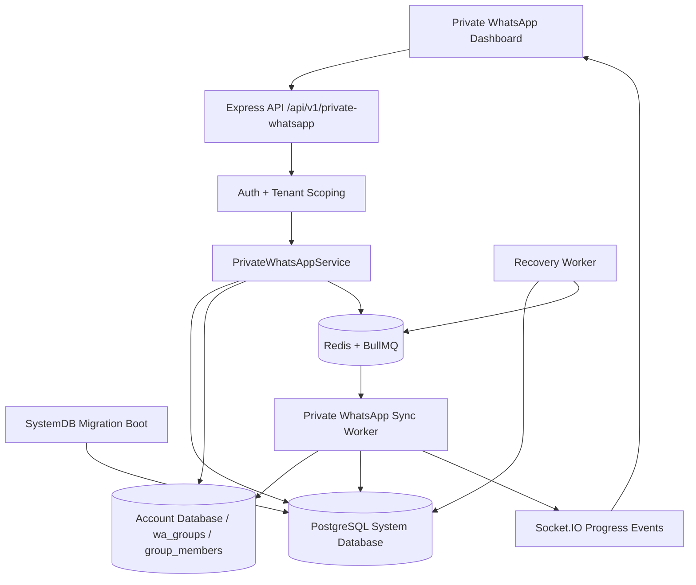
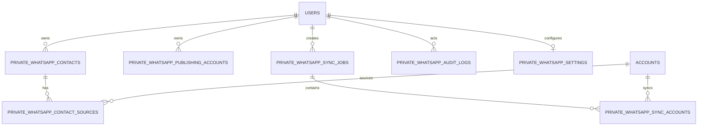

# قسم خاص واتس اب

> **حالة الوثيقة:** توثيق التصميم والتنفيذ الحالي، مع فصل واضح بين ما هو مفعّل في المستودع وما هو مخطط للتوسعة المستقبلية.
>
> **آخر تحديث:** 2026-08-26
>
> **المستودع:** [x781780889-jpg/whatsapp-dashboard-new](https://github.com/x781780889-jpg/whatsapp-dashboard-new)

## 1. الملخص التنفيذي

قسم **خاص واتس اب** هو Namespace مستقل داخل لوحة التحكم لإدارة مصدرين مختلفين للبيانات والعمليات: **حسابات الجمع العامة** التي تُستخدم لاكتشاف المجموعات والمشاركين المتاحين، و**حسابات النشر الخاصة** التي تُستخدم مستقبلًا للحملات والإرسال. القاعدة الأساسية هي عدم استخدام حساب نشر في الجمع، وعدم استخدام حساب جمع في النشر، إلا من خلال إعداد وصلاحية صريحة.

التنفيذ الحالي يوفر Dashboard تشغيلية، قاعدة أرقام مركزية، مزامنة خلفية عبر Queue وWorkers، حفظ Checkpoints، استعادة المهام بعد توقف Worker، سجل تدقيق، وإعدادات خاصة بالقسم. تبدأ كل جهة اتصال بحالة موافقة `UNKNOWN`، ولا يسمح التصميم الحالي بإرسال تلقائي إلى أرقام لم تُسجّل لها موافقة صريحة.

يعتمد القسم على قاعدة البيانات المركزية للنظام، مع Prefix موحّد هو `private_whatsapp_`، وعلى الحسابات العامة الموجودة في النظام كمصادر. تُنفّذ الترحيلات تلقائيًا أثناء إقلاع `SystemDB`، ولا تُنشأ بيانات حقيقية أو حسابات وهمية عند التهيئة.

## 2. نطاق القسم وحدود المسؤولية

ينقسم القسم منطقيًا إلى وحدتين مستقلتين:

| الوحدة | المسؤولية | الحالة الحالية |
|---|---|---|
| قاعدة أرقام المنظمين والمصادر | قراءة المجموعات المتاحة، تطبيع الأرقام، إزالة التكرار، حفظ مصادر الرقم، إدارة الموافقة، وإحصائيات المزامنة | مفعّلة |
| نشر واتس اب | إدارة حسابات النشر والحملات والمستلمين والطوابير ورسائل المحادثات | صفحة وحالة الحسابات مفعّلتان، أما مزود الإرسال والحملات الفعلية فيحتاجان تكاملًا تشغيليًا مستقلًا |

لا يُستخدم جدول `private_whatsapp_publishing_accounts` كمصدر لجمع الأرقام، ولا تُعرض حسابات النشر على أنها حسابات جمع. جلسات WhatsApp الحساسة لا تُحفظ داخل الجداول بصورتها الخام؛ يتم حفظ `session_ref` فقط عند وجود حساب نشر.

## 3. البنية المعمارية



### 3.1 طبقات النظام

| الطبقة | المكوّن | الوظيفة |
|---|---|---|
| Frontend | `PrivateWhatsAppView.tsx` | Dashboard الرئيسي، الإحصائيات، قاعدة الأرقام، البحث، الفلاتر، الموافقة، وبدء المزامنة |
| Frontend | `PrivateWhatsAppPublishingView.tsx` | صفحة نشر واتس اب وحسابات النشر المنفصلة |
| Frontend | `PrivateWhatsAppSettingsView.tsx` | إعداد رمز الدولة وجدولة المزامنة |
| API | `PrivateWhatsAppController.js` | التحقق من المستخدم، التحقق من المدخلات، تحويل الأخطاء، وإرجاع JSON موحّد |
| Service | `PrivateWhatsAppService.js` | التطبيع، Upsert، إزالة التكرار، إنشاء المهام، التقدم، الموافقة، الاستعادة، والإحصائيات |
| Database | `PrivateWhatsAppMigrations.js` | إنشاء الجداول والفهارس والقيود بصورة قابلة للتكرار |
| Queue | `QueueManager.js` | Queue مستقلة باسم `private-whatsapp-sync` وJob باسم `sync_private_whatsapp_account` |
| Worker | Handler داخل `backend/index.js` | معالجة حساب واحد في كل Job، مع Lease وCursor وRetry |
| Events | `SocketBridge` | بث حدث `private_whatsapp_sync_progress` للمستخدم صاحب المهمة |

## 4. صفحات Dashboard والمسارات

### 4.1 المسارات الأمامية

| المسار | الصفحة | الوظيفة |
|---|---|---|
| `/private-whatsapp` | لوحة القسم | عرض الإحصائيات، آخر مزامنة، فصل الحسابات، قاعدة الأرقام، والسجلات |
| `/private-whatsapp/publishing` | نشر واتس اب | عرض حسابات النشر المستقلة وحالة الجاهزية |
| `/private-whatsapp/settings` | الإعدادات | حفظ إعدادات رمز الدولة وجدولة المزامنة |

جميع الصفحات Lazy-loaded من `App.tsx`، ولذلك لا تضيف صفحات النشر والإعدادات إلى الحزمة الأولية إلا عند التنقل إليها.

### 4.2 مكونات اللوحة الرئيسية

تتضمن الصفحة الرئيسية ما يلي:

| المكوّن | الوصف |
|---|---|
| الأرقام المركزية | عدد جهات الاتصال في `private_whatsapp_contacts` |
| المجموعات المتاحة | مجموع المجموعات التي يمكن قراءتها من حسابات الجمع العامة |
| حسابات الجمع العامة | عدد الحسابات العامة ومقدار المتصل منها |
| حسابات النشر الخاصة | عدد حسابات النشر المسجلة فعليًا، أو `غير متاح` عند عدم توفر المورد |
| مزامنة الآن | إنشاء Job خلفي جديد عبر `POST /private-whatsapp/sync` |
| قاعدة الأرقام | جدول قابل للبحث والتصفية والتصفح عبر صفحات |
| الموافقة | أزرار لتسجيل `OPTED_IN` أو `OPTED_OUT` مع تحديث مباشر للصف |
| السجلات | آخر عمليات القسم من `private_whatsapp_audit_logs` |

لا تعرض الواجهة رقمًا وهميًا. عند غياب البيانات أو عدم تهيئة المورد تعرض النص **غير متاح** أو حالة فارغة واضحة.

## 5. واجهات Backend API

جميع المسارات التالية تقع تحت `/api/v1`، وجميعها محمية بـ`auth` وتعمل ضمن نطاق المستخدم الحالي. بدء المزامنة محمي أيضًا بمحدد معدل الطلبات المستخدم للعمليات الثقيلة.

### 5.1 لوحة القسم

```http
GET /api/v1/private-whatsapp/dashboard
Authorization: Bearer <access-token>
```

يعيد الإحصائيات المجمعة، الحسابات العامة المتاحة للمستخدم، آخر عشر مهام مزامنة، الإعدادات، وحسابات النشر المسجلة. لا يتم تحميل جميع جهات الاتصال إلى الذاكرة لإجراء العد؛ تستخدم الإحصائيات استعلامات `COUNT` وAggregations في PostgreSQL.

### 5.2 بدء مزامنة

```http
POST /api/v1/private-whatsapp/sync
Authorization: Bearer <access-token>
Idempotency-Key: <stable-request-id>
Content-Type: application/json

{
  "accountIds": [],
  "defaultCountryCode": "967",
  "requestId": "optional-client-request-id"
}
```

`accountIds` اختياري؛ عند تركه فارغًا تُستخدم حسابات الجمع العامة المتاحة للمستخدم. لا تُقبل معرفات غير صالحة، ويُحفظ `Idempotency-Key` في `private_whatsapp_sync_jobs.request_id` لمنع إنشاء مهمة طلب مكرر. إذا كانت المزامنة معطلة من الإعدادات يعاد خطأ `409`، وإذا لم توجد حسابات مصدر صالحة يعاد خطأ `422`.

### 5.3 متابعة المهمة

```http
GET /api/v1/private-whatsapp/sync/:id
```

يعيد سجل المهمة مع صفوف الحسابات التابعة لها، ويشمل الحالة، عدد الحسابات، عدد الأرقام المكتشفة، الجديد، المكرر، والمستبعد، إضافة إلى Cursor ومعلومات الخطأ عند وجودها.

### 5.4 قراءة قاعدة الأرقام

```http
GET /api/v1/private-whatsapp/contacts?page=1&limit=50&search=967&consentStatus=UNKNOWN&status=ACTIVE
```

تدعم الواجهة `page` و`limit` و`search` و`consentStatus` و`status`. الحد الأعلى للصفحة هو 100 سجل في الطلب. البحث يتم على `normalized_phone` و`original_phone` داخل نطاق المستخدم.

### 5.5 تحديث الموافقة

```http
PATCH /api/v1/private-whatsapp/contacts/:id/consent
Content-Type: application/json

{
  "consentStatus": "OPTED_IN"
}
```

القيم المقبولة هي `OPTED_IN` و`OPTED_OUT` و`UNKNOWN`. عند `OPTED_OUT` يتم وضع `opt_out_status = TRUE` والحالة `DO_NOT_CONTACT`. عند إعادة التسجيل كـ`OPTED_IN` يمكن إعادة الحالة من `DO_NOT_CONTACT` إلى `ACTIVE`، مع تسجيل العملية في Audit Log.

### 5.6 السجلات

```http
GET /api/v1/private-whatsapp/logs?limit=25
```

يعيد آخر العمليات التابعة للمستخدم. لا يُسمح بتسجيل Tokens أو Cookies أو Session Secrets أو API Keys في `payload`.

### 5.7 الإعدادات

```http
GET /api/v1/private-whatsapp/settings
PATCH /api/v1/private-whatsapp/settings
Content-Type: application/json

{
  "defaultCountryCode": "967",
  "syncEnabled": true
}
```

الإعدادات User-scoped. يدعم `PATCH` التحديث الجزئي ويحافظ على القيم الحالية عند عدم إرسال حقل معين. يتم تسجيل تحديث الإعدادات في Audit Log.

### 5.8 حسابات النشر

```http
GET /api/v1/private-whatsapp/publishing/accounts
```

يعيد حسابات النشر المسجلة للمستخدم فقط. لا ينشئ هذا المسار جلسة WhatsApp ولا يخزن Secret، ولا يخلط هذه الحسابات مع الحسابات العامة.

## 6. قاعدة البيانات الحالية

### 6.1 `private_whatsapp_publishing_accounts`

يمثل حسابات النشر الخاصة فقط.

| الحقل | الوظيفة |
|---|---|
| `id` | UUID رئيسي |
| `user_id` | مالك الحساب مع Foreign Key إلى `users` |
| `name` | اسم العرض |
| `phone_number` | رقم الحساب عند توفره |
| `session_ref` | مرجع جلسة غير حساس بدل Session Secret الخام |
| `status` | الحالة التشغيلية الحالية |
| `last_activity_at` | آخر نشاط |
| `created_at`, `updated_at` | تواريخ التدقيق |

القيد الفريد هو `(user_id, phone_number)`. الحذف المتسلسل من المستخدم يحذف حسابات النشر التابعة له.

### 6.2 `private_whatsapp_contacts`

هذا هو مصدر الحقيقة المركزي لجهات الاتصال.

| الحقل | الوظيفة |
|---|---|
| `id` | UUID رئيسي |
| `user_id` | عزل بيانات المستخدم |
| `normalized_phone` | الرقم الموحّد المستخدم في Deduplication |
| `original_phone` | الصيغة الأصلية لأغراض العرض والتدقيق |
| `country_code` | رمز الدولة الصريح عند توفره |
| `status` | حالة جهة الاتصال، مثل `ACTIVE` أو `DO_NOT_CONTACT` |
| `consent_status` | `OPTED_IN` أو `OPTED_OUT` أو `UNKNOWN` |
| `opt_out_status` | Boolean مساعد لمنع التواصل |
| `tags` | JSONB مرن للوسوم الحالية، وليس مصدر الاستعلامات الأساسية |
| `notes` | ملاحظات اختيارية |
| `first_seen_at`, `last_seen_at` | أول وآخر ظهور |
| `created_at`, `updated_at` | تواريخ النظام |

القيد الفريد هو `(user_id, normalized_phone)`، مع Check Constraint على قيم الموافقة. لذلك يمكن أن يظهر الرقم من عشرات المجموعات والحسابات ويبقى Contact واحدًا للمستخدم.

### 6.3 `private_whatsapp_contact_sources`

يحفظ علاقة جهة الاتصال بكل مصدر ظهر فيه الرقم.

| الحقل | الوظيفة |
|---|---|
| `contact_id` | جهة الاتصال المركزية |
| `user_id` | مالك البيانات |
| `source_account_id` | حساب الجمع، مع `ON DELETE SET NULL` |
| `source_group_id` | معرف المجموعة في قاعدة حساب WhatsApp |
| `source_group_name` | اسم المجموعة وقت الرؤية |
| `role` | الدور المتاح من المصدر، مثل `MEMBER` أو `ADMIN` |
| `first_seen_at`, `last_seen_at` | تاريخ الظهور |

القيد الفريد هو `(contact_id, source_account_id, source_group_id)`. حذف Contact يحذف مصادره، بينما حذف حساب المصدر لا يحذف Contact المركزي.

### 6.4 `private_whatsapp_sync_jobs`

يمثل طلب مزامنة متعدد الحسابات.

| الحقل | الوظيفة |
|---|---|
| `id` | UUID المهمة |
| `user_id` | صاحب الطلب |
| `status` | `QUEUED` أو `PROCESSING` أو `COMPLETED` أو `FAILED` |
| `requested_account_ids` | الحسابات المطلوبة بصيغة JSONB مرنة |
| `total_accounts` | عدد الحسابات في الطلب |
| `processed_accounts` | الحسابات المكتملة أو الفاشلة نهائيًا |
| `discovered_count` | إجمالي السجلات المقروءة |
| `new_contacts_count` | جهات الاتصال الجديدة |
| `duplicate_count` | السجلات الموجودة مسبقًا |
| `excluded_count` | السجلات المستبعدة، مثل Admin أو رقم غير صالح |
| `error_message` | رسالة عامة عند فشل المهمة |
| `request_id` | مفتاح Idempotency |
| `settings` | Snapshot لإعدادات المهمة، مثل رمز الدولة |
| `started_at`, `completed_at`, `created_at`, `updated_at` | تواريخ دورة الحياة |

يوجد Unique Partial Index على `(user_id, request_id)` عندما لا يكون `request_id` فارغًا.

### 6.5 `private_whatsapp_sync_accounts`

يمثل وحدة العمل التي يعالجها Worker لكل حساب مصدر.

| الحقل | الوظيفة |
|---|---|
| `sync_job_id` | المهمة الأم |
| `user_id` | مالك المهمة |
| `account_id` | حساب المصدر |
| `status` | `QUEUED` أو `PROCESSING` أو `RETRY` أو `COMPLETED` أو `FAILED` |
| `cursor_group_id` | آخر مجموعة مؤكدة |
| `cursor_phone` | آخر رقم مؤكد داخل المجموعة |
| `discovered_count`, `new_contacts_count`, `duplicate_count`, `excluded_count` | Counters قابلة لإعادة البناء |
| `attempts` | عدد المحاولات |
| `worker_id` | هوية Worker المالك للـLease |
| `lease_expires_at` | وقت انتهاء القفل المؤقت |
| `heartbeat_at` | آخر Heartbeat |
| `available_at` | أقرب وقت يسمح بالتنفيذ |
| `queue_job_id` | معرف BullMQ |
| `last_error` | آخر خطأ |
| `started_at`, `completed_at`, `created_at`, `updated_at` | دورة الحياة |

القيد الفريد هو `(sync_job_id, account_id)`، والفهارس الأساسية هي `(status, available_at, lease_expires_at, created_at)` و`(sync_job_id, status)`.

### 6.6 `private_whatsapp_audit_logs`

يسجل من نفّذ العملية وماذا حدث وعلى أي كيان.

| الحقل | الوظيفة |
|---|---|
| `user_id` | نطاق صاحب البيانات |
| `actor_id` | المستخدم الذي نفذ العملية |
| `action` | مثل `SYNC_REQUESTED` أو `CONTACT_CONSENT_UPDATED` |
| `entity_type` | نوع الكيان |
| `entity_id` | معرف الكيان عند توفره |
| `payload` | بيانات تدقيق غير حساسة بصيغة JSONB |
| `created_at` | وقت العملية بتوقيت UTC |

### 6.7 `private_whatsapp_settings`

يحفظ إعدادات القسم غير الحساسة على مستوى المستخدم.

| الحقل | الوظيفة |
|---|---|
| `user_id` | مفتاح رئيسي ومالك الإعدادات |
| `default_country_code` | رمز دولة اختياري للأرقام المحلية |
| `sync_enabled` | السماح بجدولة مزامنة جديدة |
| `updated_by` | المستخدم الذي حدّث الإعداد |
| `created_at`, `updated_at` | تواريخ التدقيق |

## 7. العلاقات الحالية



مصدر الحقيقة لكل نوع بيانات هو:

| نوع البيانات | Source of Truth |
|---|---|
| جهة الاتصال | `private_whatsapp_contacts` |
| مصدر الرقم | `private_whatsapp_contact_sources` |
| طلب المزامنة | `private_whatsapp_sync_jobs` |
| حالة حساب المزامنة | `private_whatsapp_sync_accounts` |
| الإعدادات | `private_whatsapp_settings` |
| الحسابات الخاصة بالنشر | `private_whatsapp_publishing_accounts` |
| سجل التدقيق | `private_whatsapp_audit_logs` |

## 8. تطبيع الأرقام وإزالة التكرار

تعمل الدالة `normalizePhone` على تنظيف المسافات والشرطات والأقواس وإزالة بادئة `00` وتحويل الرقم الدولي إلى صيغة تبدأ بـ`+`. لا يتم تخمين رمز الدولة من رقم محلي. الرقم المحلي لا يُقبل إلا إذا أرسل المستخدم رمز دولة صريحًا عبر الطلب أو الإعدادات.

تسلسل إدخال الرقم هو:

```text
قراءة الرقم من المصدر
        ↓
تطبيع الرقم أو استبعاده إذا كان غير صالح
        ↓
Upsert في private_whatsapp_contacts
        ↓
إنشاء أو تحديث Contact Source
        ↓
Commit للمعاملة
        ↓
تحديث Counters وCheckpoint
```

تتم إزالة التكرارات على مستوى `(user_id, normalized_phone)`. ظهور الرقم من مجموعة أخرى لا ينشئ Contact ثانيًا؛ بل يضيف مصدرًا جديدًا فقط إذا كانت علاقة المصدر جديدة.

## 9. قواعد الأدوار والموافقة

المصدر الحالي `group_members` يوفر حقل `is_admin`. لذلك يستبعد Worker السجلات الموسومة كـAdmin من قاعدة الأرقام المستهدفة، مع الاحتفاظ بمصدرها عند توسعة نموذج الأدوار مستقبلًا. لا ينبغي اعتبار كل عضو مكتشف صاحب موافقة على الرسائل؛ الاكتشاف والموافقة مرحلتان منفصلتان.

حالات الموافقة:

| الحالة | المعنى | قابلية الإرسال مستقبلًا |
|---|---|---|
| `UNKNOWN` | لم تسجل موافقة صريحة | ممنوع افتراضيًا |
| `OPTED_IN` | توجد موافقة صريحة موثقة | مؤهل وفق بقية القواعد |
| `OPTED_OUT` | طلب عدم التواصل | ممنوع |

أي قائمة مستقبلية للإرسال يجب أن تستبعد دائمًا `OPTED_OUT` و`opt_out_status = TRUE` و`status = DO_NOT_CONTACT`، ويجب ألا تعتمد على عداد أو Cache غير قابل لإعادة البناء.

## 10. Queue وWorkers وRecovery

### 10.1 Queue

اسم Queue هو `private-whatsapp-sync`. يضاف كل Job باسم `sync_private_whatsapp_account` ويحمل فقط `syncAccountId`. حفظ البيانات التشغيلية في PostgreSQL يجعل Redis طبقة تنفيذ لا مصدر الحقيقة الوحيد.

### 10.2 القفل والـLease

يحاول Worker امتلاك صف `private_whatsapp_sync_accounts` بعملية SQL ذرية. لا ينتقل الصف إلى `PROCESSING` إلا إذا كان في `QUEUED` أو `RETRY` أو كان Lease السابق منتهيًا. يتم حفظ:

- `worker_id` لتحديد المالك.
- `lease_expires_at` لمنع القفل الأبدي.
- `heartbeat_at` لإظهار النشاط.
- `attempts` للتحكم في إعادة المحاولة.

عند تشغيل Workerين على نفس المعرف، يحصل أحدهما فقط على الصف، ويعود الآخر بحالة `already_claimed_or_finished` دون معالجة مكررة.

### 10.3 Checkpoint والاستئناف

لا يعتمد التقدم على رقم ترتيب ثابت. يحفظ Worker آخر مجموعة في `cursor_group_id` وآخر رقم في `cursor_phone`. بعد Crash أو Restart يستكمل القراءة من آخر Cursor مؤكد بدل بدء العملية من البداية.

### 10.4 Retry وBackoff

القيمة الافتراضية القصوى للمحاولات هي ثلاث محاولات، ويمكن ضبطها عبر `PRIVATE_WHATSAPP_MAX_RETRIES` ضمن الحدود الآمنة. عند الفشل المؤقت تنتقل الوحدة إلى `RETRY` مع `available_at` مستقبلي، ويستخدم BullMQ Exponential Backoff افتراضيًا يبدأ من خمس ثوانٍ.

### 10.5 Recovery Worker

يعمل Recovery Worker داخل عملية Backend على فاصل افتراضي قدره 15 ثانية. يمكن ضبطه عبر `PRIVATE_WHATSAPP_RECOVERY_MS`. وظيفته:

1. إعادة الصفوف التي انتهى Lease الخاص بها من `PROCESSING` إلى `RETRY`.
2. قراءة الصفوف `QUEUED` و`RETRY` التي حان موعدها.
3. إعادة إضافتها إلى Queue بمعرف ثابت.
4. إزالة سجل BullMQ الفاشل عند الحاجة ثم إعادة جدولة المهمة.
5. حفظ `queue_job_id` في PostgreSQL.

## 11. الإعدادات التشغيلية

| المتغير | الافتراضي | الوظيفة |
|---|---:|---|
| `PRIVATE_WHATSAPP_BATCH_SIZE` | `250` | عدد أعضاء المجموعة في دفعة القراءة، ويُقيّد بين 25 و500 |
| `PRIVATE_WHATSAPP_LEASE_MS` | `120000` | مدة Lease للـWorker بالميلي ثانية |
| `PRIVATE_WHATSAPP_RECOVERY_MS` | `15000` | فاصل Recovery Worker |
| `PRIVATE_WHATSAPP_MAX_RETRIES` | `3` | الحد الأعلى لمحاولات المعالجة |
| `PRIVATE_WHATSAPP_SYNC_CONCURRENCY` | `2` | عدد Workers المتزامنين، ويُقيّد بين 1 و4 |
| `PRIVATE_WHATSAPP_DEFAULT_COUNTRY_CODE` | فارغ | رمز دولة افتراضي اختياري، لا يُستخدم إلا للأرقام المحلية |

يجب توفير PostgreSQL وRedis في بيئة التشغيل، ويجب أن تكون قاعدة الحسابات العامة قادرة على قراءة جداول `wa_groups` و`group_members` للحسابات المصدر.

## 12. الترحيلات والإقلاع

توجد الترحيلة في:

```text
backend/src/database/PrivateWhatsAppMigrations.js
```

ويتم استدعاؤها أثناء إقلاع `SystemDB` في:

```text
backend/src/database/SystemDB.js
```

الترحيلة Additive وقابلة لإعادة التنفيذ باستخدام `CREATE TABLE IF NOT EXISTS` و`CREATE INDEX IF NOT EXISTS` و`ALTER TABLE ... ADD COLUMN IF NOT EXISTS`. لا تحتوي على Seed لبيانات مستخدمين حقيقية.

## 13. الاختبارات

آخر تحقق مسجل في جلسة التطوير شمل:

| الفحص | النتيجة |
|---|---|
| فحص Syntax لملفات Backend | ناجح |
| بناء Vite للواجهة | ناجح |
| مجموعة اختبارات Backend الكاملة | 18 مجموعة اختبار |
| عدد الاختبارات الناجحة | 67 اختبارًا |
| Workerان على Sync Account واحد | Worker واحد فقط يعالج المهمة |
| Recovery لـ100 مهمة معلقة | 100 مهمة أُعيدت إلى Queue مرة واحدة لكل حساب |
| تطبيع الأرقام | دولي، `00`، محلي مع رمز صريح، ورفض المحلي غير المعرّف |
| تعطيل المزامنة | يمنع إنشاء Job جديد بحالة `409` |

اختبارات التزامن الحالية تستخدم عوازل اختبارية لمحاكاة طبقة PostgreSQL وQueue. اختبار Redis وPostgreSQL الحقيقيين تحت ضغط إنتاجي يحتاج بيئة Integration تحتوي على الخدمات الحقيقية، ويفضل تشغيله ببيانات اصطناعية فقط.

## 14. الأمان والعزل

يجب الالتزام بالقواعد التالية عند أي توسعة:

1. كل API جديدة يجب أن تستخدم Authentication وTenant Scoping.
2. يجب ألا يستطيع المستخدم قراءة Contact أو Job يخص مستخدمًا آخر.
3. حسابات الجمع وحسابات النشر موارد منفصلة.
4. لا تُحفظ Session Secrets أو Tokens أو Cookies أو API Keys في قاعدة البيانات أو Logs.
5. `UNKNOWN` ليست موافقة؛ وهي الحالة الافتراضية الآمنة.
6. `OPTED_OUT` و`DO_NOT_CONTACT` يجب أن تمنعا أي إرسال مستقبلي.
7. لا تُستخدم بيانات وهمية لإخفاء غياب حسابات النشر أو غياب الإحصائيات.
8. أي Provider إرسال مستقبلًا يجب أن يثبت قبول الرسالة أو Delivery وفق ما يتيحه مزود واتساب، ولا يُعتبر مجرد Attempt نجاحًا مؤكدًا.
9. يجب تسجيل العمليات الحساسة في Audit Log دون بيانات سرية.

## 15. التوسعة المستقبلية وفق التصميم العام

المواصفة الكاملة للقسم تتطلب توسيع Namespace ليشمل الجداول التالية. هذه الجداول جزء من Blueprint المستقبلي وليست كلها مفعّلة في التنفيذ الحالي؛ لذلك يجب عدم اعتبارها متاحة في API قبل إنشاء ترحيل واختبارات لها.

| الجدول المقترح | الغرض | الحالة |
|---|---|---|
| `private_whatsapp_accounts` | نموذج موحّد للحسابات مع `account_type = SOURCE/PUBLISHING` | مخطط للتوسعة |
| `private_whatsapp_groups` | تمثيل المجموعات المكتشفة داخل Namespace | مخطط للتوسعة |
| `private_whatsapp_account_groups` | علاقة الحساب بالمجموعة عند ظهور المجموعة عبر عدة حسابات | مخطط للتوسعة |
| `private_whatsapp_segments` | تعريف شرائح قابلة لإعادة البناء عبر Filter Definition | مخطط للتوسعة |
| `private_whatsapp_tags` | تعريف Tags مستقلة | مخطط للتوسعة |
| `private_whatsapp_contact_tags` | ربط Tags بجهات الاتصال | مخطط للتوسعة |
| `private_whatsapp_do_not_contact` | سجل DNC دائم مع السبب والمصدر والمنشئ | مخطط للتوسعة |
| `private_whatsapp_campaigns` | تعريف الحملات والقوالب والإعلانات والوسائط | مخطط للتوسعة |
| `private_whatsapp_campaign_recipients` | مستلمو الحملة مع حالة وإIdempotency Key | مخطط للتوسعة |
| `private_whatsapp_jobs` | Jobs الإرسال مع Lock وPriority وScheduled At | مخطط للتوسعة |
| `private_whatsapp_campaign_checkpoints` | استئناف الحملات بعد Restart أو فشل حساب | مخطط للتوسعة |
| `private_whatsapp_campaign_accounts` | تدوير حسابات النشر وتوزيع الحملات | مخطط للتوسعة |
| `private_whatsapp_delivery_attempts` | سجل كل محاولة ونتيجة Provider | مخطط للتوسعة |
| `private_whatsapp_conversations` | المحادثات المرتبطة بجهة الاتصال والحساب | مخطط للتوسعة |
| `private_whatsapp_incoming_messages` | الرسائل الواردة مع منع Duplicate Webhook | مخطط للتوسعة |
| `private_whatsapp_outgoing_messages` | الرسائل الصادرة وحالة الإرسال | مخطط للتوسعة |
| `private_whatsapp_sync_runs` | مستوى أعلى لتجميع عمليات المزامنة حسب النوع | مخطط للتوسعة |
| `private_whatsapp_sync_jobs` | Jobs تفصيلية لكل حساب أو مجموعة مع Cursor | مطبق حاليًا بصيغة `private_whatsapp_sync_accounts` التابعة لـ`sync_jobs` |
| `private_whatsapp_activity_logs` | Activity Log موسع مرتبط بحساب وحملة وContact | مطبق حاليًا بصيغة `private_whatsapp_audit_logs` |
| `private_whatsapp_notifications` | إشعارات داخلية للمستخدم | مخطط للتوسعة |

### 15.1 قواعد التوسعة المستقبلية

عند إضافة الحملات يجب تطبيق `UNIQUE(campaign_id, contact_id)` للمستلمين، وIdempotency Key فريد لكل Job إرسال، وقفل ذري قبل الانتقال إلى `PROCESSING`. عند إضافة Webhooks يجب تطبيق `UNIQUE(external_message_id)`، وعند إضافة DNC يجب أن يمنع السجل إنشاء مستلم جديد حتى لو حُذفت جهة الاتصال من الواجهة.

عند ربط الإعلانات أو الوسائط يجب استخدام `advertisement_id` أو `media_reference` إلى المكتبة الحالية بدل تكرار الجداول والملفات. لا ينبغي وضع الحقول الأساسية مثل `campaign_id` أو `contact_id` داخل JSONB بدل الأعمدة والفهارس الصريحة.

## 16. النسخ الاحتياطي والاستعادة

يجب إدخال جداول القسم في سياسة Backup الخاصة بقاعدة النظام، خصوصًا:

- `private_whatsapp_contacts`
- `private_whatsapp_contact_sources`
- `private_whatsapp_sync_jobs`
- `private_whatsapp_sync_accounts`
- `private_whatsapp_publishing_accounts`
- `private_whatsapp_audit_logs`
- `private_whatsapp_settings`

بعد Restore يجب تشغيل فحوصات Unique Constraints وForeign Keys، ثم تشغيل Recovery Worker لإعادة جدولة المهام التي بقيت في `QUEUED` أو `RETRY`. لا ينبغي إعادة إدخال Contacts أو Jobs عن طريق Seed؛ يجب الاعتماد على القيود الفريدة وIdempotency.

## 17. Runbook تشغيلي مختصر

### تشغيل قسم جديد

1. تأكد من اتصال Backend بـPostgreSQL وRedis.
2. شغّل Backend؛ ستنفذ `PrivateWhatsAppMigrations.run()` تلقائيًا.
3. تأكد من ظهور سجل `[PrivateWhatsAppMigrations] Tables ready`.
4. تأكد من تشغيل QueueManager وظهور Queue `private-whatsapp-sync`.
5. افتح `/private-whatsapp` بعد تسجيل الدخول.
6. اضبط رمز الدولة من `/private-whatsapp/settings` إذا كانت المصادر تحتوي أرقامًا محلية.
7. اضغط **مزامنة الآن**.
8. راقب `private_whatsapp_sync_jobs` و`private_whatsapp_sync_accounts` أو حدث `private_whatsapp_sync_progress`.

### عند توقف Worker

لا تُنشئ Job يدويًا مباشرة. تحقق من `lease_expires_at` و`last_error`، واترك Recovery Worker يعيد المهمة. إذا بقيت المهمة في `FAILED` بعد استنفاد المحاولات، افحص الحساب المصدر وقاعدة `group_members` ثم أعد جدولة الطلب من Dashboard بعد معالجة السبب.

### عند عدم ظهور أرقام

تحقق من أن الحساب مصدر عام متصل، وأن جداول `wa_groups` و`group_members` تحتوي بيانات، وأن الرقم دولي أو أن `defaultCountryCode` مضبوط. الأرقام المحلية غير المعرّفة تُستبعد عمدًا بدل تخمين رمز الدولة.

## 18. ما هو مفعّل وما لم يُفعّل بعد

| المجال | الوضع |
|---|---|
| زر القسم والتنقل | مفعّل |
| Dashboard والإحصائيات | مفعّل |
| قاعدة الأرقام المركزية | مفعّلة |
| التطبيع وإزالة التكرار | مفعّل |
| Consent وDo Not Contact الأساسي | مفعّل |
| Queue مزامنة الأرقام | مفعّلة |
| Worker وLease وCursor | مفعّلة |
| Recovery Worker | مفعّل |
| صفحة نشر واتس اب | مفعّلة لعرض الحالة والحسابات الفعلية |
| إنشاء جلسات النشر | غير مفعّل؛ يحتاج Provider رسمي أو تدفق اعتماد مستقل |
| إرسال الحملات الفعلي | غير مفعّل |
| Segments وTags والحملات | مخططة للتوسعة |
| Inbox والمحادثات والـWebhooks | مخططة للتوسعة |
| اختبار Redis/PostgreSQL الحقيقي تحت ضغط إنتاجي | يحتاج بيئة Integration مستقلة |

## 19. الملفات الرئيسية في المستودع

| الملف | الوصف |
|---|---|
| [`frontend/src/App.tsx`](../frontend/src/App.tsx) | تعريف مسارات القسم والصفحات الكسولة |
| [`frontend/src/views/PrivateWhatsAppView.tsx`](../frontend/src/views/PrivateWhatsAppView.tsx) | Dashboard الرئيسي وقاعدة الأرقام |
| [`frontend/src/views/PrivateWhatsAppPublishingView.tsx`](../frontend/src/views/PrivateWhatsAppPublishingView.tsx) | صفحة نشر واتس اب |
| [`frontend/src/views/PrivateWhatsAppSettingsView.tsx`](../frontend/src/views/PrivateWhatsAppSettingsView.tsx) | صفحة الإعدادات |
| [`backend/src/api/routes.js`](../backend/src/api/routes.js) | تسجيل مسارات API |
| [`backend/src/api/controllers/PrivateWhatsAppController.js`](../backend/src/api/controllers/PrivateWhatsAppController.js) | Controllers والتحقق من الطلبات |
| [`backend/src/api/services/PrivateWhatsAppService.js`](../backend/src/api/services/PrivateWhatsAppService.js) | منطق القسم والمزامنة والاستعادة |
| [`backend/src/lib/QueueManager.js`](../backend/src/lib/QueueManager.js) | Queue وWorker registration |
| [`backend/src/database/PrivateWhatsAppMigrations.js`](../backend/src/database/PrivateWhatsAppMigrations.js) | جداول القسم والفهارس والقيود |
| [`backend/src/database/SystemDB.js`](../backend/src/database/SystemDB.js) | تشغيل الترحيل أثناء الإقلاع |
| [`backend/src/api/services/PrivateWhatsAppService.test.js`](../backend/src/api/services/PrivateWhatsAppService.test.js) | اختبارات التطبيع وإعدادات المزامنة |
| [`backend/src/api/services/PrivateWhatsAppService.integration.test.js`](../backend/src/api/services/PrivateWhatsAppService.integration.test.js) | اختبارات تزامن Workers وRecovery |

## 20. مراجع الوثيقة

[1]: ../backend/src/database/PrivateWhatsAppMigrations.js "Private WhatsApp migrations"
[2]: ../backend/src/api/services/PrivateWhatsAppService.js "Private WhatsApp service"
[3]: ../backend/src/api/controllers/PrivateWhatsAppController.js "Private WhatsApp controller"
[4]: ../backend/src/api/routes.js "Private WhatsApp routes"
[5]: ../backend/src/lib/QueueManager.js "Queue manager"
[6]: ../backend/index.js "Backend bootstrap and queue handlers"
[7]: ../frontend/src/views/PrivateWhatsAppView.tsx "Private WhatsApp dashboard"
[8]: ../frontend/src/views/PrivateWhatsAppPublishingView.tsx "Private WhatsApp publishing view"
[9]: ../frontend/src/views/PrivateWhatsAppSettingsView.tsx "Private WhatsApp settings view"
[10]: ../backend/src/api/services/PrivateWhatsAppService.test.js "Private WhatsApp unit tests"
[11]: ../backend/src/api/services/PrivateWhatsAppService.integration.test.js "Private WhatsApp integration tests"
[12]: https://github.com/x781780889-jpg/whatsapp-dashboard-new "Project repository"
